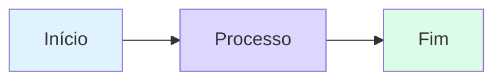

# 🎨 Guia de Estilo para Aulas em Markdown

Este documento serve como template e referência para criar aulas visualmente atraentes para jovens de 14-18 anos.

## 📋 Estrutura Básica de uma Aula

```markdown
# 🚀 [Título da Aula com Emoji]

<div style="text-align: center; font-size: 3rem; margin: 20px 0;">
[Emojis relacionados ao tema]
</div>

[Introdução amigável e motivadora]

<div class="hero-section">
    <h2>🎯 [Objetivo Principal]</h2>
    <p>[Descrição do que o aluno vai aprender]</p>
</div>

## [Seções do conteúdo...]
```

## 🎨 Componentes Visuais Disponíveis

### 1. Hero Section (Destaque Inicial)
```html
<div class="hero-section">
    <h2>🎯 Título Chamativo</h2>
    <p>Descrição motivadora que captura a atenção</p>
</div>
```

### 2. Callouts (Caixas de Destaque)

**Dica (Verde):**
```html
<div class="callout tip">
    <div class="callout-title">💡 Dica de Mestre</div>
    Conteúdo da dica aqui
</div>
```

**Aviso (Amarelo):**
```html
<div class="callout warning">
    <div class="callout-title">⚠️ Atenção</div>
    Conteúdo do aviso aqui
</div>
```

**Informação (Azul):**
```html
<div class="callout info">
    <div class="callout-title">ℹ️ Saiba Mais</div>
    Informação adicional aqui
</div>
```

### 3. Cards em Grid (2 colunas)
```html
<div class="grid-2">
    <div class="card card-red">
        <strong>🔴 Título</strong>
        <p>Conteúdo do card</p>
    </div>
    <div class="card card-amber">
        <strong>🟡 Título</strong>
        <p>Conteúdo do card</p>
    </div>
</div>
```

### 4. Caixa de Desafio
```html
<div class="challenge-box">
    <h3 style="margin-top: 0;">🎯 Desafio</h3>
    <p>Descrição do desafio aqui</p>
</div>
```

### 5. Solução Expansível
```html
<details class="solution-details">
    <summary><strong>🔍 Ver Solução</strong></summary>
    <div class="solution-content">
        <p>Conteúdo da solução aqui</p>
    </div>
</details>
```

### 6. Diagramas Mermaid
```markdown

```

### 7. Tabelas Comparativas
```markdown
| Aspecto | Opção A | Opção B |
|---------|---------|---------|
| **Performance** | ⭐⭐⭐ | ⭐⭐⭐⭐⭐ |
| **Facilidade** | ⭐⭐⭐⭐ | ⭐⭐⭐ |
```

## 😀 Uso de Emojis

### Emojis Recomendados por Contexto

**Tecnologia:**
- 💻 Computador/Código
- 📱 Mobile/App
- 🌐 Web/Internet
- ⚙️ Configuração
- 🔧 Ferramentas

**Aprendizado:**
- 📚 Conteúdo/Leitura
- 🎓 Educação
- 💡 Dica/Ideia
- 🎯 Objetivo/Meta
- ✅ Correto/Completo

**Ações:**
- 🚀 Início/Lançamento
- ⚡ Rápido/Performance
- 🔄 Processo/Loop
- 🎨 Design/Visual
- 🐛 Bug/Erro

**Emoções:**
- 🎉 Celebração
- 😰 Desafio/Difícil
- 🤔 Pensamento
- 💪 Força/Determinação
- ❤️ Amor/Paixão

## 🖼️ Imagens e Recursos

### Organização de Imagens
```
content/
└── desenvolvimento-mobile/
    └── unidade-01/
        ├── aula-01.md
        └── imagens/
            ├── diagrama-widgets.png
            ├── exemplo-codigo.gif
            └── hero-flutter.jpg
```

### Inserindo Imagens
```markdown

```

### Imagens com Estilo
```html
<div class="architecture-diagram">
    
</div>
```

## 📝 Boas Práticas

### ✅ FAÇA:
- Use emojis para destacar títulos e seções
- Quebre textos longos em parágrafos curtos
- Use listas com marcadores sempre que possível
- Adicione exemplos visuais (diagramas, imagens)
- Inclua desafios práticos ao final
- Use linguagem informal e próxima
- Destaque palavras-chave em **negrito**

### ❌ NÃO FAÇA:
- Parágrafos com mais de 4-5 linhas
- Textos densos sem quebras visuais
- Linguagem muito técnica sem explicação
- Aulas sem elementos interativos
- Excesso de emojis (máximo 2-3 por parágrafo)

## 🎯 Checklist de Qualidade

Antes de publicar uma aula, verifique:

- [ ] Título tem emoji relevante
- [ ] Hero section está presente
- [ ] Pelo menos 3 callouts diferentes
- [ ] Contém diagrama ou imagem
- [ ] Tem desafio prático
- [ ] Solução do desafio está oculta (details)
- [ ] Linguagem é adequada para 14-18 anos
- [ ] Código tem syntax highlighting
- [ ] Links externos abrem em nova aba
- [ ] Seção "O que vem por aí" no final

## 🚀 Exemplo Completo

Veja `aula-01.md` como exemplo de implementação completa deste guia.

---

<div style="text-align: center; padding: 20px; background: #f0f9ff; border-radius: 8px;">
    <p><strong>💙 Lembre-se:</strong> O objetivo é tornar o aprendizado divertido e engajante!</p>
</div>
