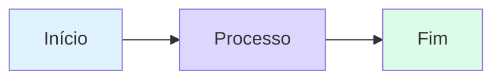

# 🎉 Transformação Completa do Projeto Prof-Dev

## 📊 Resumo das Alterações

Este documento resume todas as melhorias e ajustes realizados no projeto para torná-lo pronto para publicação no GitHub Pages e otimizado para engajar jovens de 14-18 anos.

---

## ✅ O que foi feito

### 1. 🎨 Aula Modelo Turbinada
**Arquivo:** `content/desenvolvimento-mobile/Unidade 01/aula-01.md`

Transformamos a primeira aula em um exemplo completo de conteúdo visualmente atraente:

- ✨ **Emojis estratégicos** em títulos e seções
- 🎨 **Hero section** com gradiente chamativo
- 📊 **Diagrama Mermaid** mostrando o fluxo cross-platform
- 💡 **Callouts coloridos** (dicas, avisos, informações)
- 🎯 **Desafio prático** com solução expansível
- 📋 **Tabela comparativa** entre desenvolvimento nativo e Flutter
- 🎉 **Card de conclusão** motivacional

### 2. 📁 Estrutura de Projetos
**Pasta:** `projetos/`

Criamos a estrutura para os projetos práticos:

```
projetos/
├── README.md                    # Índice de todos os projetos
└── 01-calculadora/
    └── README.md                # Guia completo do projeto
```

Cada projeto terá:
- Descrição clara dos objetivos
- Conceitos abordados
- Instruções de execução
- Desafios extras
- Checklist de conclusão

### 3. 📐 Guia de Estilo
**Arquivo:** `GUIA-DE-ESTILO.md`

Documento completo com:
- Templates prontos para criar aulas
- Todos os componentes visuais disponíveis
- Guia de uso de emojis por contexto
- Exemplos de diagramas Mermaid
- Boas práticas e checklist de qualidade

### 4. 🌐 Suporte a Markdown + HTML
**Arquivos modificados:** `index.html`, `src/main.js`, `src/style.css`

Adicionamos suporte completo para:
- ✅ **Marked.js** - Parser de Markdown para HTML
- ✅ **Mermaid.js** - Renderização de diagramas
- ✅ **Prism.js** - Syntax highlighting (já existia)
- ✅ **Componentes CSS** - Hero sections, callouts, cards, etc.

### 5. 🔧 Compatibilidade com GitHub Pages
**Arquivos modificados:** `index.html`, `src/main.js`, `content/manifest.json`

Todos os caminhos foram ajustados de **absolutos** para **relativos**:

**Antes:**
```json
"path": "/content/desenvolvimento-mobile/Unidade 01/aula-01.md"
```

**Depois:**
```json
"path": "content/desenvolvimento-mobile/Unidade 01/aula-01.md"
```

Isso garante que o site funcione tanto localmente quanto no GitHub Pages.

### 6. 📖 README Profissional
**Arquivo:** `README.md`

README completo com:
- Badges informativos
- Estrutura do projeto
- Instruções de uso local e online
- Guia de contribuição
- Informações sobre tecnologias

---

## 🎨 Novos Componentes Visuais

### Hero Section
```html
<div class="hero-section">
    <h2>🎯 Título Chamativo</h2>
    <p>Descrição motivadora</p>
</div>
```

### Callouts
```html
<!-- Dica (Verde) -->
<div class="callout tip">
    <div class="callout-title">💡 Dica</div>
    Conteúdo aqui
</div>

<!-- Aviso (Amarelo) -->
<div class="callout warning">
    <div class="callout-title">⚠️ Atenção</div>
    Conteúdo aqui
</div>

<!-- Info (Azul) -->
<div class="callout info">
    <div class="callout-title">ℹ️ Saiba Mais</div>
    Conteúdo aqui
</div>
```

### Cards em Grid
```html
<div class="grid-2">
    <div class="card card-red">
        <strong>Título</strong>
        <p>Conteúdo</p>
    </div>
    <div class="card card-amber">
        <strong>Título</strong>
        <p>Conteúdo</p>
    </div>
</div>
```

### Desafio com Solução Expansível
```html
<div class="challenge-box">
    <h3>🎯 Desafio</h3>
    <p>Descrição do desafio</p>
</div>

<details class="solution-details">
    <summary><strong>🔍 Ver Solução</strong></summary>
    <div class="solution-content">
        <p>Solução aqui</p>
    </div>
</details>
```

### Diagramas Mermaid
````markdown

````

---

## 📦 Como Publicar no GitHub Pages

### Passo a Passo:

1. **Faça commit de todas as alterações:**
```bash
git add .
git commit -m "Adiciona suporte a Markdown, projetos e guia de estilo"
git push origin main
```

2. **Ative o GitHub Pages:**
   - Vá em **Settings** > **Pages**
   - Em **Source**, selecione **main branch**
   - Clique em **Save**

3. **Aguarde alguns minutos** e acesse:
```
https://seu-usuario.github.io/prof-dev
```

✅ **Pronto!** Seu site estará online!

---

## 🎯 Próximos Passos Recomendados

### Curto Prazo:
1. ✅ Testar o site localmente
2. ✅ Converter mais aulas para Markdown
3. ✅ Adicionar imagens às aulas
4. ✅ Criar o primeiro projeto Flutter (Calculadora)

### Médio Prazo:
1. 📸 Adicionar screenshots dos projetos
2. 🎥 Incorporar vídeos explicativos
3. 🎮 Criar quizzes interativos
4. 📊 Adicionar mais diagramas Mermaid

### Longo Prazo:
1. 🌙 Implementar modo escuro
2. 🔍 Adicionar busca no conteúdo
3. 📱 Melhorar responsividade mobile
4. 🏆 Sistema de badges/conquistas

---

## 📚 Arquivos Importantes

| Arquivo | Descrição |
|---------|-----------|
| `GUIA-DE-ESTILO.md` | Template e referência para criar aulas |
| `README.md` | Documentação principal do projeto |
| `projetos/README.md` | Índice de todos os projetos práticos |
| `content/manifest.json` | Configuração do menu de navegação |
| `src/style.css` | Estilos visuais do site |
| `src/main.js` | Lógica de navegação e rendering |

---

## 🎨 Paleta de Cores Utilizada

| Cor | Uso | Hex |
|-----|-----|-----|
| 🔵 Azul Primário | Links, destaque | `#5456d3` |
| 🟣 Roxo Gradiente | Hero sections | `#4f46e5` → `#7c3aed` |
| 🟢 Verde | Callouts de dica | `#10b981` |
| 🟡 Amarelo | Callouts de aviso | `#f59e0b` |
| 🔴 Vermelho | Callouts de erro | `#ef4444` |

---

## ✨ Recursos Visuais Adicionados

### Emojis por Categoria:

**Tecnologia:**
💻 📱 🌐 ⚙️ 🔧 🖥️ 📡

**Aprendizado:**
📚 🎓 💡 🎯 ✅ 📖 🧠

**Ações:**
🚀 ⚡ 🔄 🎨 🐛 ✏️ 🔍

**Emoções:**
🎉 😰 🤔 💪 ❤️ 👏 🙌

---

## 🤝 Como Contribuir com Novas Aulas

1. Leia o `GUIA-DE-ESTILO.md`
2. Use a `aula-01.md` como referência
3. Crie o arquivo `.md` na pasta da unidade
4. Adicione a entrada no `manifest.json`
5. Teste localmente
6. Faça commit e push

---

## 🎓 Conclusão

O projeto agora está:
- ✅ Pronto para GitHub Pages
- ✅ Otimizado para jovens de 14-18 anos
- ✅ Com suporte a Markdown e HTML
- ✅ Com componentes visuais modernos
- ✅ Com estrutura para projetos práticos
- ✅ Com documentação completa

**Próximo passo:** Teste tudo localmente e depois publique no GitHub Pages!

---

<div align="center">
    <h3>🎉 Projeto Transformado com Sucesso!</h3>
    <p>Desenvolvido com ❤️ para ensinar Flutter</p>
</div>
