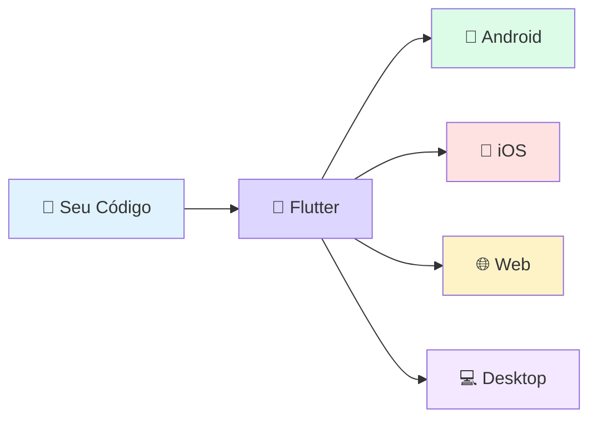

# 🚀 Desenvolvimento Cross-platform

📱 💻 🌐

Olá, futuro desenvolvedor! 👋 Vamos começar nossa jornada explorando como o mundo mobile funciona e por que criar aplicativos para múltiplos dispositivos é um dos maiores desafios — e oportunidades — da tecnologia atual.

    <h2>🎯 Um App, Muitas Telas</h2>
    
Imagine o poder de escrever seu código <strong>uma única vez</strong> e vê-lo rodando perfeitamente em um iPhone, um Android e até no navegador. Isso é o poder do desenvolvimento Cross-platform!

## 🤔 O que é desenvolvimento Cross-platform?

De forma simples, é a capacidade de construir e entregar aplicativos que funcionam em **múltiplas plataformas** (Android, iOS, Web, Desktop) usando uma **única base de código**. 

Em vez de escrever dois apps separados para Android e iOS, você escreve **um só**! 🎉

---

## 😰 Os Grandes Desafios

Se fosse fácil, todo mundo faria, certo? Criar apps que rodam em todo lugar traz complexidades que podem sobrecarregar até os desenvolvedores mais experientes.

    

### 1️⃣ Para o Desenvolvedor Solo

Para quem trabalha sozinho, o desafio é o **tempo** e o **conhecimento**. Aprender a **stack tecnológica** de cada plataforma é humanamente impossível em pouco tempo:

    

        <strong>🤖 Android</strong>
        
Java/Kotlin + Android Studio

        
Tempo de aprendizado: ~6 meses

    

    

        <strong>🍎 iOS</strong>
        
Objective-C/Swift + Xcode

        
Tempo de aprendizado: ~6 meses

    

    
⚠️ Realidade Dura

    Dominar tudo isso exige <strong>anos</strong>. Sem o cross-platform, o desenvolvedor solo fica limitado a apenas uma fatia do mercado.

### 2️⃣ Para as Empresas (Enterprises)

Nas grandes empresas, o problema muda de escala, tornando-se uma questão de **custo** e **sincronia**:

    

        <strong>💰 Custo Elevado</strong>
        
Manter equipes separadas para cada sistema <strong>dobra</strong> o custo de desenvolvimento e manutenção.

    

    

        <strong>🔄 Replicação de Esforço</strong>
        
Cada nova funcionalidade precisa ser programada, testada e corrigida <strong>duas ou três vezes</strong>.

    

---

## 💙 O Diferencial do Flutter

    
💡 A Solução Perfeita

    O Flutter nasceu para resolver <strong>exatamente</strong> esses problemas. Ele permite que você foque na <strong>lógica do negócio</strong> e no <strong>design</strong>, enquanto o framework cuida da "tradução" para cada plataforma com uma performance incrível.

### 📊 Comparação Rápida

| Aspecto | Desenvolvimento Nativo | Flutter Cross-platform |
|---------|----------------------|----------------------|
| **Linguagens** | 2+ (Swift, Kotlin) | 1 (Dart) |
| **Tempo de Dev** | 100% + 100% = 200% | 100% |
| **Equipe Necessária** | 2 times separados | 1 time unificado |
| **Manutenção** | Duplicada | Única |
| **Performance** | ⭐⭐⭐⭐⭐ | ⭐⭐⭐⭐⭐ |

---

## 🎯 Desafio do Mentor

    <h3 style="margin-top: 0;">💼 Situação Real</h3>
    
Imagine que você foi contratado por uma startup que tem pressa para lançar um app de entregas. Eles precisam estar no Android e iOS em <strong>3 meses</strong>, mas só têm orçamento para contratar <strong>um</strong> desenvolvedor.

    
<strong>🤔 Pergunta:</strong> Com base no que aprendemos hoje, qual seria o principal argumento técnico para convencê-los a usar uma tecnologia Cross-platform como o Flutter?

    
<strong>🔍 Ver Solução Sugerida</strong>

    

        
✅ <strong>Resposta:</strong> O argumento central é a <strong>Eficiência de Recurso e Tempo</strong>.

        
Como mentor, eu destacaria que:

        <ul>
            <li>📝 Uso de uma <strong>única base de código</strong> elimina a necessidade de aprender duas linguagens diferentes (Swift e Kotlin)</li>
            <li>⚡ Reduz o tempo de desenvolvimento pela <strong>metade</strong></li>
            <li>🎨 Garante que a interface do usuário seja <strong>idêntica</strong> em ambos os sistemas</li>
            <li>🚀 Acelera o lançamento (<strong>Time-to-Market</strong>)</li>
        </ul>
        

            
💰 Bônus Financeiro

            Com o orçamento de 1 desenvolvedor, eles terão um app completo para 2 plataformas. Se fossem contratar para desenvolvimento nativo, precisariam de 2 desenvolvedores ou o dobro do tempo!
        

    

---

## 📚 Recursos Adicionais

    
🔗 Links Úteis

    <ul>
        <li>📖 <a href="https://flutter.dev" target="_blank">Documentação Oficial do Flutter</a></li>
        <li>🎥 <a href="https://www.youtube.com/flutterdev" target="_blank">Canal Oficial no YouTube</a></li>
        <li>💬 <a href="https://discord.gg/flutter" target="_blank">Comunidade Flutter Brasil</a></li>
    </ul>

---

## ⏭️ O que vem por aí?

    
🎓 Próxima Aula

    Na próxima aula, vamos mergulhar em <strong>como o Flutter especificamente</strong> resolve cada um desses problemas de forma inovadora. Prepare-se para conhecer a arquitetura que está revolucionando o desenvolvimento mobile!
    
    **Spoiler:** Você vai se surpreender com o conceito de "tudo é um Widget"! 🧩

---

    <h3 style="color: white; margin: 0;">🎉 Parabéns por completar a Aula 01!</h3>
    
Continue sua jornada e se torne um desenvolvedor Flutter!

