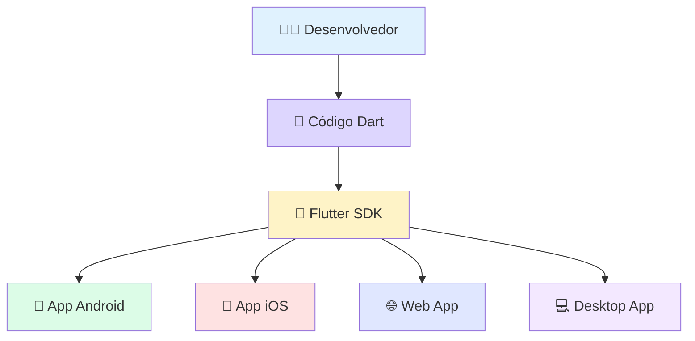
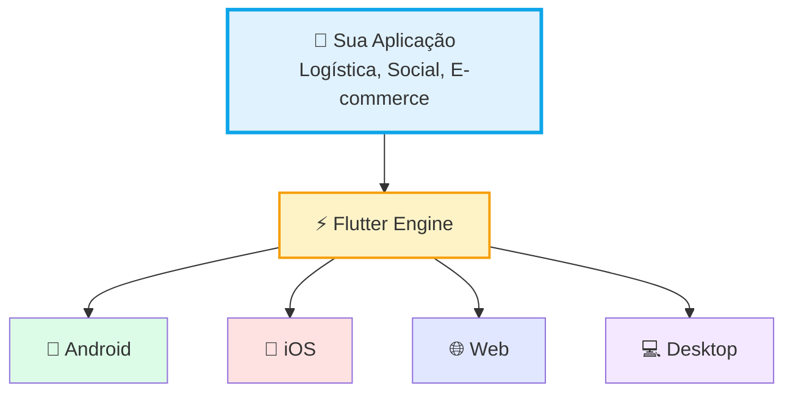

# 💙 O que é Flutter?

🚀 💻 ⚡

Depois de entendermos os desafios do mundo cross-platform, chegou a hora de conhecermos a ferramenta que **mudou o jogo**: o **Flutter**.

    <h2>🎯 Mais que uma Biblioteca</h2>
    
O Flutter é um SDK completo que permite criar aplicativos <strong>bonitos</strong>, compilados nativamente e <strong>extremamente rápidos</strong> a partir de um único código.

    
    
Desenvolvimento Ágil: Criando interfaces fluidas com o Google Flutter.

---

## 🔍 Definindo o Flutter

O **Flutter** é um SDK (Software Development Kit) de código aberto criado e mantido pelo **Google**. Ele não é apenas para "fazer telas", mas sim um **conjunto completo de ferramentas** para construir, testar e publicar apps.

    
🔑 Ponto Importante

    Os aplicativos Flutter são escritos na linguagem <strong>Dart</strong>, também desenvolvida pelo Google, focada em produtividade e UI responsiva.

---

## 🎁 Um Framework Completo

Diferente de outros frameworks que dependem de bibliotecas externas para tudo, o Flutter já traz **"no pacote"** o necessário para um app profissional:

    

        <strong>🎨 UI & Widgets</strong>
        
Uma biblioteca gigantesca de componentes prontos (Botões, Menus, Sliders).

    

    

        <strong>💾 Gerenciamento de Estado</strong>
        
Formas eficientes de controlar os dados que aparecem na tela.

    

    

        <strong>🔌 APIs de Hardware</strong>
        
Acesso fácil a Câmera, GPS, Bluetooth e Sensores.

    

    

        <strong>🧪 Testes & Navegação</strong>
        
Ferramentas robustas para garantir que o app não quebre e navegue entre telas suavemente.

    

---

## 💪 Como o Flutter nos ajuda?

A grande vantagem do Flutter é a **produtividade**. Ele ataca diretamente os problemas que vimos na aula anterior:

### ✅ Benefícios Principais:

*   **Single Code-base:** Escreva o código uma vez e publique para Android, iOS, Web e Desktop.
*   **Look & Feel Consistente:** Seus widgets terão a mesma aparência em qualquer dispositivo, ou você pode adaptá-los para parecer nativos com um clique.
*   **Custom Design:** O Flutter não tem limites. Se você consegue imaginar um design, você consegue construí-lo no Flutter sem gambiarras.

### 📊 Arquitetura Simplificada:

    
⚡ Performance Nativa

    O Flutter compila seu código Dart diretamente para <strong>código de máquina</strong>, garantindo que as animações rodem a 60 ou 120 frames por segundo, sem travamentos!

---

## 🎯 Desafio do Conhecimento

    <h3 style="margin-top: 0;">💬 Situação Real</h3>
    
Um cliente te pergunta: <em>"Mas se eu usar o Flutter, meu app vai parecer um 'site' dentro do celular ou ele vai ser rápido como um app de verdade?"</em>

    
<strong>🤔 Pergunta:</strong> Qual é a resposta correta baseada no fato do Flutter ser um SDK completo?

    
<strong>🔍 Ver Resposta do Mentor</strong>

    

        
✅ <strong>Resposta:</strong> Ele será <strong>rápido como um app nativo</strong>!

        
<strong>Por quê?</strong>

        <ul>
            <li>🚫 O Flutter <strong>NÃO</strong> usa uma "WebView" (como um site)</li>
            <li>⚙️ Ele compila seu código Dart diretamente para <strong>código de máquina</strong> (linguagem do processador)</li>
            <li>🎨 Tem seu próprio <strong>motor gráfico</strong> (Skia)</li>
            <li>⚡ Garante animações a <strong>60 ou 120 FPS</strong>, sem travamentos</li>
        </ul>
        

            
💡 Analogia

            É como comparar um carro elétrico (Flutter) com um carro a combustão (nativo). Ambos são rápidos, mas o Flutter é mais eficiente porque não precisa de "tradutores" entre o código e o hardware!
        

    

---

## 📚 Comparação: Flutter vs Outras Tecnologias

| Característica | Flutter | React Native | Desenvolvimento Nativo |
|----------------|---------|--------------|----------------------|
| **Linguagem** | Dart | JavaScript | Swift/Kotlin |
| **Performance** | ⭐⭐⭐⭐⭐ | ⭐⭐⭐⭐ | ⭐⭐⭐⭐⭐ |
| **Hot Reload** | ✅ Sim | ✅ Sim | ❌ Não |
| **UI Customizada** | ⭐⭐⭐⭐⭐ | ⭐⭐⭐ | ⭐⭐⭐⭐ |
| **Curva de Aprendizado** | Média | Fácil | Difícil |
| **Comunidade** | Grande | Muito Grande | Enorme |

---

## 🌟 Empresas que Usam Flutter

    

        <strong>🏪 Alibaba</strong>
        
Maior plataforma de e-commerce da China

    

    

        <strong>💳 Nubank</strong>
        
Banco digital brasileiro

    

    

        <strong>🚗 BMW</strong>
        
App de controle de veículos

    

    

        <strong>📺 Google Ads</strong>
        
Gerenciamento de campanhas

    

---

## ⏭️ O que vem por aí?

    
🚀 Próxima Aula

    Agora que você já sabe <strong>o que é o Flutter</strong>, na próxima aula vamos colocar a mão na massa e <strong>instalar o Flutter</strong> no seu computador!
    
    **Prepare-se para:** Configurar seu ambiente de desenvolvimento e rodar seu primeiro app! 🎉

---

    <h3 style="color: white; margin: 0;">🎉 Aula 02 Concluída!</h3>
    
Você agora entende o poder do Flutter. Próximo passo: instalação!

