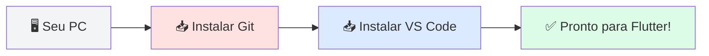
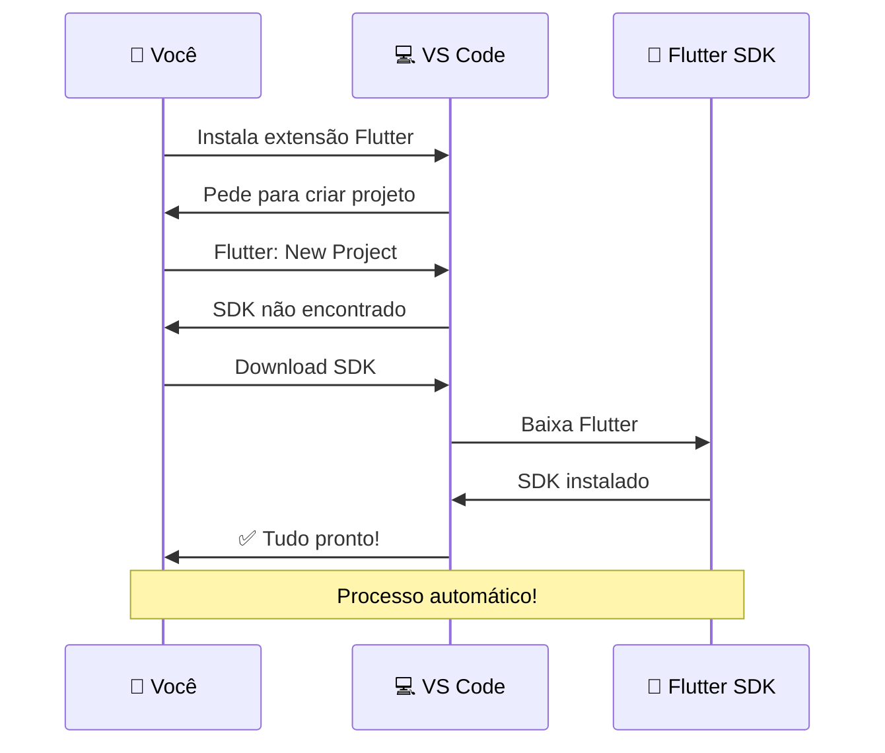

# 🛠️ Instalação do Flutter

Muitas pessoas travam na hora de configurar o ambiente de desenvolvimento. Mas não se preocupe! Hoje, o Flutter facilitou muito esse processo. Vamos transformar seu computador em uma **fábrica de aplicativos** em poucos passos.

<div class="hero-section">
    <h2>💪 Seu PC, Pronto para o Sucesso</h2>
    <p>Neste guia, vamos usar o método moderno: instalando tudo direto pelo <strong>VS Code</strong>. É mais rápido, mais simples e menos propenso a erros.</p>
</div>

<div class="architecture-diagram">
    
    <p style="text-align: center; font-size: 0.85rem; color: #64748b; margin-top: 10px;">Configuração: O primeiro passo para criar algo incrível.</p>
</div>

## 📋 Passo 1: Os Pré-requisitos Básicos

Antes de chamarmos o Flutter, precisamos de duas ferramentas essenciais que todo desenvolvedor usa:

<div class="grid-2">
    <div class="card" style="background: #f8fafc; border-left: 4px solid #ef4444;">
        <strong>1️⃣ Git (O Historiador)</strong>
        <p>O Flutter usa o Git para baixar seus arquivos. <a href="https://git-scm.com/downloads" target="_blank">Baixe e instale aqui</a> (basta clicar em 'Next' em tudo).</p>
    </div>
    <div class="card" style="background: #f8fafc; border-left: 4px solid #3b82f6;">
        <strong>2️⃣ VS Code (O Escritório)</strong>
        <p>É onde você vai escrever seu código. <a href="https://code.visualstudio.com/" target="_blank">Baixe o Visual Studio Code aqui</a>.</p>
    </div>
</div>



---

## ✨ Passo 2: O Toque de Mágica (Via VS Code)

Agora vem a parte fácil. Abra seu **VS Code** e siga estes mini-passos:

### 📝 Roteiro de Instalação:

1. Vá na aba de **Extensões** (o ícone de quadradinhos na lateral esquerda 🧩).
2. Pesquise por **Flutter** e clique em **Install**. Isso também instalará o suporte à linguagem Dart automaticamente.
3. Pressione as teclas `Ctrl + Shift + P` (ou `Cmd + Shift + P` no Mac) para abrir a Paleta de Comandos.
4. Digite **Flutter: New Project** e aperte Enter.
5. O VS Code dirá que não encontrou o SDK do Flutter. Clique no botão **Download SDK** que aparecerá.
6. Escolha uma pasta no seu computador para salvar o Flutter (Dica: evite pastas de sistema como 'Arquivos de Programas'. Crie uma pasta como `C:\dev`).

<div class="callout tip">
    <div class="callout-title">💡 Dica de Ouro</div>
    Aguarde o download terminar. O VS Code fará todo o trabalho pesado de configurar os caminhos (PATH) para você. Se ele pedir para "Add SDK to PATH", clique em <strong>Sim</strong>!
</div>



---

## 🩺 Passo 3: Verificando a Saúde (Flutter Doctor)

Para ter certeza de que tudo está perfeito, abra o terminal do VS Code (**Terminal > New Terminal**) e digite:

```bash
flutter doctor
```

O Flutter vai analisar seu sistema e mostrar uma lista. O objetivo é ter o máximo de **[✓]** verdinhos possível. Se houver algum **[✗]** em Android Studio ou Xcode agora, não se preocupe: você já pode começar a desenvolver para a **Web**!

### 📊 Exemplo de Saída:

```
Doctor summary (to see all details, run flutter doctor -v):
[✓] Flutter (Channel stable, 3.x.x)
[✓] Windows Version (Installed version of Windows is version 10 or higher)
[✓] Chrome - develop for the web
[✗] Android toolchain - develop for Android devices
    ✗ Android SDK not found
[✓] VS Code (version 1.x.x)
[✓] Connected device (1 available)
```

<div class="callout info">
    <div class="callout-title">ℹ️ Interpretando os Resultados</div>
    <ul>
        <li>✅ <strong>[✓]</strong> = Tudo certo!</li>
        <li>⚠️ <strong>[!]</strong> = Funciona, mas pode melhorar</li>
        <li>❌ <strong>[✗]</strong> = Precisa de atenção (mas não impede de começar!)</li>
    </ul>
</div>

---

## 🎮 Passo 4: Seu Primeiro Test-Drive

Quer ver a mágica acontecer agora? No seu projeto novo:

1. Na barra inferior do VS Code, clique onde diz "Windows" ou "No Device" e selecione **Chrome**.
2. Pressione a tecla **F5**.
3. Aguarde alguns segundos e... **VOILÀ!** Seu primeiro app Flutter está rodando no navegador.

<div class="callout tip">
    <div class="callout-title">⚡ Hot Reload em Ação</div>
    Experimente mudar algo no código (por exemplo, o texto "Flutter Demo Home Page") e salve o arquivo (<code>Ctrl+S</code>). Veja a mudança aparecer <strong>instantaneamente</strong> no navegador sem precisar reiniciar o app!
</div>

---

## ⏭️ Próximos Passos

<div class="callout info">
    <div class="callout-title">🎓 O que vem agora?</div>
    Agora que o SDK do Flutter está no seu computador, precisamos configurar os emuladores e o Android Studio para que você possa testar seus apps em celulares reais.
    
    Na **Próxima Aula**, vamos preparar o terreno para o mobile! 🎉
</div>

---

<div style="text-align: center; padding: 40px 0; background: linear-gradient(135deg, #0284c7 0%, #0ea5e9 100%); border-radius: 12px; color: white; margin-top: 40px;">
    <h3 style="color: white; margin: 0;">🎉 Flutter SDK Instalado!</h3>
    <p style="margin: 10px 0 0 0;">O coração do seu desenvolvimento já está batendo. Vamos configurar as ferramentas agora!</p>
</div>
