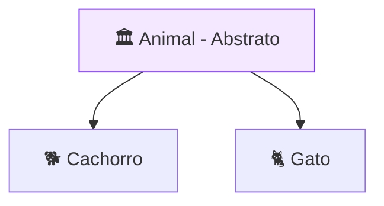

# 🏗️ Orientação a Objetos em Dart

<div style="text-align: center; font-size: 3rem; margin: 20px 0;">
🏛️ 🧬 🧱
</div>

O Flutter é inteiramente baseado em **Orientação a Objetos (POO)**. Cada Widget que você usa é uma instância de uma classe. Dominar POO é a chave mestra para criar aplicativos organizados, fáceis de manter e reutilizáveis.

<div class="hero-section" style="background: linear-gradient(135deg, #7c3aed 0%, #4f46e5 100%);">
    <h2>🎯 Modelando o Mundo Real</h2>
    <p>Classes são como "plantas" ou "moldes", e objetos são as "construções" reais feitas a partir desses moldes. Vamos aprender a criar nossos próprios moldes!</p>
</div>

---

## 1️⃣ Classes e Construtores

O Dart possui um visual muito limpo para classes. Veja como criamos um "molde" para um usuário:

```dart
class Usuario {
  String nome;
  int? idade; // O '?' significa que a idade pode ser nula

  // Construtor simplificado (Sugar Syntax)
  Usuario(this.nome, {this.idade});

  // Construtor Nomeado (Muito comum no Flutter)
  Usuario.convidado() : nome = "Convidado", idade = 0;

  void saudar() => print("Olá, eu sou $nome!");
}

void main() {
  var user1 = Usuario("Welton", idade: 18);
  var user2 = Usuario.convidado();
  
  user1.saudar(); // Olá, eu sou Welton!
}
```

<div class="callout tip">
    <div class="callout-title">💡 Dica de Flutter</div>
    Você verá construtores nomeados o tempo todo no Flutter. Exemplo: <code>EdgeInsets.all(10)</code> ou <code>MainAxisAlignment.center</code>.
</div>

---

## 2️⃣ Herança e Classes Abstratas

Deseja criar um comportamento padrão que várias outras classes vão compartilhar? Use a **Herança**.



```dart
abstract class Animal {
  void emitirSom(); // Cada animal fará o seu próprio som
}

class Cachorro extends Animal {
  @override
  void emitirSom() => print("Au Au!");
}
```

---

## 3️⃣ Mixins: Os Superpoderes do Dart

Mixins permitem "plugar" funcionalidades em uma classe sem precisar de herança complexa. É como dar uma habilidade extra para um personagem.

```dart
mixin Caminhante {
  void andar() => print("Estou caminhando...");
}

class Humano extends Animal with Caminhante {
  @override
  void emitirSom() => print("Olá!");
}
```

<div class="callout info">
    <div class="callout-title">ℹ️ No Flutter</div>
    Usamos mixins para coisas avançadas, como controlar animações (<code>with SingleTickerProviderStateMixin</code>).
</div>

---

## 🎯 Desafio de Arquitetura

<div class="challenge-box">
    <h3 style="margin-top: 0;">🛠️ Engenheiro de Pagamentos</h3>
    <p>Você está criando um sistema de pagamentos. Tem uma classe abstrata <code>Pagamento</code> com o método <code>processar()</code>. Como você criaria uma classe <code>CartaoCredito</code> que herda de Pagamento e usa um mixin chamado <code>Seguranca</code>?</p>
</div>

<details class="solution-details">
    <summary><strong>🔍 Ver Solução</strong></summary>
    <div class="solution-content">
        <pre><code class="language-dart">abstract class Pagamento {
  void processar();
}

mixin Seguranca {
  void validarToken() => print("Token validado!");
}

class CartaoCredito extends Pagamento with Seguranca {
  @override
  void processar() {
    validarToken();
    print("Processando via Cartão...");
  }
}</code></pre>
    </div>
</details>

---

## ⏭️ O que vem por aí?

<div class="callout info">
    <div class="callout-title">🚀 Próxima Etapa</div>
    Agora que você domina a fundação da linguagem (Dart e POO), estamos prontos para mergulhar nos <strong>Fundamentos do Flutter</strong> e criar interfaces que se movem de verdade!
</div>

---

<div style="text-align: center; padding: 40px 0; background: linear-gradient(135deg, #7c3aed 0%, #4f46e5 100%); border-radius: 12px; color: white; margin-top: 40px;">
    <h3 style="color: white; margin: 0;">🎉 Mestre da Orientação a Objetos!</h3>
    <p style="margin: 10px 0 0 0;">Você agora entende como as peças do Flutter são construídas!</p>
</div>
