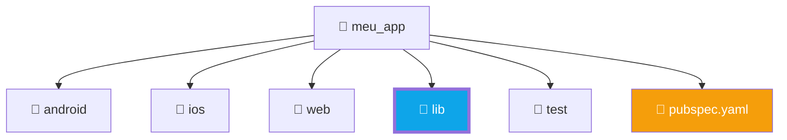

# 📂 Estrutura do Projeto Flutter

📁 🏗️ ⚙️

Agora que você tem o ambiente pronto, ao criar seu primeiro projeto (`flutter create meu_app`), você se deparará com uma série de pastas e arquivos. Entender o que cada um faz é fundamental para não se perder no desenvolvimento.

    <h2>🎯 O Mapa da Mina</h2>
    
Vamos explorar as entranhas de um projeto Flutter. Você verá que, embora pareça complexo, você passará 90% do seu tempo em apenas um lugar!

---

## 🗺️ As Pastas do Projeto

    

### 1️⃣ `lib/` (A Joia da Coroa) 💎
Esta é a pasta **mais importante**. É aqui que todo o seu código Dart viverá. O arquivo principal é o `main.dart`, que é o ponto de partida do seu aplicativo.

### 2️⃣ `android/` e `ios/`
Contêm os arquivos específicos de cada plataforma. Você raramente precisará mexer aqui, a menos que precise configurar permissões especiais (como câmera ou GPS) ou mudar o ícone do app.

### 3️⃣ `pubspec.yaml` (O Gerente) 📄
Este é o arquivo de configuração do seu projeto. É aqui que você:
- Define o nome e versão do app.
- Adiciona pacotes e bibliotecas externas.
- Declara assets como **imagens** e **fontes**.

---

## 🛠️ Ferramentas Visuais do VS Code

O Flutter no VS Code oferece painéis que ajudam muito:

- **Flutter Outline**: Mostra a hierarquia de widgets da tela atual.
- **Flutter DevTools**: Uma suíte de diagnóstico no navegador para inspecionar performance e layout.

    
💡 Dica do Mentor

    Sempre que o seu app se comportar de forma estranha após você adicionar uma nova biblioteca no <code>pubspec.yaml</code>, rode o comando <code>flutter pub get</code> no terminal para atualizar as dependências!

---

## 🎯 Desafio de Organização

    <h3 style="margin-top: 0;">🤔 Onde eu coloco?</h3>
    
Se você baixou uma imagem de um logo para usar no seu app, em qual arquivo você deve avisar ao Flutter que essa imagem existe?

    
<strong>🔍 Ver Resposta</strong>

    

        
✅ No arquivo <strong><code>pubspec.yaml</code></strong>, dentro da seção <code>assets:</code>.

    

---

    <h3 style="color: white; margin: 0;">🎉 Projeto Mapeado!</h3>
    
Agora que você conhece a casa, vamos aprender a falar a língua dela: o Dart!

