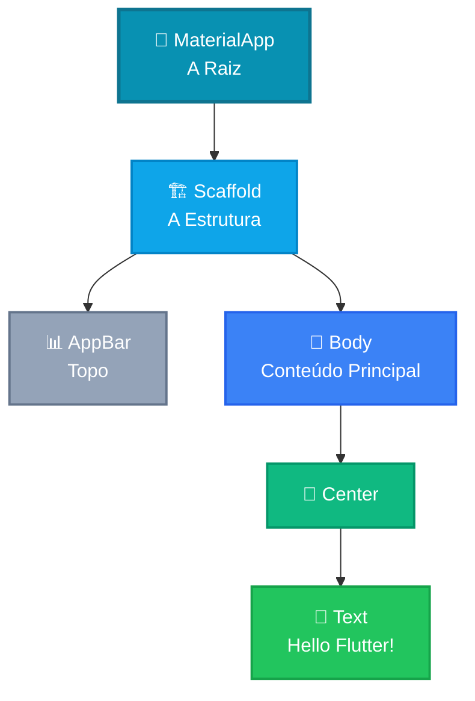
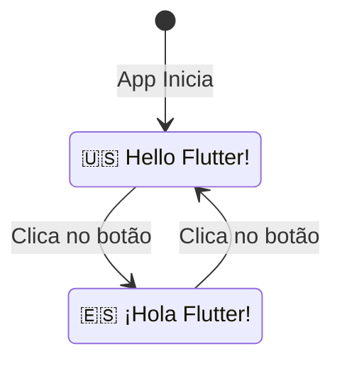

# 👋 Hello Flutter App

<div style="text-align: center; font-size: 3rem; margin: 20px 0;">
🚀 📱 ✨
</div>

Chegou o momento que todo desenvolvedor espera: o **primeiro contato real com o código**! 🚀 Nesta aula, vamos entender como um aplicativo Flutter é estruturado e criar um app que diz "Olá" em duas línguas diferentes.

<div class="hero-section">
    <h2>🎯 Seu Primeiro App Interativo</h2>
    <p>Vamos construir o "Hello Flutter App". Um aplicativo simples, mas que carrega <strong>todos os conceitos fundamentais</strong> que você usará pelo resto da sua carreira como desenvolvedor mobile.</p>
</div>

<div class="architecture-diagram">
    
    <p style="text-align: center; font-size: 0.85rem; color: #64748b; margin-top: 10px;">Aprenda Flutter do jeito que quiser.</p>
</div>

---

## 🎯 Objetivos de Aprendizado

Ao final desta lição, você terá uma compreensão clara de como o Flutter organiza as peças do quebra-cabeça. Vamos passar por:

<div class="grid-2">
    <div class="card" style="background: #f0fdfa; border-left: 4px solid #14b8a6;">
        <strong>🚀 Ponto de Entrada</strong>
        <p>Onde tudo começa (a função <code>main</code>).</p>
    </div>
    <div class="card" style="background: #f0fdfa; border-left: 4px solid #06b6d4;">
        <strong>🧱 Widget Tree</strong>
        <p>A hierarquia de <code>MaterialApp</code>, <code>Scaffold</code> e <code>AppBar</code>.</p>
    </div>
    <div class="card" style="background: #f0fdfa; border-left: 4px solid #8b5cf6;">
        <strong>🛡️ SafeArea</strong>
        <p>Garantindo que seu app não fique sob o "notch" ou notificações.</p>
    </div>
    <div class="card" style="background: #f0fdfa; border-left: 4px solid #f59e0b;">
        <strong>⚡ Stateless vs Stateful</strong>
        <p>Entendendo widgets estáticos vs widgets que mudam de estado.</p>
    </div>
</div>

---

## 🏗️ A Anatomia do App: O Scaffold

Pense no `Scaffold` como o **"esqueleto"** da sua tela. Ele oferece os espaços prontos para você colocar o que desejar.



<div class="callout tip">
    <div class="callout-title">💡 Dica do Mentor</div>
    No Flutter, nós não "desenhamos" pixels. Nós compomos uma <strong>árvore de widgets</strong>. Cada widget é uma instrução para o Flutter sobre como a tela deve parecer.
</div>

---

## 🧩 Estrutura Básica de um App Flutter

Vamos entender cada camada:

### 1️⃣ MaterialApp - A Raiz

```dart
MaterialApp(
  title: 'Hello Flutter',
  theme: ThemeData(
    primarySwatch: Colors.blue,
  ),
  home: MyHomePage(),
)
```

**O que faz:**
- 🎨 Define o tema visual do app
- 📱 Configura a navegação
- 🌍 Define a página inicial (`home`)

### 2️⃣ Scaffold - A Estrutura

```dart
Scaffold(
  appBar: AppBar(
    title: Text('Hello Flutter'),
  ),
  body: Center(
    child: Text('Olá Mundo!'),
  ),
)
```

**O que faz:**
- 📊 Fornece a barra superior (AppBar)
- 📄 Define a área de conteúdo (body)
- 🔽 Pode ter drawer, bottom navigation, etc.

### 3️⃣ Center & Text - O Conteúdo

```dart
Center(
  child: Text(
    'Hello Flutter!',
    style: TextStyle(fontSize: 24),
  ),
)
```

**O que faz:**
- 🎯 Centraliza o conteúdo
- 📝 Exibe texto na tela

---

## 🔄 Funcionalidade: O Toggle de Idioma

O "pulo do gato" da nossa Hello Flutter App é a **interatividade**. Vamos usar um botão de "refresh" no canto superior direito (no `AppBar`) que, ao ser clicado, alterna a saudação entre Inglês e Espanhol.



<div class="callout warning">
    <div class="callout-title">⚡ Por que isso é importante?</div>
    Porque para o texto mudar, o widget precisa ser <strong>Stateful</strong>. Se fosse apenas exibição estática, um <strong>Stateless</strong> bastaria.
</div>

---

## 📊 Stateless vs Stateful: A Diferença Crucial

| Característica | StatelessWidget | StatefulWidget |
|----------------|-----------------|----------------|
| **Muda com o tempo?** | ❌ Não | ✅ Sim |
| **Tem estado interno?** | ❌ Não | ✅ Sim (State) |
| **Exemplo** | Logo, Ícone, Texto fixo | Contador, Formulário, Toggle |
| **Performance** | ⚡ Mais rápido | 🔄 Precisa rebuild |
| **Uso** | 70% dos widgets | 30% dos widgets |

### 🔍 Exemplo Visual:

```dart
// ❌ STATELESS - Não muda
class LogoWidget extends StatelessWidget {
  @override
  Widget build(BuildContext context) {
    return Image.asset('logo.png');
  }
}

// ✅ STATEFUL - Muda quando clicado
class CounterWidget extends StatefulWidget {
  @override
  _CounterWidgetState createState() => _CounterWidgetState();
}

class _CounterWidgetState extends State<CounterWidget> {
  int counter = 0;
  
  @override
  Widget build(BuildContext context) {
    return Text('Contador: $counter');
  }
}
```

---

## 🎯 Desafio de Análise

<div class="challenge-box">
    <h3 style="margin-top: 0;">🤔 Pense Nisso</h3>
    <p>Observe a dinâmica descrita: <em>"Ao clicar no ícone, a mensagem central muda"</em>.</p>
    <p><strong>Pergunta:</strong> Se tivéssemos apenas o texto estático "Hello Flutter!", poderíamos usar um StatelessWidget. Mas como queremos alternar idiomas ao clicar, qual widget é OBRIGATÓRIO para gerenciar essa mudança?</p>
</div>

<details class="solution-details">
    <summary><strong>🔍 Ver Resposta do Mentor</strong></summary>
    <div class="solution-content">
        <p>✅ <strong>Resposta:</strong> O <code>StatefulWidget</code>!</p>
        <p><strong>Por quê?</strong></p>
        <ul>
            <li>📝 No Flutter, quando um dado precisa mudar e refletir essa mudança na tela após a interação do usuário, precisamos de um "estado" (State)</li>
            <li>🔄 O <code>StatefulWidget</code> nos permite avisar ao Flutter que algo mudou</li>
            <li>⚡ O Flutter então redesenha apenas o que for necessário (eficiente!)</li>
        </ul>
        <div class="callout tip">
            <div class="callout-title">💡 Regra de Ouro</div>
            <p><strong>Se muda, é Stateful. Se não muda, é Stateless.</strong></p>
            <p>Simples assim! 😊</p>
        </div>
    </div>
</details>

---

## 🔑 Conceitos-Chave Desta Aula

<div class="grid-2">
    <div class="card card-red">
        <strong>🏗️ Scaffold</strong>
        <p>Estrutura básica de uma tela com AppBar, Body, etc.</p>
    </div>
    <div class="card card-amber">
        <strong>🌳 Widget Tree</strong>
        <p>Hierarquia de widgets que formam a UI</p>
    </div>
    <div class="card" style="background: #dcfce7; border-left-color: #10b981;">
        <strong>⚡ State</strong>
        <p>Dados que podem mudar durante a vida do widget</p>
    </div>
    <div class="card" style="background: #e0e7ff; border-left-color: #6366f1;">
        <strong>🔄 Rebuild</strong>
        <p>Processo de atualizar a UI quando o estado muda</p>
    </div>
</div>

---

## 📚 Código Completo (Preview)

Aqui está uma prévia do que vamos construir na próxima aula:

```dart
import 'package:flutter/material.dart';

void main() => runApp(MyApp());

class MyApp extends StatelessWidget {
  @override
  Widget build(BuildContext context) {
    return MaterialApp(
      title: 'Hello Flutter',
      home: HelloPage(),
    );
  }
}

class HelloPage extends StatefulWidget {
  @override
  _HelloPageState createState() => _HelloPageState();
}

class _HelloPageState extends State<HelloPage> {
  bool isEnglish = true;
  
  void toggleLanguage() {
    setState(() {
      isEnglish = !isEnglish;
    });
  }
  
  @override
  Widget build(BuildContext context) {
    return Scaffold(
      appBar: AppBar(
        title: Text('Hello Flutter'),
        actions: [
          IconButton(
            icon: Icon(Icons.refresh),
            onPressed: toggleLanguage,
          ),
        ],
      ),
      body: Center(
        child: Text(
          isEnglish ? 'Hello Flutter!' : '¡Hola Flutter!',
          style: TextStyle(fontSize: 32),
        ),
      ),
    );
  }
}
```

---

## ⏭️ O que vem por aí?

<div class="callout info">
    <div class="callout-title">🚀 Próxima Aula</div>
    Na próxima aula, vamos abrir o editor e começar a <strong>digitar as primeiras linhas de código</strong> para ver esse "Hello Flutter" ganhar vida!
    
    **Prepare-se para:** Escrever código Dart, entender a estrutura de arquivos e ver seu app rodando! 🎉
</div>

---

<div style="text-align: center; padding: 40px 0; background: linear-gradient(135deg, #06b6d4 0%, #0891b2 100%); border-radius: 12px; color: white; margin-top: 40px;">
    <h3 style="color: white; margin: 0;">🎉 Conceitos Fundamentais Dominados!</h3>
    <p style="margin: 10px 0 0 0;">Você agora entende a estrutura de um app Flutter. Hora de codar!</p>
</div>
