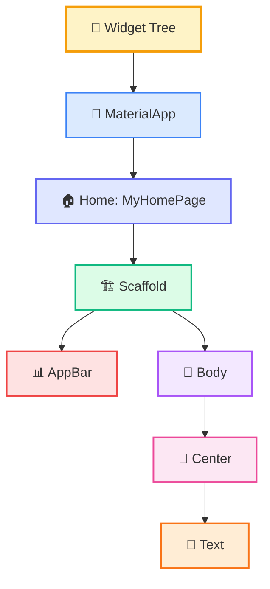
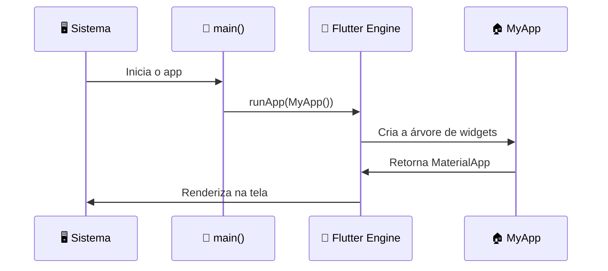
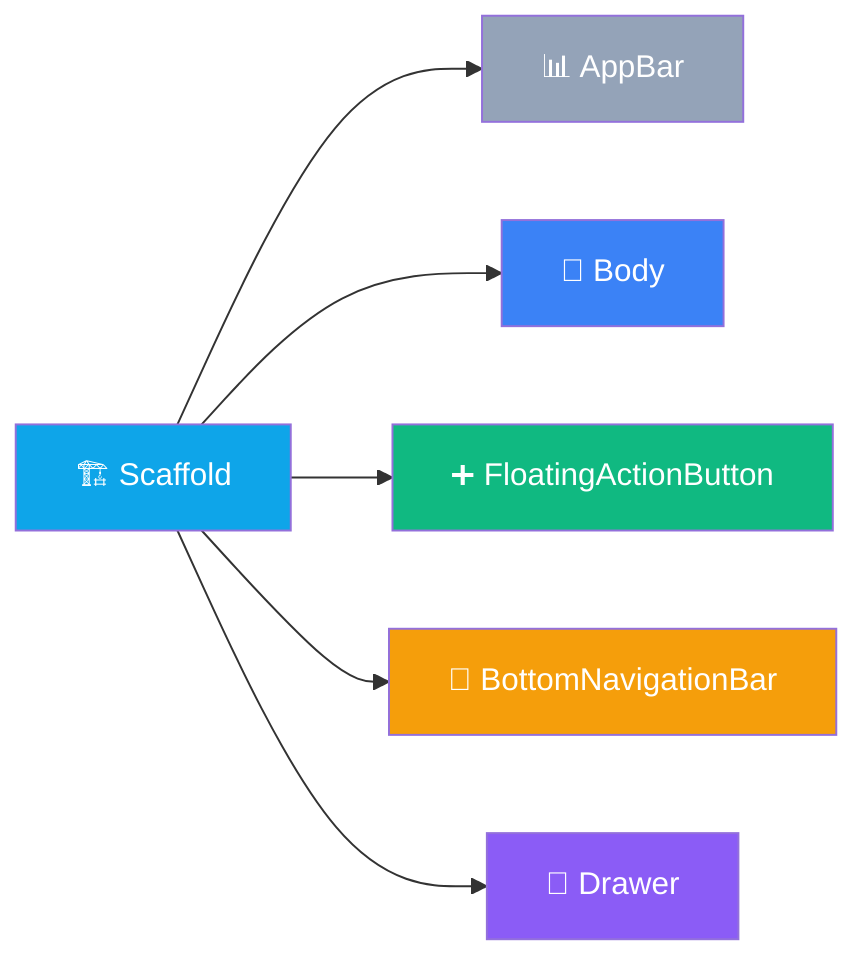

# 🔍 Anatomia do App Flutter

<div style="text-align: center; font-size: 3rem; margin: 20px 0;">
🧬 🔬 🎨
</div>

Agora que você entende a estrutura básica, vamos mergulhar mais fundo e **dissecar** um aplicativo Flutter linha por linha. É hora de entender o "porquê" por trás de cada pedaço de código!

<div class="hero-section">
    <h2>🎯 Desvendando o Código</h2>
    <p>Vamos abrir o capô e ver como o motor funciona. Cada linha tem um propósito, e você vai dominar todos eles!</p>
</div>

---

## 🌳 A Árvore de Widgets

No Flutter, **tudo é um Widget**. Mas o que isso realmente significa?



<div class="callout tip">
    <div class="callout-title">💡 Conceito-Chave</div>
    A árvore de widgets é como uma família: cada widget é um "pai" que pode ter "filhos". O Flutter percorre essa árvore para desenhar a tela.
</div>

---

## 📦 Importações e Dependências

Todo app Flutter começa com importações:

```dart
import 'package:flutter/material.dart';
```

**O que isso faz:**
- 📚 Importa a biblioteca Material Design
- 🎨 Dá acesso a todos os widgets visuais
- 🛠️ Inclui ferramentas essenciais do Flutter

<div class="callout info">
    <div class="callout-title">ℹ️ Material Design</div>
    É o sistema de design do Google. Inclui botões, cards, navegação e muito mais, tudo pronto para usar!
</div>

---

## 🚀 O Ponto de Entrada: main()

```dart
void main() {
  runApp(MyApp());
}
```

**Análise linha por linha:**

| Linha | O que faz |
|-------|-----------|
| `void main()` | Função principal - onde tudo começa |
| `runApp()` | Diz ao Flutter: "Execute este widget!" |
| `MyApp()` | Seu widget raiz personalizado |



---

## 🏠 O Widget Raiz: MaterialApp

```dart
class MyApp extends StatelessWidget {
  @override
  Widget build(BuildContext context) {
    return MaterialApp(
      title: 'Flutter Demo',
      theme: ThemeData(
        primarySwatch: Colors.blue,
      ),
      home: MyHomePage(title: 'Flutter Demo Home Page'),
    );
  }
}
```

### 🔍 Dissecando o MaterialApp:

<div class="grid-2">
    <div class="card" style="background: #dbeafe; border-left-color: #3b82f6;">
        <strong>📱 title</strong>
        <p>Nome do app (aparece no gerenciador de tarefas)</p>
    </div>
    <div class="card" style="background: #f3e8ff; border-left-color: #a855f7;">
        <strong>🎨 theme</strong>
        <p>Define cores e estilos globais</p>
    </div>
    <div class="card" style="background: #dcfce7; border-left-color: #10b981;">
        <strong>🏠 home</strong>
        <p>A primeira tela que o usuário vê</p>
    </div>
    <div class="card" style="background: #fee2e2; border-left-color: #ef4444;">
        <strong>🌍 locale</strong>
        <p>Idioma e região (opcional)</p>
    </div>
</div>

---

## 🏗️ O Scaffold: Estrutura da Tela

```dart
Scaffold(
  appBar: AppBar(
    title: Text(widget.title),
  ),
  body: Center(
    child: Column(
      mainAxisAlignment: MainAxisAlignment.center,
      children: <Widget>[
        Text('You have pushed the button this many times:'),
        Text(
          '$_counter',
          style: Theme.of(context).textTheme.headline4,
        ),
      ],
    ),
  ),
  floatingActionButton: FloatingActionButton(
    onPressed: _incrementCounter,
    tooltip: 'Increment',
    child: Icon(Icons.add),
  ),
)
```

### 📊 Componentes do Scaffold:



---

## 🎯 Center e Column: Organizando o Layout

```dart
Center(
  child: Column(
    mainAxisAlignment: MainAxisAlignment.center,
    children: <Widget>[
      Text('Texto 1'),
      Text('Texto 2'),
    ],
  ),
)
```

**O que cada um faz:**

| Widget | Função | Analogia |
|--------|--------|----------|
| `Center` | Centraliza o filho | 🎯 Mira no centro |
| `Column` | Empilha verticalmente | 📚 Pilha de livros |
| `Row` | Alinha horizontalmente | ↔️ Fila de pessoas |

<div class="callout warning">
    <div class="callout-title">⚠️ Pai e Filho</div>
    No Flutter, widgets têm uma relação <strong>pai-filho</strong>. O <code>Center</code> é pai do <code>Column</code>, que é pai dos <code>Text</code>s.
</div>

---

## 🔄 StatefulWidget: Gerenciando Estado

```dart
class MyHomePage extends StatefulWidget {
  MyHomePage({Key? key, required this.title}) : super(key: key);
  
  final String title;

  @override
  _MyHomePageState createState() => _MyHomePageState();
}

class _MyHomePageState extends State<MyHomePage> {
  int _counter = 0;

  void _incrementCounter() {
    setState(() {
      _counter++;
    });
  }

  @override
  Widget build(BuildContext context) {
    // ... código do Scaffold
  }
}
```

### 🔑 Conceitos-Chave:

<div class="grid-2">
    <div class="card card-red">
        <strong>📦 StatefulWidget</strong>
        <p>Widget que pode mudar</p>
    </div>
    <div class="card card-amber">
        <strong>🔄 State</strong>
        <p>Classe que guarda os dados mutáveis</p>
    </div>
    <div class="card" style="background: #dcfce7; border-left-color: #10b981;">
        <strong>⚡ setState()</strong>
        <p>Avisa o Flutter para redesenhar</p>
    </div>
    <div class="card" style="background: #e0e7ff; border-left-color: #6366f1;">
        <strong>🏗️ build()</strong>
        <p>Constrói a UI</p>
    </div>
</div>

---

## 🎯 Desafio de Código

<div class="challenge-box">
    <h3 style="margin-top: 0;">🧩 Complete o Código</h3>
    <p>Dado o código abaixo, identifique qual widget está faltando para que o texto fique centralizado:</p>
    <pre><code class="language-dart">Scaffold(
  body: ???(
    child: Text('Olá Mundo!'),
  ),
)</code></pre>
</div>

<details class="solution-details">
    <summary><strong>🔍 Ver Solução</strong></summary>
    <div class="solution-content">
        <p>✅ <strong>Resposta:</strong> <code>Center</code></p>
        <pre><code class="language-dart">Scaffold(
  body: Center(
    child: Text('Olá Mundo!'),
  ),
)</code></pre>
        <p><strong>Por quê?</strong> O <code>Center</code> é o widget responsável por centralizar seu filho na tela!</p>
    </div>
</details>

---

## 📚 Resumo da Anatomia

| Componente | Papel | Obrigatório? |
|------------|-------|--------------|
| `main()` | Ponto de entrada | ✅ Sim |
| `MaterialApp` | Raiz do app | ✅ Sim |
| `Scaffold` | Estrutura da tela | ⚠️ Recomendado |
| `AppBar` | Barra superior | ❌ Opcional |
| `Body` | Conteúdo principal | ✅ Sim |
| `StatefulWidget` | Para dados mutáveis | ⚠️ Quando necessário |

---

## ⏭️ O que vem por aí?

<div class="callout info">
    <div class="callout-title">🚀 Próxima Aula</div>
    Agora que você entende a anatomia, vamos <strong>criar nosso primeiro projeto do zero</strong> e ver tudo isso funcionando na prática!
    
    **Prepare-se para:** Criar um projeto, entender a estrutura de pastas e rodar seu primeiro app personalizado! 🎉
</div>

---

<div style="text-align: center; padding: 40px 0; background: linear-gradient(135deg, #8b5cf6 0%, #7c3aed 100%); border-radius: 12px; color: white; margin-top: 40px;">
    <h3 style="color: white; margin: 0;">🎉 Anatomia Dominada!</h3>
    <p style="margin: 10px 0 0 0;">Você agora sabe como cada peça se encaixa. Vamos construir!</p>
</div>
