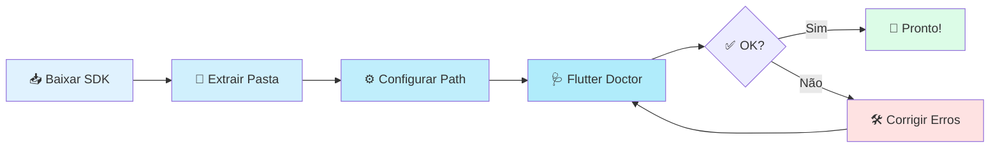
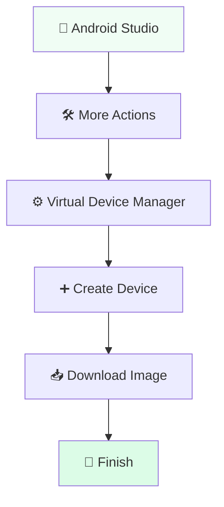

# 🏗️ Criando um Projeto Flutter

<div style="text-align: center; font-size: 3rem; margin: 20px 0;">
🛠️ 💻 🚀
</div>

Antes de criarmos nosso primeiro aplicativo, precisamos garantir que sua **"oficina"** esteja pronta. Nesta aula, vamos cobrir desde a instalação das ferramentas até o entendimento profundo da estrutura de um projeto profissional.

<div class="hero-section">
    <h2>🎯 Sua Bancada de Trabalho</h2>
    <p>Vamos configurar o ambiente de desenvolvimento perfeito no Windows e dissecarmos a anatomia de um projeto Flutter profissional.</p>
</div>

---

## 1️⃣ Preparando o Terreno (Windows)

Para desenvolver em Flutter, você precisa de três ingredientes principais: o **SDK do Flutter**, um **Editor de Código** e o **Git**.

<div class="grid-2">
    <div class="card" style="background: #f8fafc; border-left: 4px solid #0ea5e9;">
        <strong>🛠️ 1. O SDK do Flutter</strong>
        <p>Baixe o <a href="https://storage.googleapis.com/flutter_infra_release/releases/stable/windows/flutter_windows_stable.zip" target="_blank">Flutter SDK (Zip)</a>. Extraia para <code>C:\src\flutter</code> e adicione a pasta <code>bin</code> ao seu <strong>Path</strong>.</p>
    </div>
    <div class="card" style="background: #f8fafc; border-left: 4px solid #10b981;">
        <strong>🩺 2. O Checkup Médico</strong>
        <p>Rode o comando <code>flutter doctor</code> no terminal. Ele é o seu "médico" particular que dirá o que falta instalar.</p>
    </div>
</div>



---

## ⚔️ Escolhendo sua Arma: IDEs

O Flutter funciona perfeitamente nos dois principais editores. Qual deles combina mais com você?

<div class="grid-2">
    <div class="card" style="border-top: 5px solid #007acc;">
        <h3 style="margin-top: 0;">🔵 Visual Studio Code</h3>
        <p><strong>Ideal para:</strong> Computadores mais leves e velocidade.</p>
        <ul>
            <li>Instale as extensões: <strong>Flutter</strong> e <strong>Dart</strong>.</li>
            <li>Use <code>Ctrl + Shift + P</code> para criar projetos rapidamente.</li>
            <li>Configure o <strong>Error Lens</strong> para ver erros em tempo real.</li>
        </ul>
    </div>
    <div class="card" style="border-top: 5px solid #3ddc84;">
        <h3 style="margin-top: 0;">🟢 Android Studio</h3>
        <p><strong>Ideal para:</strong> Quem quer ferramentas robustas e integradas.</p>
        <ul>
            <li>Instale o plugin do <strong>Flutter</strong> no menu Settings.</li>
            <li>Gerencie seus emuladores com facilidade no Device Manager.</li>
            <li>Interface completa com tudo "na mão".</li>
        </ul>
    </div>
</div>

---

## 📱 Configurando o Emulador (AVD)

Para ver seu app rodando sem precisar de um celular físico, usamos o **celular virtual**.



<div class="callout tip">
    <div class="callout-title">💡 Dica de Desenvolvedor</div>
    Se seu PC for um pouco mais lento, você pode usar seu próprio celular via cabo USB! Basta ativar a <strong>Depuração USB</strong> nas configurações de desenvolvedor do seu Android. O app roda muito mais fluido!
</div>

---

## 📂 Estrutura de Projetos (Deep Dive)

Ao criar um projeto, você verá uma selva de pastas. Vamos aprender a navegar nela como um profissional!

<div style="background: #1e293b; color: #e2e8f0; border-radius: 8px; padding: 25px; font-family: monospace; font-size: 0.9rem; margin: 25px 0;">
    📂 meu_app/<br>
    ├── 📂 android/ <span style="color: #94a3b8;"># Cérebro do Android (Configurações nativas)</span><br>
    ├── 📂 ios/ <span style="color: #94a3b8;"># Cérebro do iOS</span><br>
    ├── 📂 <strong style="color: #4ade80;">lib/</strong> <span style="color: #4ade80;"># 🏠 AQUI FICA SEU CÓDIGO! (Onde a mágica acontece)</span><br>
    │   └── 📄 main.dart <span style="color: #94a3b8;"># Ponto de partida</span><br>
    ├── 📂 test/ <span style="color: #94a3b8;"># Onde testamos se nada quebrou</span><br>
    ├── 📄 <strong style="color: #fca5a5;">pubspec.yaml</strong> <span style="color: #fca5a5;"># 📜 Lista de ingredientes (Plugin e Imagens)</span><br>
    └── 📄 .gitignore <span style="color: #94a3b8;"># O que o Git deve ignorar</span>
</div>

### 📜 O Arquivo `pubspec.yaml`

Este é o arquivo de configuração mais importante. Se você quer instalar um banco de dados ou usar uma imagem personalizada, é aqui que deve vir.

```yaml
name: meu_app
description: Um novo projeto Flutter fantástico!

dependencies:
  flutter:
    sdk: flutter
  google_fonts: ^5.0.0  # Usando fontes lindas do Google

flutter:
  uses-material-design: true
  assets:
    - assets/images/logo.png  # Suas imagens ficam aqui!
```

<div class="callout warning">
    <div class="callout-title">⚠️ Cuidado com os Espaços!</div>
    O arquivo YAML é extremamente sensível. Um espaço a mais ou a menos pode quebrar o build do seu projeto. Use sempre 2 espaços para indentar!
</div>

---

## 🎯 Desafio de Organização

<div class="challenge-box">
    <h3 style="margin-top: 0;">🧩 Onde eu coloco?</h3>
    <p>Você acabou de criar um novo botão personalizado que quer usar em várias telas do seu app. Segundo as boas práticas de organização, em qual subpasta da <code>lib/</code> este arquivo deve ficar?</p>
</div>

<details class="solution-details">
    <summary><strong>🔍 Ver Resposta Sugerida</strong></summary>
    <div class="solution-content">
        <p>✅ <strong>Resposta:</strong> Na pasta <code>lib/widgets/</code></p>
        <p><strong>Por que?</strong></p>
        <ul>
            <li>📁 <code>lib/screens/</code> é para páginas inteiras.</li>
            <li>📁 <code>lib/widgets/</code> é para componentes pequenos e reutilizáveis (como o seu botão!).</li>
            <li>📁 <code>lib/models/</code> é para moldes de dados.</li>
        </ul>
        <div class="callout tip">
            <div class="callout-title">💡 Dica</div>
            Manter sua pasta <code>lib/</code> organizada desde o primeiro dia separa os amadores dos profissionais!
        </div>
    </div>
</details>

---

## ⏭️ O que vem por aí?

<div class="callout info">
    <div class="callout-title">🚀 Próxima Etapa</div>
    Agora que você já criou seu projeto e conhece as pastas, vamos ver o que tem dentro daquele arquivo <code>main.dart</code> e como a estrutura do código funciona de verdade!
</div>

---

<div style="text-align: center; padding: 40px 0; background: linear-gradient(135deg, #0ea5e9 0%, #0369a1 100%); border-radius: 12px; color: white; margin-top: 40px;">
    <h3 style="color: white; margin: 0;">🎉 Projeto Criado!</h3>
    <p style="margin: 10px 0 0 0;">Sua oficina está montada. Hora de começar a construção!</p>
</div>
