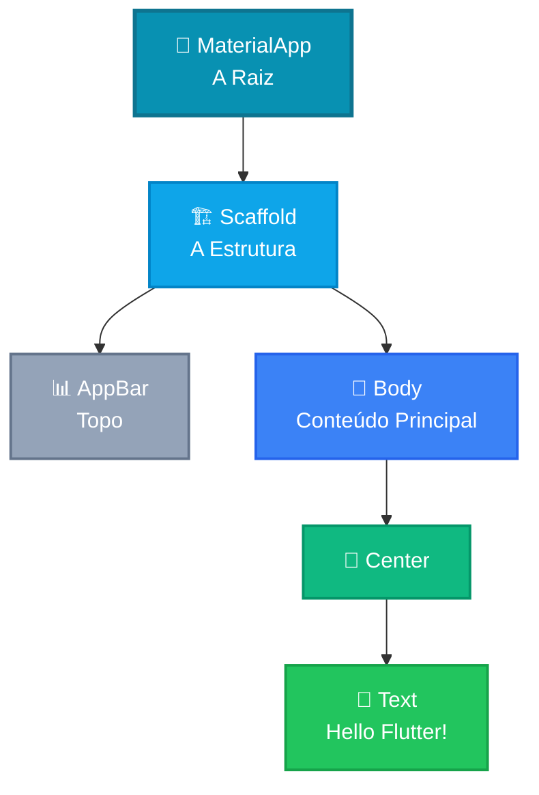

# 👋 Hello Flutter App

<div style="text-align: center; font-size: 3rem; margin: 20px 0;">
🚀 📱 ✨
</div>

Chegou o momento que todo desenvolvedor espera: o **primeiro contato real com o código**! 🚀 Nesta aula, vamos entender como um aplicativo Flutter é estruturado e criar um app que diz "Olá" em duas línguas diferentes.

<div class="hero-section">
    <h2>🎯 Seu Primeiro App Interativo</h2>
    <p>Vamos construir o "Hello Flutter App". Um aplicativo simples, mas que carrega <strong>todos os conceitos fundamentais</strong> que você usará pelo resto da sua carreira como desenvolvedor mobile.</p>
</div>

---

## 🏗️ A Anatomia do App: O Scaffold

Pense no `Scaffold` como o **"esqueleto"** da sua tela. Ele oferece os espaços prontos para você colocar o que desejar.



<div class="callout tip">
    <div class="callout-title">💡 Dica do Mentor</div>
    No Flutter, nós não "desenhamos" pixels. Nós compomos uma <strong>árvore de widgets</strong>. Cada widget é uma instrução para o Flutter sobre como a tela deve parecer.
</div>

---

## 📊 Stateless vs Stateful: A Diferença Crucial

| Característica | StatelessWidget | StatefulWidget |
|----------------|-----------------|----------------|
| **Muda com o tempo?** | ❌ Não | ✅ Sim |
| **Tem estado interno?** | ❌ Não | ✅ Sim (State) |
| **Uso** | 70% dos widgets | 30% dos widgets |

<div class="callout warning">
    <div class="callout-title">⚡ Regra de Ouro</div>
    Se o seu widget apenas exibe dados e não reage a cliques mudando sua própria aparência, ele é <strong>Stateless</strong>. Se ele precisa mudar de cor, texto ou tamanho após uma ação, ele é <strong>Stateful</strong>.
</div>

---

## 📚 Código Completo (Preview)

Aqui está uma prévia do que vamos construir:

```dart
import 'package:flutter/material.dart';

void main() => runApp(MyApp());

class MyApp extends StatelessWidget {
  @override
  Widget build(BuildContext context) {
    return MaterialApp(
      title: 'Hello Flutter',
      home: HelloPage(),
    );
  }
}

class HelloPage extends StatefulWidget {
  @override
  _HelloPageState createState() => _HelloPageState();
}

class _HelloPageState extends State<HelloPage> {
  bool isEnglish = true;
  
  void toggleLanguage() {
    setState(() {
      isEnglish = !isEnglish;
    });
  }
  
  @override
  Widget build(BuildContext context) {
    return Scaffold(
      appBar: AppBar(
        title: Text('Hello Flutter'),
        actions: [
          IconButton(
            icon: Icon(Icons.refresh),
            onPressed: toggleLanguage,
          ),
        ],
      ),
      body: Center(
        child: Text(
          isEnglish ? 'Hello Flutter!' : '¡Hola Flutter!',
          style: TextStyle(fontSize: 32),
        ),
      ),
    );
  }
}
```

---

<div style="text-align: center; padding: 40px 0; background: linear-gradient(135deg, #0ea5e9 0%, #0284c7 100%); border-radius: 12px; color: white; margin-top: 40px;">
    <h3 style="color: white; margin: 0;">🎉 App Conhecido!</h3>
    <p style="margin: 10px 0 0 0;">Agora que você viu o código, vamos entender como ele se protege das telas modernas!</p>
</div>
