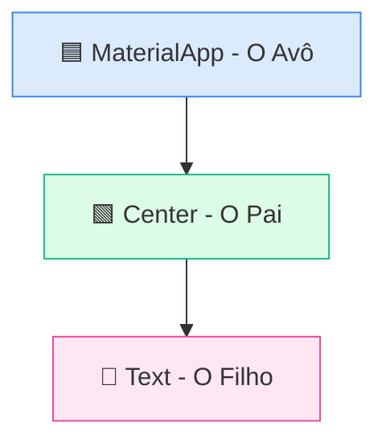

# 💻 Estrutura do Código Flutter

<div style="text-align: center; font-size: 3rem; margin: 20px 0;">
✍️ 🧠 🏗️
</div>

Agora que já criamos o projeto, vamos abrir o arquivo `lib/main.dart` e entender o que faz o coração do Flutter bater. Se na aula passada vimos as pastas, hoje vamos ver as **Classes** e como elas dão vida ao seu app.

<div class="hero-section" style="background: linear-gradient(135deg, #8b5cf6 0%, #6d28d9 100%);">
    <h2>🎯 Mergulhando no Código</h2>
    <p>Vamos dissecar o "Hello World" do Flutter e entender conceitos vitais como <code>StatelessWidget</code>, o método <code>build()</code> e a árvore de widgets na prática.</p>
</div>

---

## ⚡ O Ponto de Partida: `main()`

Todo aplicativo Dart (e consequentemente Flutter) começa em uma função chamada **`main()`**. É aqui que o compilador busca por onde começar. Imagine que é o botão de "Ligar" do seu aplicativo.

```dart
import 'package:flutter/material.dart';

void main() {
  runApp(HelloFlutterApp());
}
```

<div class="callout info">
    <div class="callout-title">🧠 O que é o runApp?</div>
    A função <code>runApp()</code> é o comando que diz: "Flutter, pegue este widget (o <code>HelloFlutterApp</code>) e o desenhe na tela inteira do dispositivo". É o ponto de conexão entre o código Dart e a tela do celular.
</div>

---

## 🧱 Criando seu Widget: `StatelessWidget`

No Flutter, quase tudo é um Widget. Para criar o nosso próprio aplicativo, nós criamos uma **Classe** que estende (herda superpoderes) de um **`StatelessWidget`**.

```dart
class HelloFlutterApp extends StatelessWidget {
  @override
  Widget build(BuildContext context) {
    return MaterialApp(
      home: Center(
        child: Text("Hello Flutter!"),
      ),
    );
  }
}
```

### 🏛️ Os Três Pilares desta Classe:

<div class="grid-3">
    <div class="card" style="border-top: 4px solid #6d28d9;">
        <strong>1. Herança</strong>
        <p><code>extends StatelessWidget</code></p>
        <p style="font-size: 0.85rem;">Significa que nossa classe herda todos os comportamentos de um widget estático do Flutter.</p>
    </div>
    <div class="card" style="border-top: 4px solid #059669;">
        <strong>2. O Método Build</strong>
        <p><code>Widget build(...)</code></p>
        <p style="font-size: 0.85rem;">É o "pintor". O Flutter chama esse método sempre que precisa saber o que desenhar na tela.</p>
    </div>
    <div class="card" style="border-top: 4px solid #2563eb;">
        <strong>3. Composição</strong>
        <p><code>return MaterialApp(...)</code></p>
        <p style="font-size: 0.85rem;">Nós não desenhamos pixels; nós combinamos outros widgets (como Lego) para formar a interface.</p>
    </div>
</div>

---

## 🎨 Material Design

Você notou o **`MaterialApp`**? Ele é o widget principal que traz o estilo visual do Google (Material Design) para o seu aplicativo. 

*   **⚡ Feedback Visual:** Botões com efeitos de ondas (ripple).
*   **📖 Tipografia:** Fontes legíveis e tamanhos padrão.
*   **📐 Geometria:** Uso de sombras e elevações para simular profundidade.

<div class="callout tip">
    <div class="callout-title">💡 Dica do Mentor</div>
    Sempre importe o pacote Material no topo do seu arquivo para ter acesso aos melhores widgets: <br>
    <code>import 'package:flutter/material.dart';</code>
</div>

---

## 🌳 Entendendo a Árvore (Código vs Hierarquia)

Observe como os widgets se aninham dentro do método `build`. É uma relação de **Pai, Filho e Neto**:



<div style="background: #1e293b; color: #e2e8f0; padding: 20px; border-radius: 8px; font-family: monospace;">
    MaterialApp ( <span style="color: #94a3b8;">// O Avô (Segura tudo)</span><br>
    &nbsp;&nbsp;home: Center ( <span style="color: #94a3b8;">// O Pai (Centraliza)</span><br>
    &nbsp;&nbsp;&nbsp;&nbsp;child: Text("Hello!") <span style="color: #94a3b8;">// O Filho (Exibe o conteúdo)</span><br>
    &nbsp;&nbsp;)<br>
    )
</div>

---

## 🎯 Mini Desafio

<div class="challenge-box">
    <h3 style="margin-top: 0;">🤔 Onde está o erro?</h3>
    <p>Se você apagar a função <code>void main()</code> mas deixar todo o resto do código da Classe pronto, o que acontecerá quando você tentar rodar o app?</p>
</div>

<details class="solution-details">
    <summary><strong>🔍 Ver Resposta</strong></summary>
    <div class="solution-content">
        <p>❌ <strong>O App não vai ligar!</strong></p>
        <p>Sem a função <code>main()</code>, o Flutter não sabe por onde começar a execução. É como ter um carro perfeito (a classe do widget), mas não ter a chave de ignição (a função main).</p>
    </div>
</details>

<div class="callout warning">
    <div class="callout-title">⚠️ Atenção aos Parênteses</div>
    Cada widget abre <code>(</code> e fecha <code>)</code>. Se você esquecer um, o código quebra! O VS Code ajuda você a organizar isso usando o atalho <code>Shift + Alt + F</code>.
</div>

---

## ⏭️ O que vem por aí?

<div class="callout info">
    <div class="callout-title">🚀 Próxima Etapa</div>
    Agora que entendemos a estrutura do código, vamos aprender como proteger nossos widgets para que eles não fiquem escondidos atrás da câmera ou do notch do celular usando o <strong>SafeArea</strong>!
</div>

---

<div style="text-align: center; padding: 40px 0; background: linear-gradient(135deg, #8b5cf6 0%, #6d28d9 100%); border-radius: 12px; color: white; margin-top: 40px;">
    <h3 style="color: white; margin: 0;">🎉 Código Desvendado!</h3>
    <p style="margin: 10px 0 0 0;">Você já fala a língua dos Widgets. Vamos avançar!</p>
</div>
