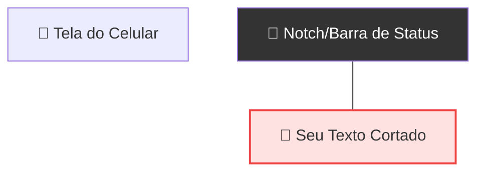

# 🛡️ Anatomia e SafeArea

<div style="text-align: center; font-size: 3rem; margin: 20px 0;">
📐 📱 🛡️
</div>

Os celulares modernos não são mais retângulos perfeitos. Eles têm cantos arredondados, recortes de câmera (**notches**) e barras de navegação dinâmicas. Se o seu app não se preparar para isso, o conteúdo pode ficar escondido ou cortado!

<div class="hero-section" style="background: linear-gradient(135deg, #f43f5e 0%, #e11d48 100%);">
    <h2>🎯 O Guardião da Tela</h2>
    <p>O <code>SafeArea</code> é o widget que garante que seu conteúdo seja exibido apenas na "área segura" do dispositivo, respeitando os limites físicos de cada hardware.</p>
</div>

---

## 🚫 O Problema do "Notch"

Imagine que você tem um texto no topo da tela. Sem proteção, ele ficaria assim:



---

## ✅ Usando o SafeArea

O `SafeArea` calcula automaticamente o espaçamento necessário para que nada seja cortado. Ele adiciona um **Padding** inteligente apenas onde é necessário.

```dart
SafeArea(
  child: Text(
    "Aqui estou seguro!",
    style: TextStyle(fontSize: 24),
  ),
)
```

### 🧠 Anatomia Visual do Widgets

No Flutter, o layout é uma cebola: uma camada dentro da outra.

1. **MaterialApp**: O cérebro (configurações).
2. **SafeArea**: O escudo (espaçamento).
3. **Center**: O alinhador (posição).
4. **Text**: O dado (conteúdo).

---

## ⚖️ Quando usar o SafeArea?

<div class="grid-2">
    <div class="card" style="border-left: 5px solid #ef4444; background: #fff1f2;">
        <strong>❌ NUNCA USE NA RAIZ</strong>
        <p>Não coloque o SafeArea como filho direto do MaterialApp. O Flutter se perderia na pintura do fundo.</p>
    </div>
    <div class="card" style="border-left: 5px solid #22c55e; background: #f0fdf4;">
        <strong>✅ USE NO BODY</strong>
        <p>O lugar perfeito para o SafeArea é dentro do <code>body:</code> do seu Scaffold, envolvendo seus widgets de conteúdo.</p>
    </div>
</div>

---

<div class="challenge-box">
    <h3 style="margin-top: 0;">🤔 Pergunta de Arquitetura</h3>
    <p>Se você colocar um <code>SafeArea</code> envolvendo toda a tela, e seu app tiver um fundo azul, o que acontecerá com a área do 'notch'?</p>
</div>

<details class="solution-details">
    <summary><strong>🔍 Ver Resposta</strong></summary>
    <div class="solution-content">
        <p>O fundo do 'notch' ficará com a cor original da tela (geralmente preto ou branco), pois o <code>SafeArea</code> "empurra" o seu conteúdo azul para baixo, deixando um vazio no topo. Para evitar isso, costumamos usar o <code>SafeArea</code> apenas no conteúdo que realmente importa, deixando o fundo preencher toda a tela.</p>
    </div>
</details>

---

<div style="text-align: center; padding: 40px 0; background: linear-gradient(135deg, #f43f5e 0%, #e11d48 100%); border-radius: 12px; color: white; margin-top: 40px;">
    <h3 style="color: white; margin: 0;">🎉 Tudo Seguro!</h3>
    <p style="margin: 10px 0 0 0;">Agora que sabemos nos proteger, vamos aprender a construir a estrutura completa: o Scaffold!</p>
</div>
