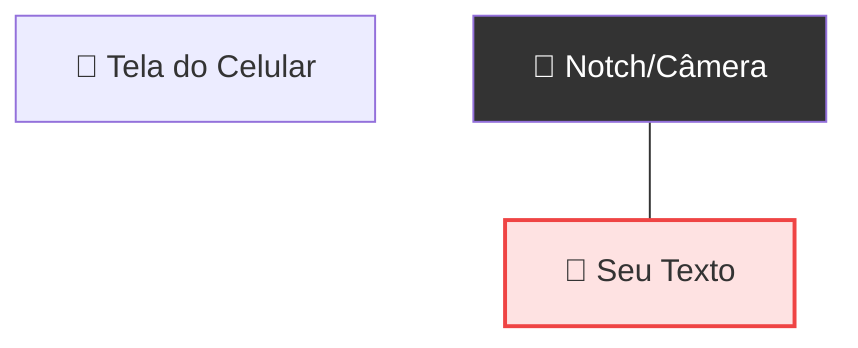
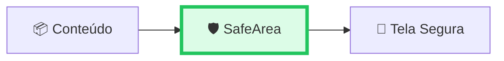

# 🛡️ O Widget SafeArea

<div style="text-align: center; font-size: 3rem; margin: 20px 0;">
📐 📱 🛡️
</div>

Na aula passada, criamos nosso "Hello Flutter" usando um `MaterialApp` e um `Center`. Se você rodou esse código no seu celular físico, deve ter notado algo estranho: o texto pode ter ficado **escondido** atrás do "notch" (recorte da câmera) ou da barra de status.

<div class="hero-section" style="background: linear-gradient(135deg, #ef4444 0%, #b91c1c 100%);">
    <h2>🎯 O Problema da "Invasão"</h2>
    <p>Os celulares modernos não são mais retângulos perfeitos. Eles têm cantos arredondados, recortes de câmera (notches) e barras de navegação dinâmicas. O Flutter, por padrão, tenta usar 100% da tela... e isso pode ser um problema.</p>
</div>

---

## 🚫 O Cenário "Sem Proteção"

Imagine que você tem o seguinte código (muito parecido com o da última aula):

```dart
class HelloFlutterApp extends StatelessWidget {
  @override
  Widget build(BuildContext context) {
    return MaterialApp(
      home: Text(
        "MENSAGEM SECRETA NO TOPO", 
        style: TextStyle(fontSize: 30, color: Colors.white)
      ), 
    );
  }
}
```

### 📉 O que acontece na tela:



<div class="card card-red">
    <strong>❌ Problema Visual:</strong> O texto colide com o notch e a barra de status. Fica ilegível e passa uma imagem de amadorismo para o usuário.
</div>

---

## ✅ A Solução: `SafeArea`

O Flutter nos dá um widget mágico chamado **`SafeArea`**. Ele funciona como um "campo de força" que calcula automaticamente o tamanho das "áreas proibidas" e adiciona um espaçamento (**Padding**) suficiente para proteger seu conteúdo.

```dart
class HelloFlutterApp extends StatelessWidget {
  @override
  Widget build(BuildContext context) {
    return MaterialApp(
      home: SafeArea(  // <--- O Guardião entra aqui!
        child: Text(
          "MENSAGEM VISÍVEL E SEGURA", 
          style: TextStyle(fontSize: 30, color: Colors.blue)
        ),
      ),
    );
  }
}
```

---

## ⚖️ Comparação na Prática

<div class="grid-2">
    <div class="card" style="border-left: 5px solid #ef4444; background: #fff1f2;">
        <strong>Sem SafeArea</strong>
        <p>🔴 Conteúdo "vaza" para fora da área útil.</p>
        <p>🔴 Texto cortado pela câmera.</p>
        <p>🔴 Dificuldade de leitura.</p>
    </div>
    <div class="card" style="border-left: 5px solid #22c55e; background: #f0fdf4;">
        <strong>Com SafeArea</strong>
        <p>🟢 Conteúdo respeita os limites físicos.</p>
        <p>🟢 Espaçamento automático inteligente.</p>
        <p>🟢 Aparência profissional.</p>
    </div>
</div>



---

## 🎯 Desafio Visual

<div class="challenge-box">
    <h3 style="margin-top: 0;">🤔 Pense Nisso</h3>
    <p>Por que o fundo da tela fica preto por padrão quando não usamos o widget <code>Scaffold</code>?</p>
</div>

<details class="solution-details">
    <summary><strong>🔍 Ver Resposta</strong></summary>
    <div class="solution-content">
        <p>✅ <strong>O Material não pinta o fundo sozinho!</strong></p>
        <p>O <code>MaterialApp</code> é apenas a configuração do app. Se você não fornecer um widget que tenha "cor de fundo" (como um <code>Scaffold</code> ou um <code>Container</code> colorido), o Flutter não pinta nada, revelando o fundo padrão do sistema (que costuma ser preto vazio).</p>
    </div>
</details>

<div class="callout tip">
    <div class="callout-title">💡 Dica do Mentor</div>
    Se você usar o widget <strong>Scaffold</strong> (que veremos na próxima aula), o corpo (body) do app geralmente precisa de um <code>SafeArea</code>, mas a <strong>AppBar</strong> é inteligente o suficiente para se proteger sozinha!
</div>

---

## ⏭️ O que vem por aí?

<div class="callout info">
    <div class="callout-title">🚀 Próxima Etapa</div>
    Chega de fundo preto e textos soltos! Vamos conhecer o widget <strong>Scaffold</strong>, que vai dar ao seu app uma cara de aplicativo de verdade, com barra no topo, cores bonitas e estrutura profissional.
</div>

---

<div style="text-align: center; padding: 40px 0; background: linear-gradient(135deg, #ef4444 0%, #b91c1c 100%); border-radius: 12px; color: white; margin-top: 40px;">
    <h3 style="color: white; margin: 0;">🎉 Conteúdo Protegido!</h3>
    <p style="margin: 10px 0 0 0;">Agora seu app está seguro em qualquer celular. Vamos estilizar!</p>
</div>
