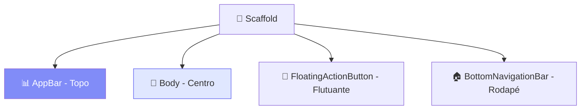

# 🏗️ O Widget Scaffold

<div style="text-align: center; font-size: 3rem; margin: 20px 0;">
🏛️ 📱 🛠️
</div>

O `Scaffold` é, sem dúvida, um dos widgets mais importantes do Flutter. Ele implementa a estrutura visual básica do **Material Design**. Pense nele como uma "página em branco organizada" que já vem com lugares reservados para o topo, o corpo e até botões flutuantes.

<div class="hero-section" style="background: linear-gradient(135deg, #6366f1 0%, #4f46e5 100%);">
    <h2>🎯 O Esqueleto do Aplicativo</h2>
    <p>Nesta aula, vamos entender como usar o Scaffold para criar interfaces que parecem e se comportam como aplicativos profissionais de verdade.</p>
</div>

---

## 🧩 Os Componentes do Scaffold

O `Scaffold` possui várias propriedades úteis. As mais comuns são:

```dart
Scaffold(
  appBar: AppBar(
    title: Text("Meu App"),
    backgroundColor: Colors.blue,
  ),
  body: Center(
    child: Text("Conteúdo da Página"),
  ),
  floatingActionButton: FloatingActionButton(
    onPressed: () {},
    child: Icon(Icons.add),
  ),
  bottomNavigationBar: BottomNavigationBar(
    items: [
      BottomNavigationBarItem(icon: Icon(Icons.home), label: "Início"),
      BottomNavigationBarItem(icon: Icon(Icons.person), label: "Perfil"),
    ],
  ),
)
```

### 📊 Estrutura Visual:



---

## 🎨 Por que usar o Scaffold?

1. **Facilidade**: Você não precisa calcular onde colocar a barra de status ou o menu inferior.
2. **Material Design**: Segue os padrões visuais recomendados pelo Google.
3. **Gerenciamento de Espaço**: Ele avisa automaticamente aos seus filhos (como o Body) quanto de espaço sobrou para eles.

<div class="callout tip">
    <div class="callout-title">💡 Dica do Mentor</div>
    Geralmente, cada tela nova que você cria em seu app começa com um <code>Scaffold</code>. É a primeira linha de código de 99% das páginas de um app Flutter!
</div>

---

## 🏗️ Exercício de Montagem

<div class="challenge-box">
    <h3 style="margin-top: 0;">🛠️ Arquiteto de UI</h3>
    <p>Como você montaria um Scaffold que tivesse uma cor de fundo Amarela no corpo, mas mantivesse a barra do topo Azul?</p>
</div>

<details class="solution-details">
    <summary><strong>🔍 Ver Código</strong></summary>
    <div class="solution-content">
        <pre><code class="language-dart">Scaffold(
  backgroundColor: Colors.yellow, // Aplica no corpo todo
  appBar: AppBar(
    title: Text("Cor Diferente"),
    backgroundColor: Colors.blue, // Aplica só no topo
  ),
  body: Center(child: Text("Olá!")),
)</code></pre>
    </div>
</details>

---

<div style="text-align: center; padding: 40px 0; background: linear-gradient(135deg, #6366f1 0%, #4f46e5 100%); border-radius: 12px; color: white; margin-top: 40px;">
    <h3 style="color: white; margin: 0;">🎉 Esqueleto Pronto!</h3>
    <p style="margin: 10px 0 0 0;">Agora seu app tem estrutura. No próximo passo, vamos aprender a organizar esses elementos em linhas e colunas!</p>
</div>
