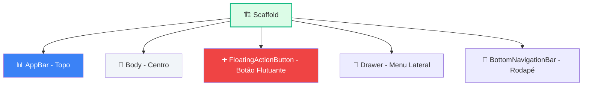

# 🏢 O Widget Scaffold

<div style="text-align: center; font-size: 3rem; margin: 20px 0;">
🏗️ 📊 🎨
</div>

Até agora, nossos apps eram apenas telas pretas com texto solto (ou protegido pelo `SafeArea`). Mas um app de verdade tem barra superior, cores, menu lateral e botões flutuantes. Quem organiza essa festa visual? O **Scaffold**.

<div class="hero-section" style="background: linear-gradient(135deg, #10b981 0%, #059669 100%);">
    <h2>🎯 O Andaime do seu App</h2>
    <p>O <strong>Scaffold</strong> (Andaime) implementa a estrutura visual básica do Material Design. É ele que nos dá "espaços prontos" para encaixar peças como a AppBar e o Corpo do app.</p>
</div>

---

## 🏗️ A Estrutura do Scaffold

O `Scaffold` divide sua tela em áreas estratégicas. Imagine que ele é um móvel planejado com nichos específicos para cada coisa:



### 💻 Como fica no código:

```dart
Scaffold(
  appBar: AppBar(
    title: Text("Meu App Incrível"),
    backgroundColor: Colors.deepPurple,
  ),
  body: Center(
    child: Text("O conteúdo principal fica aqui!"),
  ),
  floatingActionButton: FloatingActionButton(
    onPressed: () => print("Botão pressionado!"),
    child: Icon(Icons.add),
  ),
)
```

---

## 🎨 Estilizando seus Widgets

Widgets sem estilo são tristes. Vamos dar vida a eles usando propriedades de estilo.

### 📝 Text com Estilo (`TextStyle`)
O widget `Text` possui uma propriedade style que aceita um objeto `TextStyle`.

```dart
Text(
  "Olá Flutter!",
  style: TextStyle(
    fontSize: 28.0,              // Tamanho da fonte
    color: Colors.indigo,        // Cor do texto
    fontWeight: FontWeight.bold,  // Negrito
    letterSpacing: 2.0,          // Espaço entre letras
  ),
)
```

### 🌈 Cores (`Colors`)
O Flutter já traz uma paleta de cores do Material Design pronta. Você pode usar tons específicos:
*   `Colors.blue` (Padrão)
*   `Colors.blue[100]` (Tom bem claro)
*   `Colors.blue[900]` (Tom bem escuro)
*   `Colors.blueAccent` (Cores vibrantes)

---

## 🏷️ A Faixa "Debug"

Você notou uma faixinha vermelha escrita **"DEBUG"** no canto do app? Ela avisa que você está no modo de desenvolvimento. Se quiser tirá-la para fazer um print bonitão:

```dart
MaterialApp(
  debugShowCheckedModeBanner: false, // 👋 Tchau, faixinha!
  home: MinhaTelaPrincipal(),
)
```

---

## 🎯 Desafio do Mestre

<div class="challenge-box">
    <h3 style="margin-top: 0;">🔥 Missão: Compor Tudo!</h3>
    <p>Tente criar uma tela unindo tudo o que aprendemos nesta unidade. Se conseguir, você já está à frente de muitos iniciantes!</p>
    <strong>Objetivos:</strong>
    <ul>
        <li>✅ Um <code>Scaffold</code> como base.</li>
        <li>✅ Uma <code>AppBar</code> verde com o título "Desafio Aceito".</li>
        <li>✅ Um corpo (<code>body</code>) com texto centralizado.</li>
        <li>✅ Texto grande (25), Negrito e Cinza.</li>
        <li>✅ Remova a faixa de Debug.</li>
    </ul>
</div>

<details class="solution-details">
    <summary><strong>🔍 Ver Código da Solução</strong></summary>
    <div class="solution-content">
        <pre><code class="language-dart">void main() {
  runApp(
    MaterialApp(
      debugShowCheckedModeBanner: false,
      home: Scaffold(
        appBar: AppBar(
          title: Text("Desafio Aceito"),
          backgroundColor: Colors.green,
        ),
        body: Center(
          child: Text(
            "Eu sou um desenvolvedor Flutter!",
            style: TextStyle(
              fontSize: 25,
              fontWeight: FontWeight.bold,
              color: Colors.grey,
            ),
          ),
        ),
      ),
    ),
  );
}</code></pre>
    </div>
</details>

---

## ⏭️ O que vem por aí?

<div class="callout info">
    <div class="callout-title">🎓 Unidade Concluída!</div>
    Parabéns! Você concluiu os fundamentos. Na **Unidade 03**, vamos aprender o segredo dos apps interativos: a diferença entre widgets que mudam de estado e widgets que ficam parados!
</div>

---

<div style="text-align: center; padding: 40px 0; background: linear-gradient(135deg, #10b981 0%, #059669 100%); border-radius: 12px; color: white; margin-top: 40px;">
    <h3 style="color: white; margin: 0;">🎉 Unidade 02 Finalizada!</h3>
    <p style="margin: 10px 0 0 0;">Você já sabe construir a base de qualquer app. Que venha a interatividade!</p>
</div>
