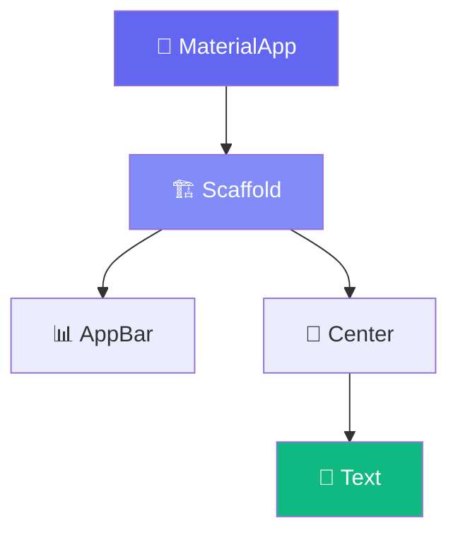
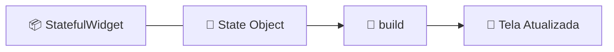

# ⚡ Stateless vs Stateful Widgets

<div style="text-align: center; font-size: 3rem; margin: 20px 0;">
🔄 🎚️ 🧠
</div>

No Flutter, quase tudo é um **Widget**. Entender a diferença entre widgets que "têm estado" e os que "não têm" é o divisor de águas entre criar uma interface estática e um aplicativo **totalmente interativo**.

<div class="hero-section" style="background: linear-gradient(135deg, #3b82f6 0%, #2563eb 100%);">
    <h2>🎯 Reatividade é a Chave</h2>
    <p>O Flutter é um framework reativo: quando o estado de um widget muda, ele se redesenha automaticamente para refletir essa mudança na tela.</p>
</div>

---

## 🏗️ A Estrutura da UI

Lembre-se da nossa árvore de widgets. Cada peça se encaixa para formar o que o usuário vê.



---

## 1️⃣ StatelessWidget: A Imutabilidade

Um **StatelessWidget** é "estático". Ele recebe dados e os exibe. Ele não pode mudar sozinho após ser construído. Pense nele como um **blueprint** (planta baixa) que não se altera.

```dart
class MeuTexto extends StatelessWidget {
  final String conteudo;
  
  const MeuTexto(this.conteudo);

  @override
  Widget build(BuildContext context) {
    return Text(conteudo);
  }
}
```

<div class="callout info">
    <div class="callout-title">💡 Importante</div>
    Se as propriedades de um <code>StatelessWidget</code> mudarem (vindas do Widget pai), o Flutter simplesmente destrói o objeto antigo e cria um <strong>NOVO</strong>. No Flutter, widgets são extremamente baratos e rápidos de criar!
</div>

---

## 2️⃣ StatefulWidget: Onde a Mágica Acontece

Diferente do anterior, o **StatefulWidget** é composto por duas partes: a classe do Widget (imutável) e a classe do **State** (mutável e persistente).



<div class="callout info">
    <div class="callout-title">🧠 Memória de Longo Prazo</div>
    O segredo está no <strong>Element Tree</strong>. Enquanto os Widgets podem ser recriados, o Element correspondente mantém a referência para o objeto <strong>State</strong>, permitindo que ele "lembre" dos dados entre um rebuild e outro.
</div>

---

## ⚡ A Função `setState()`

Ao chamar `setState(() {...})`, você marca o widget como "sujo" (dirty). Na próxima atualização de tela, o Flutter executará o método `build` apenas deste widget e de seus filhos.

<div class="card card-red">
    <strong>Dica de Sênior:</strong> Não coloque lógica pesada (como busca em banco de dados) dentro do <code>build</code>. Ele pode ser chamado 60 ou 120 vezes por segundo. Lógica pesada dentro do build vai fazer seu app travar!
</div>

---

## 🧪 Comparação: Qual usar?

| Característica | StatelessWidget | StatefulWidget |
|----------------|-----------------|----------------|
| **Estado** | Estático | Dinâmico |
| **Complexidade** | Baixa | Média |
| **Performance** | 🚀 Máxima | ⚙️ Normal |
| **Exemplos** | Ícones, Logos, Textos fixos | Contadores, Checkbox, formulários |

---

## 🎯 Desafio de Lógica

<div class="challenge-box">
    <h3 style="margin-top: 0;">🤔 Onde eu uso o quê?</h3>
    <p>Você está criando uma tela de "Perfil de Usuário". Nesta tela temos:</p>
    <ol>
        <li>O nome do usuário (que nunca muda nesta tela).</li>
        <li>Uma foto de capa fixa.</li>
        <li>Um botão "Seguir" que muda de cor e texto quando clicado.</li>
    </ol>
    <p><strong>Pergunta:</strong> Quais desses componentes devem ser Stateless e quais devem ser Stateful?</p>
</div>

<details class="solution-details">
    <summary><strong>🔍 Ver Resolução</strong></summary>
    <div class="solution-content">
        <ul>
            <li>✅ <strong>Nome e Foto:</strong> Stateless (não mudam durante a sessão).</li>
            <li>✅ <strong>Botão "Seguir":</strong> Stateful (precisa mudar seu estado visual de "Seguir" para "Seguindo").</li>
            <li>✅ <strong>A Tela Inteira:</strong> Geralmente será um StatefulWidget para gerenciar as mudanças internas.</li>
        </ul>
        <div class="callout tip">
            <div class="callout-title">💡 Dica de Ouro</div>
            Sempre tente usar <strong>StatelessWidget</strong> primeiro. Só mude para <strong>Stateful</strong> quando você REALMENTE precisar que um dado mude na tela em tempo real.
        </div>
    </div>
</details>

---

<div style="text-align: center; padding: 40px 0; background: linear-gradient(135deg, #3b82f6 0%, #2563eb 100%); border-radius: 12px; color: white; margin-top: 40px;">
    <h3 style="color: white; margin: 0;">🎉 Conceito de Estado Dominado!</h3>
    <p style="margin: 10px 0 0 0;">Agora você sabe como criar apps que respondem ao usuário!</p>
</div>
