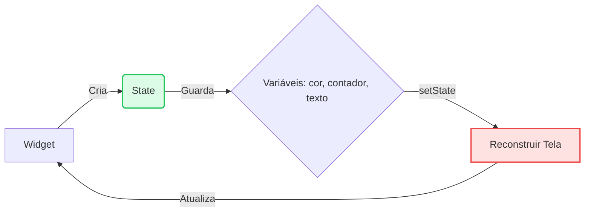

# ⚡ Stateless vs Stateful

<div style="text-align: center; font-size: 3rem; margin: 20px 0;">
🔄 🧱 ⚡
</div>

Uma das decisões mais importantes que você tomará ao criar qualquer tela no Flutter é: **"Qual tipo de Widget eu devo usar?"**. Escolher errado pode fazer seu app travar ou gastar bateria do celular sem necessidade.

<div class="hero-section" style="background: linear-gradient(135deg, #f59e0b 0%, #d97706 100%);">
    <h2>🎯 Estático vs Dinâmico</h2>
    <p>Nesta aula, vamos desmistificar os dois pilares do Flutter, entender o ciclo de vida e ver na prática quando usar cada um.</p>
</div>

---

## 📸 A Metáfora Visual

Para não esquecer nunca mais, imagine o seguinte:

<div class="grid-2">
    <div class="card">
        <h3>🖼️ StatelessWidget</h3>
        <p><strong>É como uma Fotografia Impressa.</strong></p>
        <p>Depois que a foto é tirada e revelada, ela nunca mais muda. Se você quiser mudar a foto, precisa jogar a antiga fora e imprimir uma nova.</p>
        <hr>
        <p>✅ <strong>Uso:</strong> Ícones, Textos fixos, Logotipos, Layouts de página que apenas exibem dados recebidos.</p>
    </div>
    <div class="card">
        <h3>📺 StatefulWidget</h3>
        <p><strong>É como uma TV ligada.</strong></p>
        <p>A estrutura da TV (borda, tela) continua a mesma, mas a imagem que passa nela muda o tempo todo conforme você aperta o controle remoto.</p>
        <hr>
        <p>✅ <strong>Uso:</strong> Formulários, Checkboxes, Animações, Contadores, Carregamento de dados da internet.</p>
    </div>
</div>

---

## 🏛️ Mergulhando no StatelessWidget

Um `StatelessWidget` é desenhado **uma única vez** quando o app carrega (ou quando o pai dele manda redesenhar). Ele não tem "memória". Ele apenas recebe informações e as exibe.

### Exemplo Prático: Um Cartão de Perfil

Este botão não faz nada sozinho. Ele apenas recebe cor e texto e se pinta na tela.

```dart
class ProfileCard extends StatelessWidget {
  final String nome;
  final Color cor;

  // Recebe os dados no construtor
  ProfileCard({required this.nome, required this.cor});

  @override
  Widget build(BuildContext context) {
    // 🎨 PINTA a tela e acabou. Não guarda estado.
    return Container(
      padding: EdgeInsets.all(20),
      color: cor,
      child: Text("Olá, $nome!", style: TextStyle(color: Colors.white)),
    );
  }
}
```

---

## 🔄 Mergulhando no StatefulWidget

Aqui a mágica acontece. Um `StatefulWidget` é, na verdade, **duas classes** que trabalham juntas:

1.  **O Widget (A Carcaça):** É imutável, assim como o Stateless.
2.  **O State (O Cérebro):** É aqui que as variáveis mudam e a mágica do `setState` acontece.



### Exemplo Prático: Botão de "Curtir" ❤️

Vamos criar um botão que muda de cor quando clicado. Perceba o uso do `setState`.

```dart
class LikeButton extends StatefulWidget {
  @override
  _LikeButtonState createState() => _LikeButtonState();
}

class _LikeButtonState extends State<LikeButton> {
  // 🧠 MEMÓRIA: Esta variável sobrevive mesmo quando a tela atualiza
  bool isLiked = false;

  @override
  Widget build(BuildContext context) {
    return IconButton(
      icon: Icon(
        isLiked ? Icons.favorite : Icons.favorite_border,
        color: isLiked ? Colors.red : Colors.grey,
        size: 40,
      ),
      onPressed: () {
        // ⚡ GATILHO: Avisa o Flutter que algo mudou!
        setState(() {
          isLiked = !isLiked; // Inverte o valor (true vira false, e vice-versa)
        });
      },
    );
  }
}
```

---

## 🧪 Laboratório: O Contador Completo

Agora, vamos juntar tudo em um aplicativo funcional para você rodar no emulador. Teremos um título estático (`Stateless`) e um contador dinâmico (`Stateful`).

```dart
import 'package:flutter/material.dart';

void main() => runApp(MaterialApp(home: SuperContador()));

// 1. TELA PRINCIPAL (Stateful, pois o número muda)
class SuperContador extends StatefulWidget {
  @override
  _SuperContadorState createState() => _SuperContadorState();
}

class _SuperContadorState extends State<SuperContador> {
  int cliques = 0;
  Color corAtual = Colors.blue;

  void incrementar() {
    // O setState reconstrói a tela com os novos valores
    setState(() {
      cliques++;
      // Muda a cor a cada 5 cliques
      if (cliques % 5 == 0) {
        corAtual = corAtual == Colors.blue ? Colors.purple : Colors.blue;
      }
    });
  }

  @override
  Widget build(BuildContext context) {
    return Scaffold(
      appBar: AppBar(
        title: Text("Lab: Stateless vs Stateful"),
        backgroundColor: corAtual, // A AppBar muda de cor!
      ),
      body: Center(
        child: Column(
          mainAxisAlignment: MainAxisAlignment.center,
          children: [
            // Widget Stateless (Texto fixo)
            Text("Você pressionou o botão:", style: TextStyle(fontSize: 18)),
            
            SizedBox(height: 20),
            
            // O valor que muda (Estado)
            Text(
              "$cliques",
              style: TextStyle(
                fontSize: 60,
                fontWeight: FontWeight.bold,
                color: corAtual,
              ),
            ),
            
            SizedBox(height: 20),
            
            Text(
              cliques % 5 == 0 ? "Mudou de cor! 🎨" : "",
              style: TextStyle(color: Colors.grey),
            )
          ],
        ),
      ),
      floatingActionButton: FloatingActionButton(
        onPressed: incrementar,
        backgroundColor: corAtual,
        child: Icon(Icons.add),
      ),
    );
  }
}
```

---

## 🎯 Desafio de Performance

<div class="challenge-box">
    <h3 style="margin-top: 0;">🤔 Otimização</h3>
    <p>Por que não criar <strong>tudo</strong> como <code>StatefulWidget</code>, já que ele é mais poderoso?</p>
</div>

<details class="solution-details">
    <summary><strong>🔍 Ver Resposta</strong></summary>
    <div class="solution-content">
        <p>✅ <strong>Custo de Processamento!</strong> O <code>StatefulWidget</code> consome mais memória e processamento porque o Flutter precisa ficar vigiando o "Estado" dele. Se o seu widget é apenas um texto ou um ícone que nunca muda, usar <code>StatelessWidget</code> deixa o app mais leve e rápido.</p>
    </div>
</details>

---

<div style="text-align: center; padding: 40px 0; background: linear-gradient(135deg, #f59e0b 0%, #d97706 100%); border-radius: 12px; color: white; margin-top: 40px;">
    <h3 style="color: white; margin: 0;">🎉 Dominou os Estados!</h3>
    <p style="margin: 10px 0 0 0;">Agora você entende a alma do Flutter. Vamos usar isso para construir layouts complexos na próxima aula!</p>
</div>
