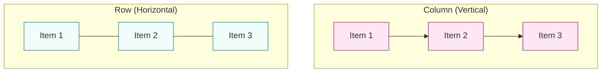
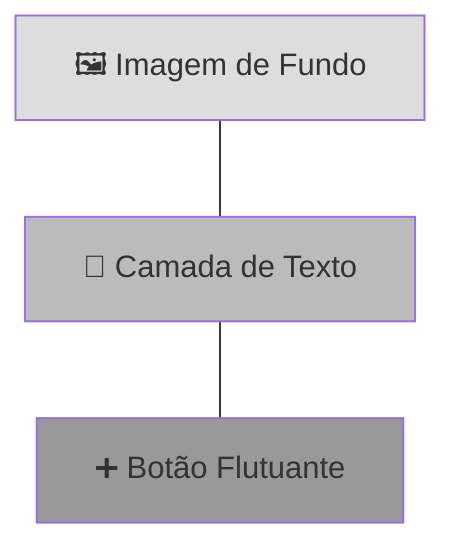

# 📐 Column, Row e Stack

<div style="text-align: center; font-size: 3rem; margin: 20px 0;">
↔️ ↕️ 🏗️
</div>

No Flutter, você não "arrasta" componentes para coordenadas fixas. Em vez disso, você usa **Layouts Flexíveis** que se adaptam a qualquer tamanho de tela. Os protagonistas dessa história são `Column`, `Row` e `Stack`.

<div class="hero-section" style="background: linear-gradient(135deg, #ec4899 0%, #db2777 100%);">
    <h2>🎯 Organizando o Espaço</h2>
    <p>Dominar o alinhamento de Column e Row é 90% do trabalho de um desenvolvedor Flutter iniciante. Vamos aprender a dominar os eixos!</p>
</div>

---

## ↕️ Column vs ↔️ Row

A grande diferença entre eles é a direção do seu **Eixo Principal (Main Axis)**.



### 🧭 Entendendo os Eixos:

| Widget | Main Axis (Principal) | Cross Axis (Cruzado) |
|--------|-----------------------|----------------------|
| **Row** | Horizontal (X) | Vertical (Y) |
| **Column** | Vertical (Y) | Horizontal (X) |

---

## 1️⃣ Alinhamento de Mestre

Você pode controlar como os itens se espalham usando o `MainAxisAlignment`:

<div class="grid-3">
    <div class="card" style="border-top: 4px solid #db2777;">
        <strong>🚀 Start</strong>
        <p>Itens colados no início do eixo.</p>
    </div>
    <div class="card" style="border-top: 4px solid #db2777;">
        <strong>🎯 Center</strong>
        <p>Itens centralizados no eixo.</p>
    </div>
    <div class="card" style="border-top: 4px solid #db2777;">
        <strong>↔️ SpaceBetween</strong>
        <p>Espaço máximo entre os itens.</p>
    </div>
</div>

---

## 🦸‍♂️ Flexible e Expanded: Os Heróis

E se um item precisar "esticar" para ocupar todo o espaço que sobra? O **Expanded** é o seu melhor amigo.

```dart
Row(
  children: [
    Icon(Icons.star),      // Tamanho fixo
    Expanded(              // Estica!
      child: Text("Este texto vai ocupar o resto da tela."),
    ),
    Icon(Icons.arrow_forward), // Tamanho fixo
  ],
)
```

<div class="callout warning">
    <div class="callout-title">⚠️ Erro de Overflow</div>
    Se você colocar um texto muito longo em uma Row sem o widget <code>Expanded</code>, o Flutter vai mostrar aquelas faixas amarelas e pretas horríveis avisando que o conteúdo vazou da tela!
</div>

---

## 📚 Stack: Criando Camadas

O **Stack** funciona como as camadas do Photoshop: o primeiro item da lista fica no fundo, e os próximos são desenhados por cima.



<div class="callout tip">
    <div class="callout-title">💡 Positioned</div>
    Use o widget <code>Positioned</code> dentro de um <code>Stack</code> para dizer exatamente onde um item deve ficar (ex: 10 pixels do topo e 20 da direita).
</div>

---

## 🎯 Desafio de Layout

<div class="challenge-box">
    <h3 style="margin-top: 0;">🧩 Monte o Quebra-Cabeça</h3>
    <p>Como você criaria um componente que tem uma foto redonda à esquerda e dois textos (nome e descrição) empilhados à direita?</p>
</div>

<details class="solution-details">
    <summary><strong>🔍 Ver Solução em Código</strong></summary>
    <div class="solution-content">
        <pre><code class="language-dart">Row(
  children: [
    CircleAvatar(child: Icon(Icons.person)), // Esquerda
    SizedBox(width: 10),                     // Espaço
    Expanded(
      child: Column(                          // Empilhado à direita
        crossAxisAlignment: CrossAxisAlignment.start,
        children: [
          Text("Nome do Usuário", style: TextStyle(fontWeight: FontWeight.bold)),
          Text("Descrição do perfil..."),
        ],
      ),
    ),
  ],
)</code></pre>
        <div class="callout tip">
            <div class="callout-title">💡 Dica</div>
            O uso do <code>Expanded</code> garante que a Column não tente "fugir" da tela se o texto for muito longo.
        </div>
    </div>
</details>

---

## ⏭️ O que vem por aí?

<div class="callout info">
    <div class="callout-title">🚀 Próxima Etapa</div>
    Já sabemos organizar os widgets! Na próxima aula, vamos aprender a dar estilo, cores e espaçamentos precisos usando o <strong>Container</strong> e o <strong>Padding</strong>.
</div>

---

<div style="text-align: center; padding: 40px 0; background: linear-gradient(135deg, #ec4899 0%, #db2777 100%); border-radius: 12px; color: white; margin-top: 40px;">
    <h3 style="color: white; margin: 0;">🎉 Layouts Flexíveis Dominados!</h3>
    <p style="margin: 10px 0 0 0;">Agora você tem o poder de organizar qualquer interface!</p>
</div>
