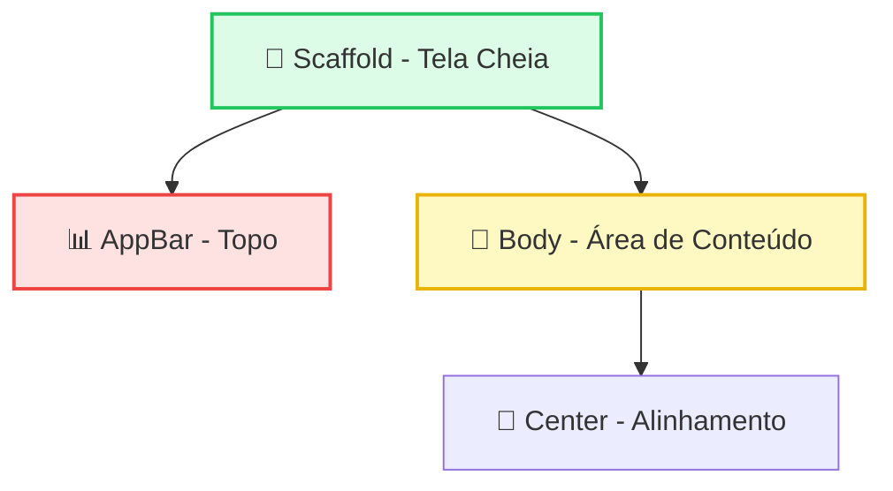

# 🏗️ Scaffold e SafeArea

<div style="text-align: center; font-size: 3rem; margin: 20px 0;">
🏛️ � 🛡️
</div>

O **Scaffold** é o esqueleto fundamental de quase todos os aplicativos Flutter que seguem o Material Design. Ele fornece a estrutura visual básica, reservando espaços para barras de navegação, botões flutuantes e o conteúdo principal.

<div class="hero-section" style="background: linear-gradient(135deg, #10b981 0%, #059669 100%);">
    <h2>🎯 Construindo a Estrutura Profissional</h2>
    <p>Nesta aula, vamos explorar como o Scaffold organiza a interface e como o SafeArea protege seu conteúdo contra os recortes (notches) das telas modernas.</p>
</div>

---

## �️ O Widget Scaffold

O `Scaffold` atua como um container de nível superior para suas páginas. Ele organiza três partes principais que veremos hoje:

1.  **appBar**: A barra que fica no topo.
2.  **body**: A área principal onde o conteúdo aparece.
3.  **Center**: Um widget auxiliar para centralizar tudo no corpo.

### 🖼️ Representação Visual



---

## 📊 Explorando a AppBar

A classe `AppBar` é rica em propriedades. Vamos destacar três fundamentais:

-   **title**: Geralmente um widget `Text` com o nome da página.
-   **leading**: O ícone ou ação que fica no canto superior esquerdo (ex: ícone de casa).
-   **actions**: Uma lista de widgets (ícones clicáveis) que ficam no canto superior direito.

---

## 🛡️ O Widget SafeArea

Celulares modernos têm câmeras frontais (notches) que "invadem" a tela. O `SafeArea` adiciona um espaçamento automático para que seu texto não fique atrás da câmera.

<div class="architecture-diagram">
    
</div>

---

## 🧪 Prática Completa no Emulador

Copie este código para o seu `main.dart`. Ele combina **Scaffold**, **AppBar**, **Center** e **Estilização de Texto** em um único exemplo funcional que você pode testar agora!

```dart
import 'package:flutter/material.dart';

void main() {
  runApp(
    MaterialApp(
      debugShowCheckedModeBanner: false, // Remove a faixa de debug
      home: Scaffold(
        // 1. Barra Superior com ícones e cores
        appBar: AppBar(
          title: Text("Meu Primeiro Scaffold"),
          backgroundColor: Colors.indigo,
          leading: Icon(Icons.home), // Ícone na esquerda
          actions: [
            IconButton(
              icon: Icon(Icons.refresh),
              onPressed: () {
                print("Lógica de atualização aqui!");
              },
            ),
          ],
        ),
        
        // 2. O conteúdo principal protegido pela SafeArea
        body: SafeArea(
          child: Center(
            child: Text(
              "Hello Flutter!",
              style: TextStyle(
                fontSize: 24,            // Tamanho da fonte
                fontWeight: FontWeight.bold, // Negrito
                color: Colors.indigo,    // Cor do texto
              ),
            ),
          ),
        ),
      ),
    ),
  );
}
```

<div class="callout tip">
    <div class="callout-title">💡 Dica de Design</div>
    A propriedade <code>style</code> do widget <code>Text</code> usa a classe <code>TextStyle</code>. Ela é fundamental para dar personalidade ao seu app, permitindo mudar cores, tamanhos e até o espaçamento entre as letras!
</div>

---

## 🎯 Desafio de Visualização

<div class="challenge-box">
    <h3 style="margin-top: 0;">🤔 Pense Nisso</h3>
    <p>O que acontece se você mudar o <code>leading</code> da AppBar para um <code>IconButton</code> que abre uma gaveta (drawer)? Como o usuário veria isso?</p>
</div>

<details class="solution-details">
    <summary><strong>🔍 Ver Resposta</strong></summary>
    <div class="solution-content">
        <p>✅ O ícone de casa seria substituído pelo ícone de menu (hambúrguer) e, ao clicar, o Flutter poderia abrir um menu lateral. O Scaffold facilita muito a criação desses menus através da propriedade <code>drawer</code>!</p>
    </div>
</details>

---

<div style="text-align: center; padding: 40px 0; background: linear-gradient(135deg, #10b981 0%, #059669 100%); border-radius: 12px; color: white; margin-top: 40px;">
    <h3 style="color: white; margin: 0;">🎉 Estrutura Concluída!</h3>
    <p style="margin: 10px 0 0 0;">Agora você já domina a base. No próximo passo, vamos aprender a empilhar elementos com Column e Row!</p>
</div>
