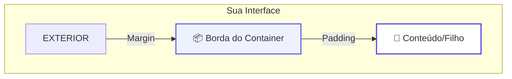

# 📦 Container e Padding

<div style="text-align: center; font-size: 3rem; margin: 20px 0;">
🎨 📦 📐
</div>

Se a `Column` e a `Row` são os esqueletos do seu app, o **Container** é a alma visual. Ele é o widget de decoração mais versátil do Flutter, permitindo adicionar cores, bordas, sombras e controlar o espaçamento com precisão cirúrgica.

<div class="hero-section" style="background: linear-gradient(135deg, #6366f1 0%, #4f46e5 100%);">
    <h2>🎯 O Modelo de Caixa</h2>
    <p>Entender a diferença entre Margem e Preenchimento (Padding) é fundamental para criar layouts harmônicos e profissionais.</p>
</div>

---

## 📐 Padding vs Margin

O conceito é simples, mas vital. Pense no Container como uma **caixa de presente**:



*   **Padding (Preenchimento):** Espaço **interno** entre a borda do container e o seu filho. É o "ar" que o conteúdo precisa para não ficar colado na borda.
*   **Margin (Margem):** Espaço **externo** entre o container e os outros widgets ao redor. É a distância que ele mantém dos vizinhos.

### 💻 No Código:
```dart
Container(
  margin: EdgeInsets.all(20.0),       // 20 pixels de espaço por fora
  padding: EdgeInsets.only(left: 10), // 10 pixels só na esquerda por dentro
  child: Text("Olá!"),
)
```

---

## 🎨 BoxDecoration: Pintando sua Obra

Para dar um visual premium, usamos a propriedade `decoration`. É aqui que você adiciona o "estilo" de verdade.

```dart
Container(
  width: 200,
  height: 100,
  decoration: BoxDecoration(
    color: Colors.white,
    borderRadius: BorderRadius.circular(15), // Bordas arredondadas
    boxShadow: [
      BoxShadow(
        color: Colors.black12,
        blurRadius: 10,
        offset: Offset(0, 5), // Sombra para baixo
      ),
    ],
    border: Border.all(color: Colors.blue, width: 2),
  ),
  child: Center(child: Text("Card Estilizado")),
)
```

<div class="grid-2">
    <div class="card" style="border-left: 5px solid #6366f1;">
        <strong>🌈 Gradientes</strong>
        <p>Você pode usar <code>LinearGradient</code> para criar fundos que mudam de cor suavemente.</p>
    </div>
    <div class="card" style="border-left: 5px solid #8b5cf6;">
        <strong>🖼️ Imagens de Fundo</strong>
        <p>O <code>DecorationImage</code> permite colocar fotos dentro da caixa com filtros e recortes.</p>
    </div>
</div>

---

## 📏 SizedBox e ConstrainedBox

Às vezes você não precisa de cor ou sombra, apenas de um espaço fixo entre dois itens.

*   **SizedBox:** O widget mais leve para criar "vazios" calculados.
    *   `SizedBox(height: 16)` -> Espaço vertical.
    *   `SizedBox(width: 16)` -> Espaço horizontal.
*   **Padding Widget:** Se você quer apenas aplicar espaçamento ao redor de um widget sem usar um Container pesado.

<div class="callout tip">
    <div class="callout-title">🚀 Dica de Performance</div>
    Se você precisa APENAS de espaçamento, use o widget <code>Padding</code> ou <code>SizedBox</code>. Eles são mais leves que o <code>Container</code> e deixam seu código muito mais limpo e semântico.
</div>

---

## 🎯 Desafio Visual

<div class="challenge-box">
    <h3 style="margin-top: 0;">🎨 Crie um Card Premium</h3>
    <p>Imagine que você quer criar um cartão de "Destaque" que tenha um fundo degradê do <strong>Azul</strong> para o <strong>Roxo</strong> e bordas bem arredondadas (25px). Como ficaria a <code>BoxDecoration</code>?</p>
</div>

<details class="solution-details">
    <summary><strong>🔍 Ver Solução</strong></summary>
    <div class="solution-content">
        <pre><code class="language-dart">BoxDecoration(
  borderRadius: BorderRadius.circular(25),
  gradient: LinearGradient(
    begin: Alignment.topLeft,
    end: Alignment.bottomRight,
    colors: [Colors.blue, Colors.purple],
  ),
)</code></pre>
        <p>Ao usar <code>gradient</code>, você não deve definir a propriedade <code>color</code> direta do Container, pois elas iriam conflitar!</p>
    </div>
</details>

---

## ⏭️ O que vem por aí?

<div class="callout info">
    <div class="callout-title">🚀 Próxima Etapa</div>
    Agora que sabemos deixar os widgets bonitos, vamos aprender a lidar com muita informação! Veremos como exibir centenas de itens sem travar o app usando <strong>ListView</strong> e <strong>GridView</strong>.
</div>

---

<div style="text-align: center; padding: 40px 0; background: linear-gradient(135deg, #6366f1 0%, #4f46e5 100%); border-radius: 12px; color: white; margin-top: 40px;">
    <h3 style="color: white; margin: 0;">🎉 Dominou o Design de Caixas!</h3>
    <p style="margin: 10px 0 0 0;">Seu app agora tem estilo e elegância!</p>
</div>
