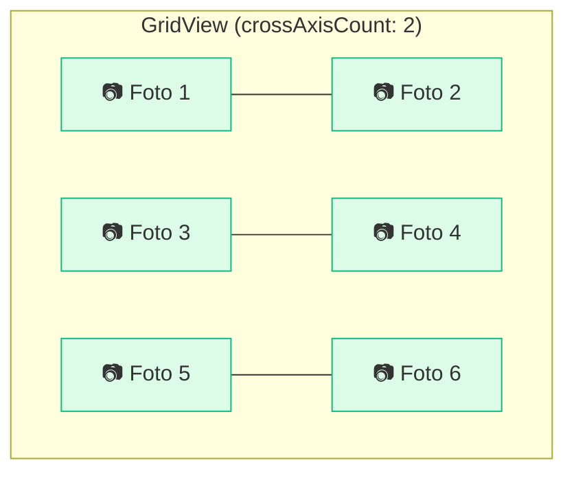

# 📱 ListView e GridView

<div style="text-align: center; font-size: 3rem; margin: 20px 0;">
📜 🖼️ ⚡
</div>

A maioria dos aplicativos modernos é, na essência, uma **lista de alguma coisa**: mensagens do WhatsApp, produtos do Instagram, notícias ou fotos. No Flutter, gerenciar grandes quantidades de dados com velocidade é a especialidade do `ListView` e do `GridView`.

<div class="hero-section" style="background: linear-gradient(135deg, #10b981 0%, #059669 100%);">
    <h2>🎯 Scroll Infinito e Performance</h2>
    <p>Aprenda a exibir milhares de itens sem travar o celular do seu usuário, renderizando apenas o que é visível na tela!</p>
</div>

---

## 1️⃣ ListView: O Rei da Rolagem

O `ListView` é o widget mais comum para criar interfaces com scroll. Ele pode ser usado de duas formas principais:

### 📜 Padrão (Static)
Use quando você tem **poucos itens** fixos (ex: um menu de configurações).
```dart
ListView(
  children: [
    Text("Configurações"),
    Text("Perfil"),
    Text("Sair"),
  ],
)
```

### ⚡ Builder (Dynamic)
Use para **listas longas** ou dados que vêm da internet. Ele só carrega o que o usuário está vendo no momento!
```dart
ListView.builder(
  itemCount: 1000, // Mil itens!
  itemBuilder: (context, index) {
    return ListTile(title: Text("Pessoa número $index"));
  },
)
```

<div class="callout tip">
    <div class="callout-title">💡 Lazy Loading</div>
    O segredo da fluidez do Flutter é o <strong>Lazy Loading</strong> do builder. Ele não gasta memória processando o item 500 se o usuário está vendo apenas o item 1 ao 5. Isso economiza bateria e processador!
</div>

---

## 🖼️ GridView: Layouts em Grade

Quer exibir fotos em duas colunas ou um menu de ícones? O `GridView` resolve isso com facilidade e elegância.



```dart
GridView.count(
  crossAxisCount: 3, // 3 colunas por linha
  children: [
    Image.network('...'),
    Image.network('...'),
  ],
)
```

---

## 🏷️ ListTile: O Atalho Profissional

O Flutter oferece o widget **`ListTile`** pronto para o Prime Time. Ele já vem com espaços perfeitos para ícones e textos seguindo o Material Design.

```dart
ListTile(
  leading: Icon(Icons.person),          // Início (Ícone)
  title: Text("Welton Castoldi"),        // Título
  subtitle: Text("Desenvolvedor Sênior"), // Subtítulo
  trailing: Icon(Icons.arrow_forward),   // Final (Ação)
  onTap: () => print("Clicou!"),         // Evento de clique
)
```

<div class="callout info">
    <div class="callout-title">ℹ️ Por que usar ListTile?</div>
    Ele economiza horas de estilização manual e já tem o comportamento de clique e acessibilidade embutidos por padrão. Use sempre que puder!
</div>

---

## 🎯 Desafio de Lista Real

<div class="challenge-box">
    <h3 style="margin-top: 0;">📱 Lista de Contatos</h3>
    <p>Você precisa criar uma lista de contatos. Cada contato tem um **Nome** e um **Telefone**. Como você usaria o <code>ListView.builder</code> para exibir uma lista que vem de uma variável chamada <code>listaUsuarios</code>?</p>
</div>

<details class="solution-details">
    <summary><strong>🔍 Ver Solução Técnica</strong></summary>
    <div class="solution-content">
        <pre><code class="language-dart">ListView.builder(
  itemCount: listaUsuarios.length,
  itemBuilder: (context, index) {
    final usuario = listaUsuarios[index];
    return ListTile(
      leading: CircleAvatar(child: Text(usuario.nome[0])), // Inicial do nome
      title: Text(usuario.nome),
      subtitle: Text(usuario.telefone),
      trailing: Icon(Icons.phone),
    );
  },
)</code></pre>
        <p>Observe como usamos o <code>index</code> para pegar o usuário correto da lista a cada linha!</p>
    </div>
</details>

---

## ⏭️ O que vem por aí?

<div class="callout info">
    <div class="callout-title">🚀 Próxima Unidade</div>
    Você agora consegue exibir dados! Na <strong>Unidade 04</strong>, vamos aprender o que faz o app ser um app de verdade: responder a toques, cliques e gestos complexos do usuário.
</div>

---

<div style="text-align: center; padding: 40px 0; background: linear-gradient(135deg, #10b981 0%, #059669 100%); border-radius: 12px; color: white; margin-top: 40px;">
    <h3 style="color: white; margin: 0;">🎉 Listas e Grades Dominadas!</h3>
    <p style="margin: 10px 0 0 0;">Você agora pode lidar com qualquer quantidade de dados no seu app!</p>
</div>
