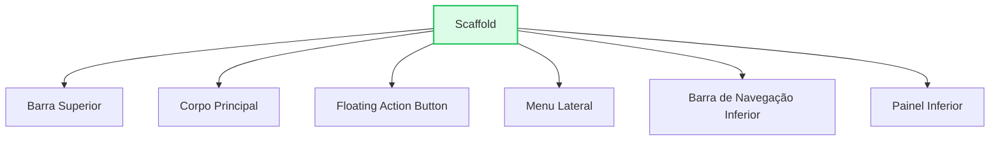

# 🏗️ Scaffold: O Guia Definitivo

<div style="text-align: center; font-size: 3rem; margin: 20px 0;">
🏛️ 🎒 🧭
</div>

Até agora, usamos o `Scaffold` apenas para ter uma barra no topo e um corpo. Mas o widget mais importante do Material Design é muito mais poderoso do que isso. Ele é uma "caixa de ferramentas" completa que já traz embutida a lógica para menus laterais, botões flutuantes, rodapés e barras de navegação.

<div class="hero-section" style="background: linear-gradient(135deg, #0f172a 0%, #334155 100%);">
    <h2>🎯 A "API" Visual do Seu App</h2>
    <p>Nesta aula, vamos explorar cada canto do Scaffold, entendendo como adicionar Drawers, Bottom Sheets, SnackBars e muito mais, tudo com propriedades nativas.</p>
</div>

---

## 🗺️ Anatomia Completa do Scaffold

O `Scaffold` foi desenhado para preencher a tela inteira e gerenciar a posição de widgets clássicos de aplicativos móveis.



### 1️⃣ Drawer (Menu Lateral) e EndDrawer

O menu "hambúrguer" clássico. Só de adicionar a propriedade `drawer`, o Flutter já:
1.  Troca o ícone da esquerda da AppBar automaticamente.
2.  Cria a animação de deslizar o menu.
3.  Gerencia o sombreamento do fundo.

```dart
drawer: Drawer(
  child: ListView(
    children: [
      DrawerHeader(child: Text("Menu do App")),
      ListTile(title: Text("Perfil"), onTap: () {}),
      ListTile(title: Text("Configurações"), onTap: () {}),
    ],
  ),
),
```

### 2️⃣ FloatingActionButton (FAB)

O botão de ação principal da tela. O Scaffold gerencia onde ele fica (geralmente no canto inferior direito) e como ele se comporta quando o teclado sobe ou quando snackbars aparecem.

-   **floatingActionButtonLocation**: Permite mudar a posição do botão (ex: `centerDocked` para ficar no meio da barra inferior).

```dart
floatingActionButton: FloatingActionButton(
  onPressed: () {},
  child: Icon(Icons.add),
  backgroundColor: Colors.pink,
),
floatingActionButtonLocation: FloatingActionButtonLocation.centerDocked,
```

### 3️⃣ BottomNavigationBar (Navegação Inferior)

A barra clássica de abas na parte inferior.

```dart
bottomNavigationBar: BottomNavigationBar(
  items: [
    BottomNavigationBarItem(icon: Icon(Icons.home), label: "Início"),
    BottomNavigationBarItem(icon: Icon(Icons.search), label: "Buscar"),
  ],
  currentIndex: 0,
  onTap: (index) { /* Lógica de troca de tela */ },
),
```

### 4️⃣ BottomSheet e PersistentFooterButtons

-   **bottomSheet**: Um painel que fica fixo no fundo da tela (como um player de música minimizado).
-   **persistentFooterButtons**: Uma lista de botões que ficam sempre visíveis acima da barra de navegação, independente do scroll do corpo.

### 5️⃣ SnackBar (Notificações)

Embora não seja uma propriedade direta do construtor, o `ScaffoldMessenger` trabalha em conjunto com o Scaffold para mostrar mensagens temporárias no rodapé.

```dart
ScaffoldMessenger.of(context).showSnackBar(
  SnackBar(content: Text("Ação realizada com sucesso!")),
);
```

---

## 🧪 Laboratório: O "Super Scaffold" no Emulador

Este é um dos códigos mais completos que você vai rodar. Ele implementa **todas** as principais funcionalidades do Scaffold de uma vez só. Copie e cole no seu `main.dart` para ver a mágica.

```dart
import 'package:flutter/material.dart';

void main() => runApp(MaterialApp(
  debugShowCheckedModeBanner: false,
  theme: ThemeData(primarySwatch: Colors.indigo), // Tema Azul Índigo
  home: SuperScaffoldPage()
));

class SuperScaffoldPage extends StatefulWidget {
  @override
  _SuperScaffoldPageState createState() => _SuperScaffoldPageState();
}

class _SuperScaffoldPageState extends State<SuperScaffoldPage> {
  int _indiceAtual = 0; // Controla a aba selecionada

  @override
  Widget build(BuildContext context) {
    return Scaffold(
      // 1. App Bar
      appBar: AppBar(
        title: Text("Super Scaffold"),
        backgroundColor: Colors.indigo,
        actions: [
          IconButton(icon: Icon(Icons.notifications), onPressed: () {}),
        ],
      ),

      // 2. Menu Lateral (Drawer)
      drawer: Drawer(
        child: Column(
          children: [
            UserAccountsDrawerHeader(
              accountName: Text("Aluno Flutter"),
              accountEmail: Text("aluno@flutter.dev"),
              currentAccountPicture: CircleAvatar(child: Text("AL")),
            ),
            ListTile(leading: Icon(Icons.settings), title: Text("Configurações")),
            ListTile(leading: Icon(Icons.exit_to_app), title: Text("Sair")),
          ],
        ),
      ),

      // 3. Corpo Principal
      body: Center(
        child: Column(
          mainAxisAlignment: MainAxisAlignment.center,
          children: [
            Text(
              "Aba Selecionada: $_indiceAtual",
              style: TextStyle(fontSize: 24, fontWeight: FontWeight.bold),
            ),
            SizedBox(height: 20),
            ElevatedButton(
              onPressed: () {
                // Dispara uma SnackBar
                ScaffoldMessenger.of(context).showSnackBar(
                  SnackBar(
                    content: Text("Olá! Eu sou uma SnackBar."),
                    action: SnackBarAction(label: "FECHAR", onPressed: () {}),
                  ),
                );
              },
              child: Text("Mostrar SnackBar"),
            )
          ],
        ),
      ),

      // 4. Botão Flutuante (FAB)
      floatingActionButton: FloatingActionButton(
        onPressed: () {},
        child: Icon(Icons.add),
        backgroundColor: Colors.pink,
      ),
      // Posiciona o botão no MEIO da barra inferior
      floatingActionButtonLocation: FloatingActionButtonLocation.centerDocked,

      // 5. Barra de Navegação Inferior
      bottomNavigationBar: BottomAppBar(
        shape: CircularNotchedRectangle(), // Cria o recorte para o botão
        notchMargin: 8.0,
        color: Colors.indigo,
        child: Row(
          mainAxisAlignment: MainAxisAlignment.spaceAround,
          children: [
            IconButton(
              icon: Icon(Icons.home, color: Colors.white), 
              onPressed: () => setState(() => _indiceAtual = 0)
            ),
            IconButton(
              icon: Icon(Icons.person, color: Colors.white), 
              onPressed: () => setState(() => _indiceAtual = 1)
            ),
          ],
        ),
      ),
    );
  }
}
```

---

## 🎯 Desafio "Full Stack UI"

<div class="challenge-box">
    <h3 style="margin-top: 0;">🤔 Misturando Componentes</h3>
    <p>O que acontece se você definir tanto um <code>drawer</code> (menu esquerdo) quanto um <code>endDrawer</code> (menu direito) no mesmo Scaffold?</p>
</div>

<details class="solution-details">
    <summary><strong>🔍 Ver Resposta</strong></summary>
    <div class="solution-content">
        <p>✅ **Funciona perfeitamente!** O Flutter vai colocar o ícone de menu (hambúrguer) na esquerda da AppBar para abrir o <code>drawer</code>, e você manualmente precisará adicionar um botão ou ícone na direita (nas <code>actions</code>) para abrir o <code>endDrawer</code> usando <code>Scaffold.of(context).openEndDrawer()</code>.</p>
    </div>
</details>

---

<div style="text-align: center; padding: 40px 0; background: linear-gradient(135deg, #0f172a 0%, #334155 100%); border-radius: 12px; color: white; margin-top: 40px;">
    <h3 style="color: white; margin: 0;">🎉 Dominador de Scaffolds!</h3>
    <p style="margin: 10px 0 0 0;">Agora você sabe que o Scaffold é muito mais que uma tela em branco. Ele é o sistema operacional do seu app.</p>
</div>
