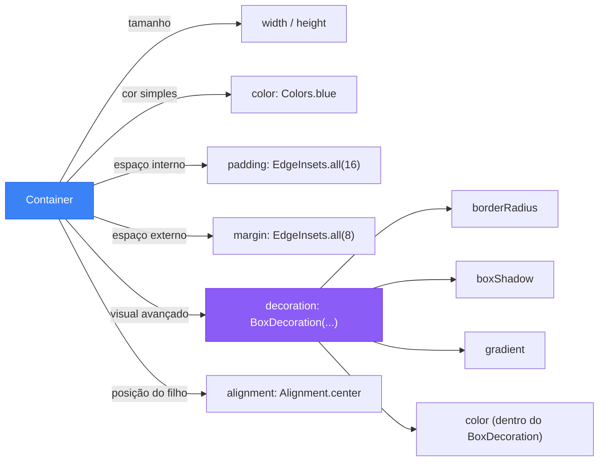

# 📦 Container: A Caixa Mágica do Flutter

<div style="text-align: center; font-size: 3rem; margin: 20px 0;">
📦 🎨 📐
</div>

Você já viu aquelas caixas de presente com laço, cor e tamanho perfeitos? O **Container** no Flutter é exatamente isso: uma caixa que você pode personalizar do jeito que quiser — cor, tamanho, bordas arredondadas, sombra e muito mais!

<div class="hero-section" style="background: linear-gradient(135deg, #94bbecff 0%, #d1edffff 100%); padding: 20px;">
    <h2>🎯 O que você vai aprender</h2>
    <p>Nesta aula vamos dominar o <code>Container</code>, o widget mais versátil do Flutter. Você vai entender cada propriedade dele e criar layouts bonitos e organizados.</p>
</div>

---

## 🤔 O que é um Container?

Pense no `Container` como uma **caixa de papelão** que você pode:

- 📏 **Definir o tamanho** (largura e altura)
- 🎨 **Pintar por dentro** (cor de fundo)
- 🖼️ **Decorar** (bordas, sombra, gradiente)
- 📐 **Adicionar espaço** dentro e fora (padding e margin)
- 📌 **Posicionar o conteúdo** dentro dela (alinhamento)

<!-- Diagrama: Anatomia do Container -->
<div style="background: #f8f9fa; border-radius: 16px; padding: 30px; margin: 30px 0; font-family: monospace;">
  <p style="text-align:center; font-weight: bold; font-size: 1.1rem; color: #333; margin-bottom: 20px;">🔍 Anatomia de um Container</p>
  <div style="position: relative; padding: 8px;">
    <!-- MARGIN -->
    <div style="background: #fff3cd; border: 2.5px dashed #f0a500; border-radius: 14px; padding: 18px; text-align: center;">
      <span style="position: absolute; top: 10px; left: 50%; transform: translateX(-50%); background: #f0a500; color: white; border-radius: 20px; padding: 2px 14px; font-size: 0.8rem; font-weight: bold;">📦 MARGIN (espaço externo)</span>
      <!-- BORDER -->
      <div style="background: #e3d5f5; border: 2.5px solid #7c3aed; border-radius: 10px; padding: 18px; margin-top: 10px;">
        <span style="display: block; color: #7c3aed; font-weight: bold; font-size: 0.8rem; margin-bottom: 8px;">🟣 BORDER (borda)</span>
        <!-- PADDING -->
        <div style="background: #d1fae5; border: 2px dashed #059669; border-radius: 8px; padding: 18px;">
          <span style="display: block; color: #059669; font-weight: bold; font-size: 0.8rem; margin-bottom: 8px;">🟢 PADDING (espaço interno)</span>
          <!-- CHILD -->
          <div style="background: #3b82f6; color: white; border-radius: 6px; padding: 12px; text-align: center; font-weight: bold;">
            🧩 CHILD (seu widget aqui: Text, Image, Icon...)
          </div>
        </div>
      </div>
    </div>
  </div>
</div>

> 💡 **Regra de ouro:** A **margin** empurra o Container para longe dos outros widgets. O **padding** empurra o conteúdo interno para longe das bordas do Container.

---

## ⚙️ Propriedades Essenciais

Veja as principais propriedades do `Container` e para que serve cada uma:

<!-- Tabela de propriedades -->
<div style="display: grid; grid-template-columns: repeat(auto-fit, minmax(250px, 1fr)); gap: 16px; margin: 24px 0;">

  <div style="background: linear-gradient(135deg, #1e3c72, #2a69ac); color: white; border-radius: 12px; padding: 20px;">
    <div style="font-size: 2rem; margin-bottom: 8px;">📏</div>
    <strong>width / height</strong>
    <p style="margin: 8px 0 0; font-size: 0.9rem; opacity: 0.9;">Define a largura e altura da caixa em pixels. Se não definir, o Container tenta ocupar todo o espaço disponível.</p>
  </div>

  <div style="background: linear-gradient(135deg, #c0392b, #e74c3c); color: white; border-radius: 12px; padding: 20px;">
    <div style="font-size: 2rem; margin-bottom: 8px;">🎨</div>
    <strong>color</strong>
    <p style="margin: 8px 0 0; font-size: 0.9rem; opacity: 0.9;">Pinta o fundo do Container com uma cor sólida. <em>Não pode ser usado junto com decoration!</em></p>
  </div>

  <div style="background: linear-gradient(135deg, #27ae60, #2ecc71); color: white; border-radius: 12px; padding: 20px;">
    <div style="font-size: 2rem; margin-bottom: 8px;">📐</div>
    <strong>padding</strong>
    <p style="margin: 8px 0 0; font-size: 0.9rem; opacity: 0.9;">Espaço interno entre as bordas do Container e o seu conteúdo. Usa <code>EdgeInsets</code>.</p>
  </div>

  <div style="background: linear-gradient(135deg, #8e44ad, #9b59b6); color: white; border-radius: 12px; padding: 20px;">
    <div style="font-size: 2rem; margin-bottom: 8px;">🔲</div>
    <strong>margin</strong>
    <p style="margin: 8px 0 0; font-size: 0.9rem; opacity: 0.9;">Espaço externo ao redor do Container. Afasta o Container dos outros widgets. Usa <code>EdgeInsets</code>.</p>
  </div>

  <div style="background: linear-gradient(135deg, #d35400, #e67e22); color: white; border-radius: 12px; padding: 20px;">
    <div style="font-size: 2rem; margin-bottom: 8px;">✨</div>
    <strong>decoration</strong>
    <p style="margin: 8px 0 0; font-size: 0.9rem; opacity: 0.9;">Decoração avançada: bordas arredondadas, sombra, gradiente. Usa <code>BoxDecoration</code>.</p>
  </div>

  <div style="background: linear-gradient(135deg, #16a085, #1abc9c); color: white; border-radius: 12px; padding: 20px;">
    <div style="font-size: 2rem; margin-bottom: 8px;">🎯</div>
    <strong>alignment</strong>
    <p style="margin: 8px 0 0; font-size: 0.9rem; opacity: 0.9;">Posiciona o conteúdo interno. Ex: <code>Alignment.center</code>, <code>Alignment.topLeft</code>.</p>
  </div>

</div>

---

## 🚀 Do Básico ao Avançado: Exemplos Práticos

### 1️⃣ Container Simples — Cor e Tamanho

O básico: uma caixa laranja de 200×100 pixels.

```dart
Container(
  width: 200,
  height: 100,
  color: Colors.orange,
)
```

<!-- Visual do resultado -->
<div style="background: #f1f5f9; border-radius: 12px; padding: 20px; margin: 16px 0; text-align: center;">
  <p style="color: #64748b; font-size: 0.85rem; margin: 0 0 10px;">📱 Resultado no emulador:</p>
  <div style="display: inline-block; width: 200px; height: 100px; background: #f97316; border-radius: 4px;"></div>
</div>

---

### 2️⃣ Adicionando Padding e Margin

Agora vamos dar espaço interno (padding) e externo (margin):

```dart
Container(
  margin: EdgeInsets.all(20),      // 20px de espaço externo em todos os lados
  padding: EdgeInsets.all(16),     // 16px de espaço interno em todos os lados
  color: Colors.blue,
  child: Text(
    'Olá, Container!',
    style: TextStyle(color: Colors.white, fontSize: 18),
  ),
)
```

<!-- Visual comparativo -->
<div style="background: #f1f5f9; border-radius: 12px; padding: 20px; margin: 16px 0;">
  <p style="color: #64748b; font-size: 0.85rem; text-align: center; margin: 0 0 16px;">📊 Comparando COM e SEM padding:</p>
  <div style="display: flex; gap: 24px; justify-content: center; flex-wrap: wrap;">
    <div style="text-align: center;">
      <div style="background: #3b82f6; color: white; font-size: 0.85rem; display: inline-block; border-radius: 4px;">Olá!</div>
      <p style="font-size: 0.8rem; color: #64748b; margin: 6px 0 0;">❌ Sem padding (apertado)</p>
    </div>
    <div style="text-align: center;">
      <div style="background: #3b82f6; color: white; font-size: 0.85rem; display: inline-block; padding: 16px; border-radius: 4px;">Olá!</div>
      <p style="font-size: 0.8rem; color: #64748b; margin: 6px 0 0;">✅ Com padding (confortável)</p>
    </div>
  </div>
</div>

---

### 3️⃣ EdgeInsets: Controlando o Espaço com Precisão

O `EdgeInsets` é como um controle remoto para o espaço. Veja as opções:

```dart
// Mesmo espaço em TODOS os lados
EdgeInsets.all(16)

// Espaço DIFERENTE em cada lado
EdgeInsets.only(
  top: 20,
  bottom: 10,
  left: 16,
  right: 16,
)

// Espaço simétrico: vertical e horizontal
EdgeInsets.symmetric(
  vertical: 20,    // top e bottom
  horizontal: 16,  // left e right
)
```

<!-- Diagrama visual EdgeInsets -->
<div style="background: #f8f9fa; border-radius: 12px; padding: 24px; margin: 16px 0; text-align: center;">
  <div style="display: inline-block; position: relative; background: #dbeafe; border: 2px solid #3b82f6; border-radius: 8px; padding: 30px 40px 20px 40px; font-size: 0.85rem;">
    <div style="position: absolute; top: 4px; left: 50%; transform: translateX(-50%); background: #3b82f6; color: white; border-radius: 8px; padding: 1px 8px; font-size: 0.75rem;">top: 30</div>
    <div style="position: absolute; bottom: 4px; left: 50%; transform: translateX(-50%); background: #3b82f6; color: white; border-radius: 8px; padding: 1px 8px; font-size: 0.75rem;">bottom: 20</div>
    <div style="position: absolute; left: 2px; top: 50%; transform: translateY(-50%); background: #3b82f6; color: white; border-radius: 8px; padding: 1px 6px; font-size: 0.75rem; writing-mode: vertical-rl;">left: 40</div>
    <div style="position: absolute; right: 2px; top: 50%; transform: translateY(-50%); background: #3b82f6; color: white; border-radius: 8px; padding: 1px 6px; font-size: 0.75rem; writing-mode: vertical-rl;">right: 40</div>
    <div style="background: #3b82f6; color: white; border-radius: 6px; padding: 10px 20px; font-weight: bold;">child</div>
  </div>
  <p style="color: #64748b; font-size: 0.8rem; margin: 10px 0 0;"><code>EdgeInsets.only(top: 30, bottom: 20, left: 40, right: 40)</code></p>
</div>

---

### 4️⃣ BoxDecoration: O Poder Total da Decoração

Quando você quer mais do que uma cor simples, usa o `decoration` com `BoxDecoration`:

```dart
Container(
  width: double.infinity,  // largura máxima disponível
  height: 150,
  decoration: BoxDecoration(
    color: Colors.purple,            // cor de fundo
    borderRadius: BorderRadius.circular(20), // bordas arredondadas
    boxShadow: [
      BoxShadow(
        color: Colors.black.withOpacity(0.3),
        blurRadius: 10,
        offset: Offset(0, 5),         // sombra para baixo
      ),
    ],
  ),
  child: Center(
    child: Text(
      '✨ Com BoxDecoration!',
      style: TextStyle(color: Colors.white, fontSize: 18),
    ),
  ),
)
```

<!-- Visual das decorações -->
<div style="display: grid; grid-template-columns: repeat(auto-fit, minmax(180px, 1fr)); gap: 16px; margin: 20px 0;">

  <div style="text-align: center;">
    <div style="background: #6366f1; height: 70px; border-radius: 4px; display: flex; align-items: center; justify-content: center; color: white; font-size: 0.85rem; margin-bottom: 8px;">Sem arredondamento</div>
    <code style="font-size: 0.75rem; color: #64748b;">borderRadius: null</code>
  </div>

  <div style="text-align: center;">
    <div style="background: #6366f1; height: 70px; border-radius: 16px; display: flex; align-items: center; justify-content: center; color: white; font-size: 0.85rem; margin-bottom: 8px;">Bordas suaves</div>
    <code style="font-size: 0.75rem; color: #64748b;">borderRadius: circular(16)</code>
  </div>

  <div style="text-align: center;">
    <div style="background: #6366f1; height: 70px; border-radius: 50px; display: flex; align-items: center; justify-content: center; color: white; font-size: 0.85rem; margin-bottom: 8px;">Totalmente redondo</div>
    <code style="font-size: 0.75rem; color: #64748b;">borderRadius: circular(50)</code>
  </div>

</div>

---

### 5️⃣ Gradiente: Deixando Mais Bonito

```dart
Container(
  width: double.infinity,
  height: 200,
  decoration: BoxDecoration(
    gradient: LinearGradient(
      colors: [Colors.blue, Colors.purple],   // de azul para roxo
      begin: Alignment.topLeft,
      end: Alignment.bottomRight,
    ),
    borderRadius: BorderRadius.circular(16),
  ),
  child: Center(
    child: Text(
      '🌈 Gradiente!',
      style: TextStyle(color: Colors.white, fontSize: 22, fontWeight: FontWeight.bold),
    ),
  ),
)
```

<!-- Visual do gradiente -->
<div style="background: linear-gradient(135deg, #3b82f6, #8b5cf6); border-radius: 16px; height: 100px; display: flex; align-items: center; justify-content: center; margin: 16px 0;">
  <span style="color: white; font-size: 1.2rem; font-weight: bold;">🌈 Gradiente!</span>
</div>

---

## 🧪 Laboratório: Cartão de Perfil Completo

Vamos juntar tudo que aprendemos e criar um **cartão de perfil** bonito! Cole no seu `main.dart`:

```dart
import 'package:flutter/material.dart';

void main() => runApp(
  MaterialApp(
    debugShowCheckedModeBanner: false,
    home: Scaffold(
      backgroundColor: Color(0xFF1a1a2e),
      body: Center(
        child: CartaoDePerfil(),
      ),
    ),
  ),
);

class CartaoDePerfil extends StatelessWidget {
  @override
  Widget build(BuildContext context) {
    return Container(
      width: 300,
      padding: EdgeInsets.all(24),
      decoration: BoxDecoration(
        // Gradiente de fundo
        gradient: LinearGradient(
          colors: [Color(0xFF0f3460), Color(0xFF16213e)],
          begin: Alignment.topLeft,
          end: Alignment.bottomRight,
        ),
        // Bordas arredondadas
        borderRadius: BorderRadius.circular(24),
        // Sombra
        boxShadow: [
          BoxShadow(
            color: Colors.blue.withOpacity(0.4),
            blurRadius: 20,
            offset: Offset(0, 10),
          ),
        ],
        // Borda fina
        border: Border.all(
          color: Colors.blue.withOpacity(0.3),
          width: 1.5,
        ),
      ),
      child: Column(
        mainAxisSize: MainAxisSize.min,  // ocupa só o necessário
        children: [
          // Avatar circular
          Container(
            width: 80,
            height: 80,
            decoration: BoxDecoration(
              shape: BoxShape.circle,    // forma de círculo!
              gradient: LinearGradient(
                colors: [Colors.blue, Colors.purple],
              ),
            ),
            child: Center(
              child: Text(
                '👨‍💻',
                style: TextStyle(fontSize: 36),
              ),
            ),
          ),

          SizedBox(height: 16),

          // Nome
          Text(
            'João Flutter',
            style: TextStyle(
              color: Colors.white,
              fontSize: 22,
              fontWeight: FontWeight.bold,
            ),
          ),

          SizedBox(height: 6),

          // Subtítulo
          Container(
            padding: EdgeInsets.symmetric(horizontal: 12, vertical: 4),
            decoration: BoxDecoration(
              color: Colors.blue.withOpacity(0.2),
              borderRadius: BorderRadius.circular(20),
              border: Border.all(color: Colors.blue.withOpacity(0.5)),
            ),
            child: Text(
              '🚀 Desenvolvedor Mobile',
              style: TextStyle(color: Colors.blue[300], fontSize: 13),
            ),
          ),

          SizedBox(height: 20),

          // Estatísticas
          Row(
            mainAxisAlignment: MainAxisAlignment.spaceAround,
            children: [
              _buildEstatistica('12', 'Projetos'),
              _buildEstatistica('48', 'Commits'),
              _buildEstatistica('⭐ 5.0', 'Nota'),
            ],
          ),
        ],
      ),
    );
  }

  // Método para criar cada estatística
  Widget _buildEstatistica(String valor, String label) {
    return Column(
      children: [
        Text(
          valor,
          style: TextStyle(
            color: Colors.white,
            fontSize: 18,
            fontWeight: FontWeight.bold,
          ),
        ),
        Text(
          label,
          style: TextStyle(color: Colors.grey[400], fontSize: 12),
        ),
      ],
    );
  }
}
```

<!-- Preview visual do cartão -->
<div style="background: #1a1a2e; border-radius: 16px; padding: 24px; max-width: 340px; margin: 20px auto; border: 1px solid rgba(59,130,246,0.3); box-shadow: 0 10px 30px rgba(59,130,246,0.3);">
  <div style="text-align: center;">
    <div style="width: 80px; height: 80px; border-radius: 50%; background: linear-gradient(135deg, #3b82f6, #8b5cf6); display: flex; align-items: center; justify-content: center; font-size: 2.2rem; margin: 0 auto;">👨‍💻</div>
    <div style="color: white; font-size: 1.3rem; font-weight: bold; margin-top: 12px;">João Flutter</div>
    <div style="background: rgba(59,130,246,0.2); border: 1px solid rgba(59,130,246,0.5); border-radius: 20px; padding: 4px 14px; display: inline-block; color: #93c5fd; font-size: 0.85rem; margin-top: 8px;">🚀 Desenvolvedor Mobile</div>
    <div style="display: flex; justify-content: space-around; margin-top: 20px; border-top: 1px solid rgba(255,255,255,0.1); padding-top: 16px;">
      <div><div style="color: white; font-weight: bold;">12</div><div style="color: #9ca3af; font-size: 0.8rem;">Projetos</div></div>
      <div><div style="color: white; font-weight: bold;">48</div><div style="color: #9ca3af; font-size: 0.8rem;">Commits</div></div>
      <div><div style="color: white; font-weight: bold;">⭐ 5.0</div><div style="color: #9ca3af; font-size: 0.8rem;">Nota</div></div>
    </div>
  </div>
</div>

---

## ⚠️ Erros Comuns (Não Caia Nessa!)

<div style="background: #fff5f5; border-left: 4px solid #ef4444; border-radius: 8px; padding: 20px; margin: 20px 0;">

**❌ ERRO: Usar `color` junto com `decoration`**

```dart
// ERRADO — vai dar erro no Flutter!
Container(
  color: Colors.blue,           // ❌
  decoration: BoxDecoration(    // ❌ não pode ter os dois!
    color: Colors.blue,
  ),
)
```

**✅ CERTO: Use `color` OU `decoration`, nunca os dois:**

```dart
// Opção 1: Só color (simples)
Container(
  color: Colors.blue,
)

// Opção 2: decoration com color dentro (avançado)
Container(
  decoration: BoxDecoration(
    color: Colors.blue,
    borderRadius: BorderRadius.circular(12),
  ),
)
```

</div>

---

## 🗺️ Guia Rápido de Referência



---

## 🎯 Desafio: Crie Seu Próprio Cartão!

<div class="challenge-box">
    <h3 style="margin-top: 0;">🤔 Missão do Dia</h3>
    <p>Usando tudo que aprendeu, crie um <strong>cartão de jogo</strong> com:</p>
    <ul>
        <li>🎮 Um emoji de personagem no centro</li>
        <li>🌈 Gradiente de fundo (duas cores que combinem)</li>
        <li>💜 Bordas arredondadas com <code>circular(20)</code></li>
        <li>👤 Nome do personagem embaixo</li>
        <li>⚡ Uma estatística (ex: Poder: 9000)</li>
        <li>🔲 Uma sombra colorida com <code>boxShadow</code></li>
    </ul>
</div>

<details class="solution-details">
    <summary><strong>🔍 Ver Exemplo de Solução</strong></summary>
    <div class="solution-content">

```dart
Container(
  width: 200,
  padding: EdgeInsets.all(20),
  decoration: BoxDecoration(
    gradient: LinearGradient(
      colors: [Colors.red[800]!, Colors.orange[700]!],
      begin: Alignment.topCenter,
      end: Alignment.bottomCenter,
    ),
    borderRadius: BorderRadius.circular(20),
    boxShadow: [
      BoxShadow(
        color: Colors.red.withOpacity(0.5),
        blurRadius: 15,
        offset: Offset(0, 8),
      ),
    ],
  ),
  child: Column(
    mainAxisSize: MainAxisSize.min,
    children: [
      Text('🐉', style: TextStyle(fontSize: 48)),
      SizedBox(height: 8),
      Text('Dragão de Fogo',
        style: TextStyle(color: Colors.white, fontSize: 16, fontWeight: FontWeight.bold)),
      SizedBox(height: 8),
      Text('⚡ Poder: 9000',
        style: TextStyle(color: Colors.yellow[300], fontSize: 14)),
    ],
  ),
)
```

  </div>
</details>

---

<div style="text-align: center; padding: 40px 0; background: linear-gradient(135deg, #1e3a5f 0%, #2980b9 100%); border-radius: 12px; color: white; margin-top: 40px;">
    <h3 style="color: white; margin: 0;">🎉 Você Dominou o Container!</h3>
    <p style="margin: 10px 0 0 0;">Agora você sabe que o <code>Container</code> é muito mais que uma caixa — é a base de toda interface bonita no Flutter. Use margin, padding, decoration e alignment para criar layouts incríveis!</p>
</div>
