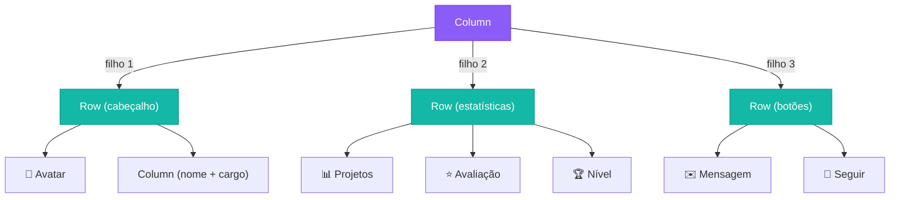
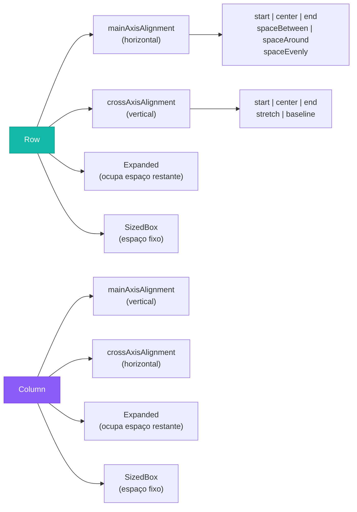

# ↔️↕️ Row e Column: Organizando a Tela como um Pro

<div style="text-align: center; font-size: 3rem; margin: 20px 0;">
↔️ 📐 ↕️
</div>

Já montou um quebra-cabeça? No Flutter, a tela é um quebra-cabeça — e o **Row** e o **Column** são as peças que organizam tudo na horizontal e na vertical. Sem eles, seus widgets ficariam todos empilhados sem ordem nenhuma!

<div class="hero-section" style="background: linear-gradient(135deg, #f0f0f0ff 0%, #2ee7d8ff 100%); padding: 20px; border-radius: 10px;">
    <h2>🎯 O que você vai aprender</h2>
    <p>Nesta aula vamos dominar o <strong>Row</strong> (linha horizontal) e o <strong>Column</strong> (coluna vertical) — os dois widgets de layout mais usados no Flutter. Você vai aprender a alinhar, distribuir e organizar widgets da forma que quiser.</p>
</div>

---

## 🧭 A Regra de Ouro: Eixos

Antes de qualquer coisa, você precisa entender um conceito fundamental: todo widget de layout tem **dois eixos**.

<!-- Diagrama de Eixos -->
<div style="background: #f8f9fa; border-radius: 16px; padding: 28px; margin: 24px 0;">
  <p style="text-align: center; font-weight: bold; color: #334155; font-size: 1rem; margin: 0 0 20px;">🧭 Os Dois Eixos de Cada Widget</p>

  <div style="display: flex; gap: 24px; flex-wrap: wrap; justify-content: center;">

    <!-- ROW -->
    <div style="background: white; border-radius: 12px; padding: 20px; flex: 1; min-width: 240px; border: 2px solid #14b8a6; box-shadow: 0 4px 12px rgba(20,184,166,0.15);">
      <p style="font-weight: bold; color: #0f766e; text-align: center; margin: 0 0 12px; font-size: 1rem;">↔️ ROW (Linha)</p>
      <!-- Eixo principal -->
      <div style="display: flex; align-items: center; gap: 6px; margin-bottom: 8px;">
        <div style="background: #14b8a6; color: white; border-radius: 6px; padding: 4px 10px; font-size: 0.8rem; white-space: nowrap;">📏 Eixo Principal →</div>
        <div style="color: #64748b; font-size: 0.8rem;">Horizontal (esquerda/direita)</div>
      </div>
      <!-- Eixo cruzado -->
      <div style="display: flex; align-items: center; gap: 6px;">
        <div style="background: #f59e0b; color: white; border-radius: 6px; padding: 4px 10px; font-size: 0.8rem; white-space: nowrap;">📏 Eixo Cruzado ↕</div>
        <div style="color: #64748b; font-size: 0.8rem;">Vertical (cima/baixo)</div>
      </div>
      <!-- Preview -->
      <div style="border: 2px dashed #14b8a6; border-radius: 8px; padding: 12px; margin-top: 14px; display: flex; align-items: center; justify-content: space-around;">
        <div style="background: #14b8a6; color: white; border-radius: 6px; padding: 8px 12px; font-size: 0.8rem;">A</div>
        <div style="background: #14b8a6; color: white; border-radius: 6px; padding: 8px 12px; font-size: 0.8rem;">B</div>
        <div style="background: #14b8a6; color: white; border-radius: 6px; padding: 8px 12px; font-size: 0.8rem;">C</div>
      </div>
      <p style="text-align: center; color: #64748b; font-size: 0.75rem; margin: 6px 0 0;">Widgets lado a lado →</p>
    </div>

    <!-- COLUMN -->
    <div style="background: white; border-radius: 12px; padding: 20px; flex: 1; min-width: 240px; border: 2px solid #8b5cf6; box-shadow: 0 4px 12px rgba(139,92,246,0.15);">
      <p style="font-weight: bold; color: #7c3aed; text-align: center; margin: 0 0 12px; font-size: 1rem;">↕️ COLUMN (Coluna)</p>
      <!-- Eixo principal -->
      <div style="display: flex; align-items: center; gap: 6px; margin-bottom: 8px;">
        <div style="background: #8b5cf6; color: white; border-radius: 6px; padding: 4px 10px; font-size: 0.8rem; white-space: nowrap;">📏 Eixo Principal ↓</div>
        <div style="color: #64748b; font-size: 0.8rem;">Vertical (cima/baixo)</div>
      </div>
      <!-- Eixo cruzado -->
      <div style="display: flex; align-items: center; gap: 6px;">
        <div style="background: #f59e0b; color: white; border-radius: 6px; padding: 4px 10px; font-size: 0.8rem; white-space: nowrap;">📏 Eixo Cruzado ↔</div>
        <div style="color: #64748b; font-size: 0.8rem;">Horizontal (esquerda/direita)</div>
      </div>
      <!-- Preview -->
      <div style="border: 2px dashed #8b5cf6; border-radius: 8px; padding: 12px; margin-top: 14px; display: flex; flex-direction: column; align-items: center; gap: 6px;">
        <div style="background: #8b5cf6; color: white; border-radius: 6px; padding: 6px 24px; font-size: 0.8rem;">A</div>
        <div style="background: #8b5cf6; color: white; border-radius: 6px; padding: 6px 24px; font-size: 0.8rem;">B</div>
        <div style="background: #8b5cf6; color: white; border-radius: 6px; padding: 6px 24px; font-size: 0.8rem;">C</div>
      </div>
      <p style="text-align: center; color: #64748b; font-size: 0.75rem; margin: 6px 0 0;">Widgets empilhados ↓</p>
    </div>

  </div>
</div>

> 💡 **Macete fácil:** **R**ow = **R**etinha horizontal. **C**olumn = **C**oluna vertical.

---

## ↔️ Row — Widgets na Horizontal

O `Row` coloca os widgets um ao lado do outro, da esquerda para a direita.

```dart
Row(
  children: [
    Icon(Icons.star, color: Colors.yellow),
    Icon(Icons.star, color: Colors.yellow),
    Icon(Icons.star, color: Colors.yellow),
    Text(' 5.0'),
  ],
)
```

<!-- Preview Row -->
<div style="background: #f1f5f9; border-radius: 12px; padding: 20px; margin: 16px 0; text-align: center;">
  <p style="color: #64748b; font-size: 0.85rem; margin: 0 0 10px;">📱 Resultado:</p>
  <div style="display: inline-flex; align-items: center; gap: 4px; background: white; padding: 12px 20px; border-radius: 8px; box-shadow: 0 2px 8px rgba(0,0,0,0.1);">
    <span style="color: #facc15; font-size: 1.4rem;">★</span>
    <span style="color: #facc15; font-size: 1.4rem;">★</span>
    <span style="color: #facc15; font-size: 1.4rem;">★</span>
    <span style="color: #334155; font-size: 1rem; margin-left: 4px;"> 5.0</span>
  </div>
</div>

---

## ↕️ Column — Widgets na Vertical

O `Column` empilha os widgets um em cima do outro, de cima para baixo.

```dart
Column(
  children: [
    Text('📧 email@exemplo.com'),
    Text('📱 (11) 99999-9999'),
    Text('🏠 São Paulo, SP'),
  ],
)
```

<!-- Preview Column -->
<div style="background: #f1f5f9; border-radius: 12px; padding: 20px; margin: 16px 0; text-align: center;">
  <p style="color: #64748b; font-size: 0.85rem; margin: 0 0 10px;">📱 Resultado:</p>
  <div style="display: inline-flex; flex-direction: column; gap: 8px; background: white; padding: 16px 28px; border-radius: 8px; box-shadow: 0 2px 8px rgba(0,0,0,0.1); text-align: left;">
    <span>📧 email@exemplo.com</span>
    <span>📱 (11) 99999-9999</span>
    <span>🏠 São Paulo, SP</span>
  </div>
</div>

---

## 🎛️ MainAxisAlignment — Distribuindo no Eixo Principal

Essa propriedade controla **como os widgets são distribuídos** ao longo do eixo principal.

<!-- Diagrama MainAxisAlignment -->
<div style="background: #f8f9fa; border-radius: 16px; padding: 24px; margin: 20px 0;">
  <p style="text-align: center; font-weight: bold; color: #334155; margin: 0 0 20px;">🎛️ MainAxisAlignment em uma Row (eixo horizontal)</p>

  <div style="display: flex; flex-direction: column; gap: 14px;">

    <!-- start -->
    <div>
      <code style="font-size: 0.8rem; color: #7c3aed;">MainAxisAlignment.start</code>
      <div style="background: #ede9fe; border-radius: 8px; padding: 8px 12px; margin-top: 4px; display: flex; justify-content: flex-start; gap: 8px;">
        <div style="background: #7c3aed; color: white; border-radius: 4px; padding: 6px 14px; font-size: 0.8rem;">A</div>
        <div style="background: #7c3aed; color: white; border-radius: 4px; padding: 6px 14px; font-size: 0.8rem;">B</div>
        <div style="background: #7c3aed; color: white; border-radius: 4px; padding: 6px 14px; font-size: 0.8rem;">C</div>
      </div>
    </div>

    <!-- center -->
    <div>
      <code style="font-size: 0.8rem; color: #0284c7;">MainAxisAlignment.center</code>
      <div style="background: #e0f2fe; border-radius: 8px; padding: 8px 12px; margin-top: 4px; display: flex; justify-content: center; gap: 8px;">
        <div style="background: #0284c7; color: white; border-radius: 4px; padding: 6px 14px; font-size: 0.8rem;">A</div>
        <div style="background: #0284c7; color: white; border-radius: 4px; padding: 6px 14px; font-size: 0.8rem;">B</div>
        <div style="background: #0284c7; color: white; border-radius: 4px; padding: 6px 14px; font-size: 0.8rem;">C</div>
      </div>
    </div>

    <!-- end -->
    <div>
      <code style="font-size: 0.8rem; color: #059669;">MainAxisAlignment.end</code>
      <div style="background: #dcfce7; border-radius: 8px; padding: 8px 12px; margin-top: 4px; display: flex; justify-content: flex-end; gap: 8px;">
        <div style="background: #059669; color: white; border-radius: 4px; padding: 6px 14px; font-size: 0.8rem;">A</div>
        <div style="background: #059669; color: white; border-radius: 4px; padding: 6px 14px; font-size: 0.8rem;">B</div>
        <div style="background: #059669; color: white; border-radius: 4px; padding: 6px 14px; font-size: 0.8rem;">C</div>
      </div>
    </div>

    <!-- spaceBetween -->
    <div>
      <code style="font-size: 0.8rem; color: #d97706;">MainAxisAlignment.spaceBetween</code>
      <div style="background: #fef3c7; border-radius: 8px; padding: 8px 12px; margin-top: 4px; display: flex; justify-content: space-between; gap: 0;">
        <div style="background: #d97706; color: white; border-radius: 4px; padding: 6px 14px; font-size: 0.8rem;">A</div>
        <div style="background: #d97706; color: white; border-radius: 4px; padding: 6px 14px; font-size: 0.8rem;">B</div>
        <div style="background: #d97706; color: white; border-radius: 4px; padding: 6px 14px; font-size: 0.8rem;">C</div>
      </div>
    </div>

    <!-- spaceAround -->
    <div>
      <code style="font-size: 0.8rem; color: #dc2626;">MainAxisAlignment.spaceAround</code>
      <div style="background: #fee2e2; border-radius: 8px; padding: 8px 12px; margin-top: 4px; display: flex; justify-content: space-around;">
        <div style="background: #dc2626; color: white; border-radius: 4px; padding: 6px 14px; font-size: 0.8rem;">A</div>
        <div style="background: #dc2626; color: white; border-radius: 4px; padding: 6px 14px; font-size: 0.8rem;">B</div>
        <div style="background: #dc2626; color: white; border-radius: 4px; padding: 6px 14px; font-size: 0.8rem;">C</div>
      </div>
    </div>

    <!-- spaceEvenly -->
    <div>
      <code style="font-size: 0.8rem; color: #0f766e;">MainAxisAlignment.spaceEvenly</code>
      <div style="background: #ccfbf1; border-radius: 8px; padding: 8px 12px; margin-top: 4px; display: flex; justify-content: space-evenly;">
        <div style="background: #0f766e; color: white; border-radius: 4px; padding: 6px 14px; font-size: 0.8rem;">A</div>
        <div style="background: #0f766e; color: white; border-radius: 4px; padding: 6px 14px; font-size: 0.8rem;">B</div>
        <div style="background: #0f766e; color: white; border-radius: 4px; padding: 6px 14px; font-size: 0.8rem;">C</div>
      </div>
    </div>

  </div>
</div>

```dart
Row(
  mainAxisAlignment: MainAxisAlignment.spaceBetween, // tente trocar!
  children: [
    Icon(Icons.home),
    Icon(Icons.search),
    Icon(Icons.person),
  ],
)
```

---

## 🎛️ CrossAxisAlignment — Alinhando no Eixo Cruzado

Controla o alinhamento **perpendicular** ao eixo principal (cima/baixo numa Row, ou esquerda/direita numa Column).

<!-- Diagrama CrossAxisAlignment em uma Row -->
<div style="background: #f8f9fa; border-radius: 16px; padding: 24px; margin: 20px 0;">
  <p style="text-align: center; font-weight: bold; color: #334155; margin: 0 0 20px;">🎛️ CrossAxisAlignment em uma Row (eixo vertical)</p>

  <div style="display: flex; gap: 16px; flex-wrap: wrap; justify-content: center;">

    <!-- start -->
    <div style="flex: 1; min-width: 160px; text-align: center;">
      <code style="font-size: 0.75rem; color: #7c3aed;">.start</code>
      <div style="background: #ede9fe; border-radius: 8px; padding: 10px 8px; margin-top: 6px; display: flex; align-items: flex-start; justify-content: center; gap: 6px; height: 80px;">
        <div style="background: #7c3aed; color: white; border-radius: 4px; padding: 6px 10px; font-size: 0.75rem;">A</div>
        <div style="background: #7c3aed; color: white; border-radius: 4px; padding: 12px 10px; font-size: 0.75rem;">B</div>
        <div style="background: #7c3aed; color: white; border-radius: 4px; padding: 8px 10px; font-size: 0.75rem;">C</div>
      </div>
    </div>

    <!-- center -->
    <div style="flex: 1; min-width: 160px; text-align: center;">
      <code style="font-size: 0.75rem; color: #0284c7;">.center</code>
      <div style="background: #e0f2fe; border-radius: 8px; padding: 10px 8px; margin-top: 6px; display: flex; align-items: center; justify-content: center; gap: 6px; height: 80px;">
        <div style="background: #0284c7; color: white; border-radius: 4px; padding: 6px 10px; font-size: 0.75rem;">A</div>
        <div style="background: #0284c7; color: white; border-radius: 4px; padding: 12px 10px; font-size: 0.75rem;">B</div>
        <div style="background: #0284c7; color: white; border-radius: 4px; padding: 8px 10px; font-size: 0.75rem;">C</div>
      </div>
    </div>

    <!-- end -->
    <div style="flex: 1; min-width: 160px; text-align: center;">
      <code style="font-size: 0.75rem; color: #059669;">.end</code>
      <div style="background: #dcfce7; border-radius: 8px; padding: 10px 8px; margin-top: 6px; display: flex; align-items: flex-end; justify-content: center; gap: 6px; height: 80px;">
        <div style="background: #059669; color: white; border-radius: 4px; padding: 6px 10px; font-size: 0.75rem;">A</div>
        <div style="background: #059669; color: white; border-radius: 4px; padding: 12px 10px; font-size: 0.75rem;">B</div>
        <div style="background: #059669; color: white; border-radius: 4px; padding: 8px 10px; font-size: 0.75rem;">C</div>
      </div>
    </div>

    <!-- stretch -->
    <div style="flex: 1; min-width: 160px; text-align: center;">
      <code style="font-size: 0.75rem; color: #d97706;">.stretch</code>
      <div style="background: #fef3c7; border-radius: 8px; padding: 10px 8px; margin-top: 6px; display: flex; align-items: stretch; justify-content: center; gap: 6px; height: 80px;">
        <div style="background: #d97706; color: white; border-radius: 4px; padding: 0 10px; font-size: 0.75rem; display: flex; align-items: center;">A</div>
        <div style="background: #d97706; color: white; border-radius: 4px; padding: 0 10px; font-size: 0.75rem; display: flex; align-items: center;">B</div>
        <div style="background: #d97706; color: white; border-radius: 4px; padding: 0 10px; font-size: 0.75rem; display: flex; align-items: center;">C</div>
      </div>
    </div>

  </div>
</div>

```dart
Row(
  crossAxisAlignment: CrossAxisAlignment.center,
  children: [
    Container(width: 40, height: 40, color: Colors.red),    // pequeno
    Container(width: 40, height: 80, color: Colors.green),  // grande
    Container(width: 40, height: 55, color: Colors.blue),   // médio
  ],
)
```

---

## 📦 O Widget SizedBox — Criando Espaços

Entre os itens de um `Row` ou `Column`, usamos o `SizedBox` para criar um espaço vazio com tamanho definido. É muito mais prático do que colocar Container vazio!

```dart
Column(
  children: [
    Text('Primeiro item'),
    SizedBox(height: 16),   // espaço de 16px entre os itens
    Text('Segundo item'),
    SizedBox(height: 8),    // espaço de 8px
    Text('Terceiro item'),
  ],
)
```

<!-- Preview SizedBox -->
<div style="background: #f1f5f9; border-radius: 12px; padding: 20px; margin: 16px 0; text-align: center;">
  <p style="color: #64748b; font-size: 0.85rem; margin: 0 0 10px;">📊 Comparando COM e SEM SizedBox:</p>
  <div style="display: flex; gap: 32px; justify-content: center; flex-wrap: wrap;">
    <div style="text-align: center;">
      <div style="background: white; border-radius: 8px; padding: 12px 20px; display: inline-flex; flex-direction: column; box-shadow: 0 2px 8px rgba(0,0,0,0.1);">
        <span style="background: #ef4444; color: white; border-radius: 4px; padding: 4px 12px; font-size: 0.8rem;">Item A</span>
        <span style="background: #ef4444; color: white; border-radius: 4px; padding: 4px 12px; font-size: 0.8rem; margin-top: 2px;">Item B</span>
        <span style="background: #ef4444; color: white; border-radius: 4px; padding: 4px 12px; font-size: 0.8rem; margin-top: 2px;">Item C</span>
      </div>
      <p style="font-size: 0.8rem; color: #64748b; margin: 6px 0 0;">❌ Sem SizedBox (grudado)</p>
    </div>
    <div style="text-align: center;">
      <div style="background: white; border-radius: 8px; padding: 12px 20px; display: inline-flex; flex-direction: column; box-shadow: 0 2px 8px rgba(0,0,0,0.1);">
        <span style="background: #22c55e; color: white; border-radius: 4px; padding: 4px 12px; font-size: 0.8rem;">Item A</span>
        <span style="background: #22c55e; color: white; border-radius: 4px; padding: 4px 12px; font-size: 0.8rem; margin-top: 16px;">Item B</span>
        <span style="background: #22c55e; color: white; border-radius: 4px; padding: 4px 12px; font-size: 0.8rem; margin-top: 8px;">Item C</span>
      </div>
      <p style="font-size: 0.8rem; color: #64748b; margin: 6px 0 0;">✅ Com SizedBox (respirando)</p>
    </div>
  </div>
</div>

---

## 🔀 Row + Column Juntos: O Poder do Layout Aninhado

A mágica acontece quando você **aninha** um dentro do outro! Assim você consegue criar qualquer layout que imaginar.



---

## 🧪 Laboratório: Tela de Perfil com Row + Column

Vamos construir uma **tela de perfil completa** usando Row e Column aninhados. Cole no seu `main.dart`:

```dart
import 'package:flutter/material.dart';

void main() => runApp(
  MaterialApp(
    debugShowCheckedModeBanner: false,
    home: TelaDePerfil(),
  ),
);

class TelaDePerfil extends StatelessWidget {
  @override
  Widget build(BuildContext context) {
    return Scaffold(
      backgroundColor: Color(0xFF0f172a),
      body: SafeArea(
        child: SingleChildScrollView(
          padding: EdgeInsets.all(20),
          child: Column(            // 📌 Column principal — empilha tudo de cima pra baixo
            crossAxisAlignment: CrossAxisAlignment.start,
            children: [

              // ── SEÇÃO 1: Cabeçalho ─────────────────────────────
              Row(                 // 📌 Row — avatar ao lado das informações
                children: [

                  // Avatar circular
                  Container(
                    width: 72,
                    height: 72,
                    decoration: BoxDecoration(
                      shape: BoxShape.circle,
                      gradient: LinearGradient(
                        colors: [Color(0xFF6366f1), Color(0xFF8b5cf6)],
                      ),
                    ),
                    child: Center(
                      child: Text('👩‍💻', style: TextStyle(fontSize: 32)),
                    ),
                  ),

                  SizedBox(width: 16),  // espaço entre avatar e texto

                  // Coluna com nome e cargo
                  Column(              // 📌 Column dentro do Row!
                    crossAxisAlignment: CrossAxisAlignment.start,
                    children: [
                      Text(
                        'Ana Flutter',
                        style: TextStyle(
                          color: Colors.white,
                          fontSize: 20,
                          fontWeight: FontWeight.bold,
                        ),
                      ),
                      SizedBox(height: 4),
                      Text(
                        '🚀 Dev Mobile Sênior',
                        style: TextStyle(color: Colors.indigo[300], fontSize: 14),
                      ),
                      SizedBox(height: 6),
                      // Badge de status
                      Container(
                        padding: EdgeInsets.symmetric(horizontal: 10, vertical: 3),
                        decoration: BoxDecoration(
                          color: Colors.green.withOpacity(0.2),
                          borderRadius: BorderRadius.circular(20),
                          border: Border.all(color: Colors.green.withOpacity(0.5)),
                        ),
                        child: Row(              // 📌 Row dentro do Column dentro do Row!
                          mainAxisSize: MainAxisSize.min,
                          children: [
                            Container(
                              width: 8,
                              height: 8,
                              decoration: BoxDecoration(
                                color: Colors.green,
                                shape: BoxShape.circle,
                              ),
                            ),
                            SizedBox(width: 6),
                            Text(
                              'Online',
                              style: TextStyle(color: Colors.green[300], fontSize: 12),
                            ),
                          ],
                        ),
                      ),
                    ],
                  ),
                ],
              ),

              SizedBox(height: 28),

              // ── SEÇÃO 2: Estatísticas ──────────────────────────
              Row(
                mainAxisAlignment: MainAxisAlignment.spaceAround,
                children: [
                  _buildEstatistica('42', 'Projetos', Icons.folder, Colors.blue),
                  _buildEstatistica('1.2k', 'Commits', Icons.code, Colors.purple),
                  _buildEstatistica('98%', 'Sucesso', Icons.star, Colors.amber),
                ],
              ),

              SizedBox(height: 28),

              // ── SEÇÃO 3: Bio ────────────────────────────────────
              Text(
                'Sobre mim',
                style: TextStyle(
                  color: Colors.white,
                  fontSize: 16,
                  fontWeight: FontWeight.bold,
                ),
              ),
              SizedBox(height: 8),
              Text(
                'Apaixonada por criar apps bonitos com Flutter. '
                'Adoro transformar ideias em interfaces incríveis! 💙',
                style: TextStyle(color: Colors.grey[400], fontSize: 14, height: 1.5),
              ),

              SizedBox(height: 28),

              // ── SEÇÃO 4: Habilidades ────────────────────────────
              Text(
                'Habilidades',
                style: TextStyle(
                  color: Colors.white,
                  fontSize: 16,
                  fontWeight: FontWeight.bold,
                ),
              ),
              SizedBox(height: 12),
              Row(
                children: [
                  _buildBadge('Flutter', Colors.blue),
                  SizedBox(width: 8),
                  _buildBadge('Dart', Colors.indigo),
                  SizedBox(width: 8),
                  _buildBadge('Firebase', Colors.orange),
                  SizedBox(width: 8),
                  _buildBadge('UI/UX', Colors.pink),
                ],
              ),

              SizedBox(height: 28),

              // ── SEÇÃO 5: Botões de ação ─────────────────────────
              Row(
                children: [
                  // Botão principal — ocupa o máximo possível
                  Expanded(
                    child: ElevatedButton.icon(
                      onPressed: () {},
                      icon: Icon(Icons.message),
                      label: Text('Mensagem'),
                      style: ElevatedButton.styleFrom(
                        backgroundColor: Color(0xFF6366f1),
                        padding: EdgeInsets.symmetric(vertical: 14),
                        shape: RoundedRectangleBorder(
                          borderRadius: BorderRadius.circular(12),
                        ),
                      ),
                    ),
                  ),
                  SizedBox(width: 12),
                  // Botão secundário
                  OutlinedButton.icon(
                    onPressed: () {},
                    icon: Icon(Icons.person_add, color: Colors.white),
                    label: Text('Seguir', style: TextStyle(color: Colors.white)),
                    style: OutlinedButton.styleFrom(
                      side: BorderSide(color: Colors.grey[600]!),
                      padding: EdgeInsets.symmetric(vertical: 14, horizontal: 20),
                      shape: RoundedRectangleBorder(
                        borderRadius: BorderRadius.circular(12),
                      ),
                    ),
                  ),
                ],
              ),

            ],
          ),
        ),
      ),
    );
  }

  // Widget auxiliar para estatísticas
  Widget _buildEstatistica(String valor, String label, IconData icone, Color cor) {
    return Column(
      children: [
        Container(
          width: 56,
          height: 56,
          decoration: BoxDecoration(
            color: cor.withOpacity(0.15),
            borderRadius: BorderRadius.circular(16),
          ),
          child: Icon(icone, color: cor, size: 24),
        ),
        SizedBox(height: 8),
        Text(
          valor,
          style: TextStyle(
            color: Colors.white,
            fontSize: 18,
            fontWeight: FontWeight.bold,
          ),
        ),
        Text(
          label,
          style: TextStyle(color: Colors.grey[500], fontSize: 12),
        ),
      ],
    );
  }

  // Widget auxiliar para badges de habilidade
  Widget _buildBadge(String texto, Color cor) {
    return Container(
      padding: EdgeInsets.symmetric(horizontal: 12, vertical: 6),
      decoration: BoxDecoration(
        color: cor.withOpacity(0.15),
        borderRadius: BorderRadius.circular(20),
        border: Border.all(color: cor.withOpacity(0.4)),
      ),
      child: Text(
        texto,
        style: TextStyle(color: cor, fontSize: 12, fontWeight: FontWeight.w600),
      ),
    );
  }
}
```

---

## 🔑 O Widget Expanded — Occupando o Espaço Restante

Quando um filho de Row ou Column precisa **preencher todo o espaço que sobrou**, usamos o `Expanded`:

```dart
Row(
  children: [
    Icon(Icons.person),       // tamanho natural
    SizedBox(width: 8),
    Expanded(                 // 📌 ocupa TODO o restante!
      child: Text('Nome muito longo que precisa de espaço...'),
    ),
    Icon(Icons.arrow_forward), // tamanho natural
  ],
)
```

<!-- Diagrama Expanded -->
<div style="background: #f8f9fa; border-radius: 12px; padding: 20px; margin: 16px 0;">
  <p style="color: #64748b; font-size: 0.85rem; text-align: center; margin: 0 0 12px;">📊 Como o Expanded funciona em uma Row:</p>
  <div style="display: flex; align-items: center; gap: 6px; background: #e0f2fe; border-radius: 8px; padding: 10px;">
    <div style="background: #0284c7; color: white; border-radius: 4px; padding: 6px 10px; font-size: 0.8rem; white-space: nowrap;">👤 Icon</div>
    <div style="background: #0ea5e9; color: white; border-radius: 4px; padding: 6px; flex: 1; font-size: 0.8rem; text-align: center;">
      ↔️ Expanded — preenche o restante
    </div>
    <div style="background: #0284c7; color: white; border-radius: 4px; padding: 6px 10px; font-size: 0.8rem; white-space: nowrap;">▶ Icon</div>
  </div>
</div>

> 💡 Você pode usar **`flex`** dentro do `Expanded` para dividir proporcionalmente:
> ```dart
> Expanded(flex: 2, child: widgetA), // ocupa 2/3
> Expanded(flex: 1, child: widgetB), // ocupa 1/3
> ```

---

## ⚠️ Erros Comuns

<div style="background: #fff5f5; border-left: 4px solid #ef4444; border-radius: 8px; padding: 20px; margin: 20px 0;">

### ❌ ERRO: Row com filhos de largura infinita

```dart
// ERRO! Text() dentro de Row tenta ter largura infinita
Row(
  children: [
    Text('Texto muito longo que pode causar overflow...'), // 💥
  ],
)
```

### ✅ SOLUÇÃO: Use Expanded

```dart
Row(
  children: [
    Expanded( // ✅ define um limite para o Text
      child: Text('Texto muito longo que agora funciona!'),
    ),
  ],
)
```

</div>

<div style="background: #fff5f5; border-left: 4px solid #ef4444; border-radius: 8px; padding: 20px; margin: 20px 0;">

### ❌ ERRO: Column com filho de altura infinita

```dart
// ERRO! ListView dentro de Column sem altura definida
Column(
  children: [
    ListView(children: [...]), // 💥 ListView quer altura infinita!
  ],
)
```

### ✅ SOLUÇÃO: Use SizedBox ou Expanded

```dart
Column(
  children: [
    SizedBox(
      height: 300, // ✅ altura definida para o ListView
      child: ListView(children: [...]),
    ),
  ],
)
```

</div>

---

## 🗺️ Guia Rápido de Referência



---

## 🎯 Desafio: Barra de Navegação Inferior

<div class="challenge-box">
    <h3 style="margin-top: 0;">🤔 Missão do Dia</h3>
    <p>Crie uma <strong>barra de navegação inferior personalizada</strong> usando apenas <code>Row</code>, <code>Column</code> e <code>Container</code>. Ela deve ter:</p>
    <ul>
        <li>🏠 Ícone de Home (selecionado — colorido)</li>
        <li>🔍 Ícone de Busca</li>
        <li>❤️ Ícone de Favoritos</li>
        <li>👤 Ícone de Perfil</li>
        <li>Cada ícone com seu label embaixo (<code>Column</code>)</li>
        <li>Todos distribuídos igualmente (<code>mainAxisAlignment.spaceAround</code>)</li>
    </ul>
</div>

<details class="solution-details">
    <summary><strong>🔍 Ver Exemplo de Solução</strong></summary>
    <div class="solution-content">

```dart
Container(
  padding: EdgeInsets.symmetric(vertical: 12),
  decoration: BoxDecoration(
    color: Color(0xFF1e293b),
    borderRadius: BorderRadius.only(
      topLeft: Radius.circular(20),
      topRight: Radius.circular(20),
    ),
    boxShadow: [
      BoxShadow(color: Colors.black45, blurRadius: 10, offset: Offset(0, -2)),
    ],
  ),
  child: Row(
    mainAxisAlignment: MainAxisAlignment.spaceAround,
    children: [
      _buildNavItem(Icons.home, 'Home', true),
      _buildNavItem(Icons.search, 'Buscar', false),
      _buildNavItem(Icons.favorite, 'Favoritos', false),
      _buildNavItem(Icons.person, 'Perfil', false),
    ],
  ),
)

// Widget auxiliar
Widget _buildNavItem(IconData icone, String label, bool ativo) {
  return Column(
    mainAxisSize: MainAxisSize.min,
    children: [
      Icon(icone, color: ativo ? Colors.indigo[300] : Colors.grey[600]),
      SizedBox(height: 4),
      Text(
        label,
        style: TextStyle(
          color: ativo ? Colors.indigo[300] : Colors.grey[600],
          fontSize: 11,
        ),
      ),
    ],
  );
}
```

  </div>
</details>

---

<div style="text-align: center; padding: 40px 0; background: linear-gradient(135deg, #134e4a 0%, #0d9488 100%); border-radius: 12px; color: white; margin-top: 40px;">
    <h3 style="color: white; margin: 0;">🎉 Mestre do Layout!</h3>
    <p style="margin: 10px 0 0 0;">Com <code>Row</code> e <code>Column</code>, você consegue criar qualquer layout de aplicativo. A chave é pensar: <strong>"Isso vai para o lado? → Row. Vai pra baixo? → Column."</strong> Misture os dois e crie layouts incríveis!</p>
</div>
