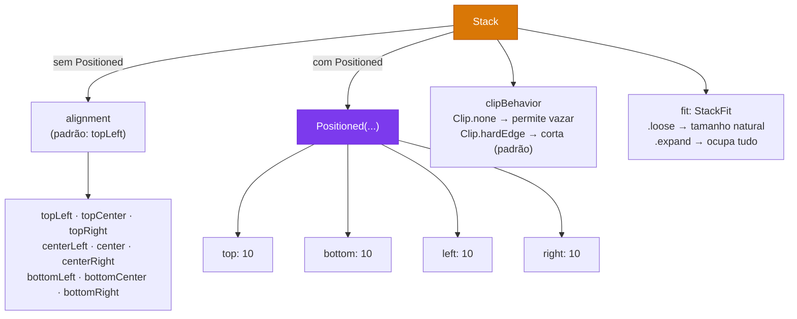

# 🃏 Stack: Sobrepondo Widgets como Camadas

<div style="text-align: center; font-size: 3rem; margin: 20px 0;">
🃏 🖼️ 📍
</div>

Você já viu uma foto com um texto escrito em cima dela? Ou um botão flutuante sobre uma imagem? Isso é o **Stack** em ação! Enquanto o `Row` coloca widgets lado a lado e o `Column` os empilha de cima pra baixo, o `Stack` os coloca **uns sobre os outros**, como folhas de papel numa mesa.

<div class="hero-section" style="background: linear-gradient(135deg, #e0e0e0ff 0%, #fff4e9ff 100%); padding: 20px; border-radius: 10px;">
    <h2>🎯 O que você vai aprender</h2>
    <p>Nesta aula vamos dominar o <strong>Stack</strong> — o widget que permite sobrepor widgets como camadas. Você vai aprender a posicionar elementos com precisão usando o <strong>Positioned</strong> e criar interfaces com overlays, badges e banners.</p>
</div>

---

## 🤔 O que é um Stack?

Imagine uma **pilha de cartas de baralho** na sua mão. A primeira carta fica embaixo, a segunda por cima dela, a terceira por cima da segunda... O `Stack` funciona exatamente assim com os widgets!

<div style="background: #f8f9fa; border-radius: 16px; padding: 28px; margin: 24px 0;">
  <p style="text-align: center; font-weight: bold; color: #334155; font-size: 1rem; margin: 0 0 24px;">🃏 Como o Stack empilha os widgets</p>
  <div style="display: flex; gap: 20px; flex-wrap: wrap; justify-content: center;">

    <div style="text-align: center; flex: 1; min-width: 150px;">
      <div style="font-weight: bold; color: #0d9488; margin-bottom: 8px; font-size: 0.9rem;">↔️ Row</div>
      <div style="background: white; border: 2px solid #0d9488; border-radius: 8px; padding: 12px; display: flex; gap: 6px; justify-content: center;">
        <div style="background: #f87171; border-radius: 4px; width: 30px; height: 30px;"></div>
        <div style="background: #4ade80; border-radius: 4px; width: 30px; height: 30px;"></div>
        <div style="background: #60a5fa; border-radius: 4px; width: 30px; height: 30px;"></div>
      </div>
      <p style="font-size: 0.75rem; color: #64748b; margin: 6px 0 0;">Lado a lado</p>
    </div>

    <div style="text-align: center; flex: 1; min-width: 150px;">
      <div style="font-weight: bold; color: #7c3aed; margin-bottom: 8px; font-size: 0.9rem;">↕️ Column</div>
      <div style="background: white; border: 2px solid #7c3aed; border-radius: 8px; padding: 12px; display: flex; flex-direction: column; gap: 6px; align-items: center;">
        <div style="background: #f87171; border-radius: 4px; width: 30px; height: 18px;"></div>
        <div style="background: #4ade80; border-radius: 4px; width: 30px; height: 18px;"></div>
        <div style="background: #60a5fa; border-radius: 4px; width: 30px; height: 18px;"></div>
      </div>
      <p style="font-size: 0.75rem; color: #64748b; margin: 6px 0 0;">Um em cima do outro</p>
    </div>

    <div style="text-align: center; flex: 1; min-width: 150px;">
      <div style="font-weight: bold; color: #d97706; margin-bottom: 8px; font-size: 0.9rem;">🃏 Stack</div>
      <div style="background: white; border: 2px solid #d97706; border-radius: 8px; padding: 12px; display: flex; flex-direction: column; align-items: center; gap: 4px;">
        <div style="background: #f87171; border-radius: 4px; width: 60px; height: 14px; opacity: 0.9;"></div>
        <div style="background: #4ade80; border-radius: 4px; width: 44px; height: 14px; opacity: 0.9;"></div>
        <div style="background: #60a5fa; border-radius: 4px; width: 28px; height: 14px; opacity: 0.9;"></div>
        <p style="font-size: 0.65rem; color: #d97706; margin: 4px 0 0;">1º (fundo) → 3º (topo)</p>
      </div>
      <p style="font-size: 0.75rem; color: #64748b; margin: 6px 0 0;">Sobrepostos como camadas</p>
    </div>

  </div>
</div>

> 💡 **Regra fundamental:** No `Stack`, o **primeiro filho** fica na camada mais **baixa** (fundo), e o **último filho** fica na camada mais **alta** (topo).

---

## 🎨 Stack Simples — O Básico

O exemplo mais simples: três caixas sobrepostas. A vermelha fica embaixo, a verde no meio e a azul no topo.

```dart
Stack(
  children: [
    Container(width: 200, height: 200, color: Colors.red),    // 1º = fundo
    Container(width: 160, height: 160, color: Colors.green),  // 2º = meio
    Container(width: 120, height: 120, color: Colors.blue),   // 3º = topo
  ],
)
```

<div style="background: #f1f5f9; border-radius: 12px; padding: 20px; margin: 16px 0; text-align: center;">
  <p style="color: #64748b; font-size: 0.85rem; margin: 0 0 14px;">📱 Resultado (representação das camadas):</p>
  <div style="display: flex; flex-direction: column; align-items: center; gap: 6px; margin-bottom: 12px;">
    <div style="background: #ef4444; border-radius: 6px; width: 140px; height: 28px; display: flex; align-items: center; justify-content: center;">
      <span style="color: white; font-size: 0.75rem; font-weight: bold;">🟥 Vermelho — 1º (fundo)</span>
    </div>
    <div style="background: #22c55e; border-radius: 6px; width: 110px; height: 28px; display: flex; align-items: center; justify-content: center;">
      <span style="color: white; font-size: 0.75rem; font-weight: bold;">� Verde — 2º (meio)</span>
    </div>
    <div style="background: #3b82f6; border-radius: 6px; width: 80px; height: 28px; display: flex; align-items: center; justify-content: center;">
      <span style="color: white; font-size: 0.75rem; font-weight: bold;">� Azul — 3º (topo)</span>
    </div>
  </div>
  <p style="color: #94a3b8; font-size: 0.75rem; margin: 0;">⬆️ O maior fica embaixo, o menor fica em cima, todos sobrepostos</p>
</div>

---

## 📍 Positioned — Posicionando com Precisão

Por padrão, os filhos do Stack ficam no canto superior esquerdo. Para posicionar com precisão, usamos o widget **`Positioned`** — ele funciona como um "alfinete no mapa":

```dart
Stack(
  children: [
    // Base (fundo)
    Container(width: 300, height: 300, color: Colors.grey[200]),

    // Posicionado no canto superior direito
    Positioned(
      top: 10,
      right: 10,
      child: Icon(Icons.star, color: Colors.yellow, size: 32),
    ),

    // Posicionado no centro inferior
    Positioned(
      bottom: 16,
      left: 0,
      right: 0,   // left: 0 + right: 0 = largura total da Stack
      child: Center(
        child: Text(
          'Legenda aqui',
          style: TextStyle(fontSize: 16, fontWeight: FontWeight.bold),
        ),
      ),
    ),
  ],
)
```

<div style="background: #f8f9fa; border-radius: 16px; padding: 24px; margin: 20px 0;">
  <p style="text-align: center; font-weight: bold; color: #334155; margin: 0 0 16px;">📍 Propriedades do Positioned — onde cada valor posiciona o widget</p>
  <div style="display: grid; grid-template-columns: 1fr 1fr; gap: 10px; max-width: 420px; margin: 0 auto;">
    <div style="background: #fee2e2; border: 2px solid #dc2626; border-radius: 10px; padding: 12px; text-align: center;">
      <div style="background: #dc2626; color: white; border-radius: 6px; padding: 3px 10px; font-size: 0.75rem; font-weight: bold; display: inline-block; margin-bottom: 6px;">top</div>
      <p style="font-size: 0.75rem; color: #7f1d1d; margin: 0;">Distância a partir do <strong>topo</strong> do Stack</p>
      <code style="font-size: 0.7rem; color: #dc2626;">top: 20</code>
    </div>
    <div style="background: #ede9fe; border: 2px solid #7c3aed; border-radius: 10px; padding: 12px; text-align: center;">
      <div style="background: #7c3aed; color: white; border-radius: 6px; padding: 3px 10px; font-size: 0.75rem; font-weight: bold; display: inline-block; margin-bottom: 6px;">right</div>
      <p style="font-size: 0.75rem; color: #4c1d95; margin: 0;">Distância a partir da <strong>direita</strong> do Stack</p>
      <code style="font-size: 0.7rem; color: #7c3aed;">right: 16</code>
    </div>
    <div style="background: #dcfce7; border: 2px solid #16a34a; border-radius: 10px; padding: 12px; text-align: center;">
      <div style="background: #16a34a; color: white; border-radius: 6px; padding: 3px 10px; font-size: 0.75rem; font-weight: bold; display: inline-block; margin-bottom: 6px;">left</div>
      <p style="font-size: 0.75rem; color: #14532d; margin: 0;">Distância a partir da <strong>esquerda</strong> do Stack</p>
      <code style="font-size: 0.7rem; color: #16a34a;">left: 16</code>
    </div>
    <div style="background: #dbeafe; border: 2px solid #2563eb; border-radius: 10px; padding: 12px; text-align: center;">
      <div style="background: #2563eb; color: white; border-radius: 6px; padding: 3px 10px; font-size: 0.75rem; font-weight: bold; display: inline-block; margin-bottom: 6px;">bottom</div>
      <p style="font-size: 0.75rem; color: #1e3a8a; margin: 0;">Distância a partir do <strong>fundo</strong> do Stack</p>
      <code style="font-size: 0.7rem; color: #2563eb;">bottom: 20</code>
    </div>
  </div>
  <p style="text-align: center; color: #64748b; font-size: 0.8rem; margin: 14px 0 0;">💡 Use <code>left: 0, right: 0</code> juntos para <strong>preencher toda a largura</strong>!</p>
</div>

---

## 🃏 Casos de Uso Reais do Stack

O `Stack` é essencial para criar interfaces profissionais. Veja os casos mais comuns:

<!-- Cards de casos de uso -->
<div style="display: grid; grid-template-columns: repeat(auto-fit, minmax(230px, 1fr)); gap: 16px; margin: 24px 0;">

  <div style="background: linear-gradient(135deg, #1e3a5f, #2563eb); color: white; border-radius: 12px; padding: 20px;">
    <div style="font-size: 2rem; margin-bottom: 10px;">🖼️</div>
    <strong>Imagem com Legenda</strong>
    <p style="font-size: 0.85rem; opacity: 0.9; margin: 8px 0 0;">Texto sobre uma foto com gradiente escurecendo a parte inferior. Muito usado em cards de notícias.</p>
  </div>

  <div style="background: linear-gradient(135deg, #7c3aed, #a855f7); color: white; border-radius: 12px; padding: 20px;">
    <div style="font-size: 2rem; margin-bottom: 10px;">🔴</div>
    <strong>Badge de Notificação</strong>
    <p style="font-size: 0.85rem; opacity: 0.9; margin: 8px 0 0;">O número vermelho em cima do ícone de sino ou carrinho. O badge fica posicionado no topo-direito do ícone.</p>
  </div>

  <div style="background: linear-gradient(135deg, #065f46, #10b981); color: white; border-radius: 12px; padding: 20px;">
    <div style="font-size: 2rem; margin-bottom: 10px;">🎌</div>
    <strong>Banner / Faixa</strong>
    <p style="font-size: 0.85rem; opacity: 0.9; margin: 8px 0 0;">Faixa de "Novo", "Promoção" ou "Em alta" no canto de um card de produto.</p>
  </div>

  <div style="background: linear-gradient(135deg, #9a3412, #ea580c); color: white; border-radius: 12px; padding: 20px;">
    <div style="font-size: 2rem; margin-bottom: 10px;">🎴</div>
    <strong>Cards Sobrepostos</strong>
    <p style="font-size: 0.85rem; opacity: 0.9; margin: 8px 0 0;">Efeito de "deck" de cards, como em apps de galeria de fotos ou apps de quiz.</p>
  </div>

  <div style="background: linear-gradient(135deg, #1e293b, #475569); color: white; border-radius: 12px; padding: 20px;">
    <div style="font-size: 2rem; margin-bottom: 10px;">⬇️</div>
    <strong>Overlay / Loading</strong>
    <p style="font-size: 0.85rem; opacity: 0.9; margin: 8px 0 0;">Tela de carregamento semi-transparente por cima do conteúdo, bloqueando a interação.</p>
  </div>

  <div style="background: linear-gradient(135deg, #701a75, #d946ef); color: white; border-radius: 12px; padding: 20px;">
    <div style="font-size: 2rem; margin-bottom: 10px;">🎮</div>
    <strong>Interface de Jogo</strong>
    <p style="font-size: 0.85rem; opacity: 0.9; margin: 8px 0 0;">HUD (placar, vidas, tempo) sobreposta ao cenário do jogo, todos num Stack gigante.</p>
  </div>

</div>

---

## 🧪 Laboratório 1: Card com Imagem e Gradiente

O caso de uso mais clássico do Stack. Veja como criar um card de notícia com texto sobre imagem:

```dart
import 'package:flutter/material.dart';

void main() => runApp(
  MaterialApp(
    debugShowCheckedModeBanner: false,
    home: Scaffold(
      backgroundColor: Color(0xFF111827),
      body: Center(child: CardNoticia()),
    ),
  ),
);

class CardNoticia extends StatelessWidget {
  @override
  Widget build(BuildContext context) {
    return ClipRRect(          // ClipRRect "corta" os cantos para arredondar
      borderRadius: BorderRadius.circular(20),
      child: Stack(
        children: [

          // CAMADA 1 (fundo): Imagem de fundo simulada com um Container colorido
          Container(
            width: 320,
            height: 420,
            decoration: BoxDecoration(
              gradient: LinearGradient(
                colors: [Color(0xFF0f4c75), Color(0xFF1b262c)],
                begin: Alignment.topLeft,
                end: Alignment.bottomRight,
              ),
            ),
            child: Center(
              child: Text('🌆', style: TextStyle(fontSize: 100)),
            ),
          ),

          // CAMADA 2: Gradiente escuro na parte de baixo (para o texto ficar legível)
          Positioned(
            bottom: 0,
            left: 0,
            right: 0,
            height: 200,    // cobre apenas metade inferior
            child: Container(
              decoration: BoxDecoration(
                gradient: LinearGradient(
                  begin: Alignment.topCenter,
                  end: Alignment.bottomCenter,
                  colors: [
                    Colors.transparent,           // invisível no topo
                    Colors.black.withOpacity(0.9), // bem escuro embaixo
                  ],
                ),
              ),
            ),
          ),

          // CAMADA 3: Badge de categoria no topo esquerdo
          Positioned(
            top: 16,
            left: 16,
            child: Container(
              padding: EdgeInsets.symmetric(horizontal: 12, vertical: 6),
              decoration: BoxDecoration(
                color: Colors.blue,
                borderRadius: BorderRadius.circular(20),
              ),
              child: Text(
                '🏙️ TECNOLOGIA',
                style: TextStyle(
                  color: Colors.white,
                  fontSize: 11,
                  fontWeight: FontWeight.bold,
                  letterSpacing: 0.5,
                ),
              ),
            ),
          ),

          // CAMADA 4: Ícone de favorito no topo direito
          Positioned(
            top: 12,
            right: 12,
            child: Container(
              width: 40,
              height: 40,
              decoration: BoxDecoration(
                color: Colors.black.withOpacity(0.4),
                shape: BoxShape.circle,
              ),
              child: Icon(Icons.favorite_border, color: Colors.white, size: 20),
            ),
          ),

          // CAMADA 5 (topo): Textos na parte inferior
          Positioned(
            bottom: 20,
            left: 20,
            right: 20,
            child: Column(
              crossAxisAlignment: CrossAxisAlignment.start,
              children: [
                Text(
                  'Flutter domina o mercado\nde desenvolvimento mobile',
                  style: TextStyle(
                    color: Colors.white,
                    fontSize: 18,
                    fontWeight: FontWeight.bold,
                    height: 1.3,
                  ),
                ),
                SizedBox(height: 8),
                Row(
                  children: [
                    CircleAvatar(
                      radius: 12,
                      child: Text('👤', style: TextStyle(fontSize: 14)),
                    ),
                    SizedBox(width: 8),
                    Text(
                      'João Dev  •  24 Fev 2026',
                      style: TextStyle(color: Colors.grey[400], fontSize: 12),
                    ),
                  ],
                ),
              ],
            ),
          ),

        ],
      ),
    );
  }
}
```

---

## 🧪 Laboratório 2: Ícone com Badge de Notificação

O Stack mais útil do dia a dia — o badge vermelho em cima de um ícone:

```dart
// Widget reutilizável de ícone com badge
Widget iconeComBadge(IconData icone, int quantidade) {
  return Stack(
    clipBehavior: Clip.none,      // permite o badge "vazar" para fora
    children: [

      // CAMADA 1: O ícone principal
      Icon(icone, size: 32, color: Colors.white),

      // CAMADA 2: O badge de notificação
      Positioned(
        top: -6,      // sobe 6px acima do ícone
        right: -6,    // avança 6px para a direita
        child: Container(
          width: 20,
          height: 20,
          decoration: BoxDecoration(
            color: Colors.red,
            shape: BoxShape.circle,
            border: Border.all(color: Colors.white, width: 2),
          ),
          child: Center(
            child: Text(
              '$quantidade',
              style: TextStyle(
                color: Colors.white,
                fontSize: 10,
                fontWeight: FontWeight.bold,
              ),
            ),
          ),
        ),
      ),

    ],
  );
}

// Usando o widget:
iconeComBadge(Icons.notifications, 3)
iconeComBadge(Icons.shopping_cart, 12)
```

<!-- Preview do badge -->
<div style="background: #1e293b; border-radius: 12px; padding: 24px; margin: 16px 0; display: flex; gap: 32px; justify-content: center; flex-wrap: wrap;">

  <div style="text-align: center;">
    <div style="position: relative; display: inline-block; margin: 10px;">
      <span style="font-size: 2rem;">🔔</span>
      <div style="position: absolute; top: -6px; right: -6px; background: red; color: white; border-radius: 50%; width: 20px; height: 20px; display: flex; align-items: center; justify-content: center; font-size: 0.65rem; font-weight: bold; border: 2px solid #1e293b;">3</div>
    </div>
    <p style="color: #94a3b8; font-size: 0.8rem; margin: 6px 0 0;">Notificações</p>
  </div>

  <div style="text-align: center;">
    <div style="position: relative; display: inline-block; margin: 10px;">
      <span style="font-size: 2rem;">🛒</span>
      <div style="position: absolute; top: -6px; right: -6px; background: red; color: white; border-radius: 50%; width: 20px; height: 20px; display: flex; align-items: center; justify-content: center; font-size: 0.65rem; font-weight: bold; border: 2px solid #1e293b;">12</div>
    </div>
    <p style="color: #94a3b8; font-size: 0.8rem; margin: 6px 0 0;">Carrinho</p>
  </div>

  <div style="text-align: center;">
    <div style="position: relative; display: inline-block; margin: 10px;">
      <span style="font-size: 2rem;">✉️</span>
      <div style="position: absolute; top: -6px; right: -6px; background: red; color: white; border-radius: 50%; width: 20px; height: 20px; display: flex; align-items: center; justify-content: center; font-size: 0.65rem; font-weight: bold; border: 2px solid #1e293b;">7</div>
    </div>
    <p style="color: #94a3b8; font-size: 0.8rem; margin: 6px 0 0;">Mensagens</p>
  </div>

</div>

---

## ⚙️ Propriedades do Stack

<div style="display: grid; grid-template-columns: repeat(auto-fit, minmax(250px, 1fr)); gap: 16px; margin: 24px 0;">

  <div style="background: linear-gradient(135deg, #1e3a5f, #2563eb); color: white; border-radius: 12px; padding: 20px;">
    <div style="font-size: 1.8rem; margin-bottom: 8px;">🎯</div>
    <strong>alignment</strong>
    <p style="font-size: 0.85rem; opacity: 0.9; margin: 8px 0 0;">Define onde os filhos <em>não posicionados</em> ficam por padrão. Ex: <code>Alignment.center</code> centraliza todos.</p>
    <code style="font-size: 0.75rem; opacity: 0.8;">alignment: Alignment.center</code>
  </div>

  <div style="background: linear-gradient(135deg, #7c3aed, #a855f7); color: white; border-radius: 12px; padding: 20px;">
    <div style="font-size: 1.8rem; margin-bottom: 8px;">✂️</div>
    <strong>clipBehavior</strong>
    <p style="font-size: 0.85rem; opacity: 0.9; margin: 8px 0 0;">Controla se filhos que "vazam" para fora do Stack são cortados. Use <code>Clip.none</code> para badges.</p>
    <code style="font-size: 0.75rem; opacity: 0.8;">clipBehavior: Clip.none</code>
  </div>

  <div style="background: linear-gradient(135deg, #065f46, #10b981); color: white; border-radius: 12px; padding: 20px;">
    <div style="font-size: 1.8rem; margin-bottom: 8px;">📐</div>
    <strong>fit (StackFit)</strong>
    <p style="font-size: 0.85rem; opacity: 0.9; margin: 8px 0 0;"><code>loose</code>: filhos usam seu tamanho natural. <code>expand</code>: filhos expandem para preencher o Stack todo.</p>
    <code style="font-size: 0.75rem; opacity: 0.8;">fit: StackFit.expand</code>
  </div>

</div>

---

## 🎛️ alignment — Posicionando sem Positioned

Se você não usar `Positioned`, pode controlar o alinhamento geral de todos os filhos com a propriedade `alignment` do Stack:

```dart
Stack(
  alignment: Alignment.center,  // centraliza todos os filhos não posicionados
  children: [
    Container(width: 200, height: 200, color: Colors.indigo),
    Text(
      '🎯 Centrado!',
      style: TextStyle(color: Colors.white, fontWeight: FontWeight.bold),
    ),
  ],
)
```

<div style="background: #f8f9fa; border-radius: 16px; padding: 24px; margin: 20px 0;">
  <p style="text-align: center; font-weight: bold; color: #334155; margin: 0 0 16px;">🎛️ Valores de alignment no Stack — onde o filho ficará</p>
  <div style="display: grid; grid-template-columns: repeat(3, 1fr); gap: 8px; max-width: 420px; margin: 0 auto;">

    <div style="background: #dbeafe; border-radius: 8px; padding: 10px; text-align: center; border: 1px solid #bfdbfe;">
      <div style="font-size: 1.2rem;">↖️</div>
      <code style="font-size: 0.65rem; color: #1d4ed8; display: block; margin-top: 4px;">topLeft</code>
    </div>

    <div style="background: #dbeafe; border-radius: 8px; padding: 10px; text-align: center; border: 1px solid #bfdbfe;">
      <div style="font-size: 1.2rem;">⬆️</div>
      <code style="font-size: 0.65rem; color: #1d4ed8; display: block; margin-top: 4px;">topCenter</code>
    </div>

    <div style="background: #dbeafe; border-radius: 8px; padding: 10px; text-align: center; border: 1px solid #bfdbfe;">
      <div style="font-size: 1.2rem;">↗️</div>
      <code style="font-size: 0.65rem; color: #1d4ed8; display: block; margin-top: 4px;">topRight</code>
    </div>

    <div style="background: #dbeafe; border-radius: 8px; padding: 10px; text-align: center; border: 1px solid #bfdbfe;">
      <div style="font-size: 1.2rem;">⬅️</div>
      <code style="font-size: 0.65rem; color: #1d4ed8; display: block; margin-top: 4px;">centerLeft</code>
    </div>

    <div style="background: #bfdbfe; border-radius: 8px; padding: 10px; text-align: center; border: 2px solid #1d4ed8;">
      <div style="font-size: 1.2rem;">🎯</div>
      <code style="font-size: 0.65rem; color: #1d4ed8; display: block; margin-top: 4px; font-weight: bold;">center</code>
    </div>

    <div style="background: #dbeafe; border-radius: 8px; padding: 10px; text-align: center; border: 1px solid #bfdbfe;">
      <div style="font-size: 1.2rem;">➡️</div>
      <code style="font-size: 0.65rem; color: #1d4ed8; display: block; margin-top: 4px;">centerRight</code>
    </div>

    <div style="background: #dbeafe; border-radius: 8px; padding: 10px; text-align: center; border: 1px solid #bfdbfe;">
      <div style="font-size: 1.2rem;">↙️</div>
      <code style="font-size: 0.65rem; color: #1d4ed8; display: block; margin-top: 4px;">bottomLeft</code>
    </div>

    <div style="background: #dbeafe; border-radius: 8px; padding: 10px; text-align: center; border: 1px solid #bfdbfe;">
      <div style="font-size: 1.2rem;">⬇️</div>
      <code style="font-size: 0.65rem; color: #1d4ed8; display: block; margin-top: 4px;">bottomCenter</code>
    </div>

    <div style="background: #dbeafe; border-radius: 8px; padding: 10px; text-align: center; border: 1px solid #bfdbfe;">
      <div style="font-size: 1.2rem;">↘️</div>
      <code style="font-size: 0.65rem; color: #1d4ed8; display: block; margin-top: 4px;">bottomRight</code>
    </div>

  </div>
  <p style="text-align: center; color: #64748b; font-size: 0.8rem; margin: 14px 0 0;">Cada seta indica para qual canto do Stack o filho (sem Positioned) será enviado</p>
</div>


---


## ⚠️ Erros Comuns

<div style="background: #fff5f5; border-left: 4px solid #ef4444; border-radius: 8px; padding: 20px; margin: 20px 0;">

### ❌ ERRO: Filho com tamanho infinito no Stack

```dart
// ERRO! Column dentro de Stack tenta ter altura infinita
Stack(
  children: [
    Column(children: [...]), // 💥 Column sem altura definida
  ],
)
```

### ✅ SOLUÇÃO: Envolva em Positioned ou dê tamanho fixo

```dart
Stack(
  children: [
    Positioned(
      top: 0, bottom: 0, left: 0, right: 0, // ✅ define limites para a Column
      child: Column(children: [...]),
    ),
  ],
)
```

</div>

<div style="background: #fff5f5; border-left: 4px solid #ef4444; border-radius: 8px; padding: 20px; margin: 20px 0;">

### ❌ ERRO: Badge cortado pelo Stack

```dart
// O badge some porque o Stack corta o que excede seus limites
Stack(
  // clipBehavior padrão = Clip.hardEdge (corta o conteúdo)
  children: [
    Icon(Icons.notifications),
    Positioned(top: -8, right: -8,  // ❌ "vaza" para fora e é cortado
      child: Container(/*badge*/),
    ),
  ],
)
```

### ✅ SOLUÇÃO: Use `clipBehavior: Clip.none`

```dart
Stack(
  clipBehavior: Clip.none, // ✅ permite que o badge apareça para fora
  children: [
    Icon(Icons.notifications),
    Positioned(top: -8, right: -8,
      child: Container(/*badge*/),
    ),
  ],
)
```

</div>

---

## 🗺️ Guia Rápido de Referência



---

## 🎯 Desafio: Card de Produto com Faixa de Desconto

<div class="challenge-box">
    <h3 style="margin-top: 0;">🤔 Missão do Dia</h3>
    <p>Crie um <strong>card de produto</strong> usando Stack com:</p>
    <ul>
        <li>🟦 Um Container colorido simulando a foto do produto (com emoji no centro)</li>
        <li>🎌 Uma faixa diagonal "OFERTA" no canto superior esquerdo (use <code>Positioned</code>)</li>
        <li>❤️ Um ícone de favorito no canto superior direito</li>
        <li>💰 Nome e preço do produto na parte inferior (com gradiente escuro embaixo)</li>
        <li>⭐ Uma avaliação com estrelas sobreposta ao conteúdo</li>
    </ul>
</div>

<details class="solution-details">
    <summary><strong>🔍 Ver Exemplo de Solução</strong></summary>
    <div class="solution-content">

```dart
ClipRRect(
  borderRadius: BorderRadius.circular(16),
  child: Stack(
    children: [
      // Fundo do produto
      Container(
        width: 200,
        height: 260,
        color: Color(0xFF1e293b),
        child: Center(child: Text('👟', style: TextStyle(fontSize: 80))),
      ),

      // Gradiente inferior
      Positioned(
        bottom: 0, left: 0, right: 0, height: 120,
        child: Container(
          decoration: BoxDecoration(
            gradient: LinearGradient(
              begin: Alignment.topCenter,
              end: Alignment.bottomCenter,
              colors: [Colors.transparent, Colors.black87],
            ),
          ),
        ),
      ),

      // Faixa de oferta
      Positioned(
        top: 16, left: -20,
        child: Transform.rotate(
          angle: -0.5,
          child: Container(
            width: 120, height: 28,
            color: Colors.red,
            alignment: Alignment.center,
            child: Text('🔥 OFERTA',
              style: TextStyle(color: Colors.white, fontSize: 11, fontWeight: FontWeight.bold)),
          ),
        ),
      ),

      // Botão favorito
      Positioned(
        top: 10, right: 10,
        child: Container(
          padding: EdgeInsets.all(6),
          decoration: BoxDecoration(
            color: Colors.black45,
            shape: BoxShape.circle,
          ),
          child: Icon(Icons.favorite, color: Colors.red, size: 18),
        ),
      ),

      // Textos inferiores
      Positioned(
        bottom: 12, left: 12, right: 12,
        child: Column(
          crossAxisAlignment: CrossAxisAlignment.start,
          children: [
            Text('Tênis Tech Pro',
              style: TextStyle(color: Colors.white, fontWeight: FontWeight.bold, fontSize: 15)),
            SizedBox(height: 4),
            Row(
              mainAxisAlignment: MainAxisAlignment.spaceBetween,
              children: [
                Text('R\$ 299,90',
                  style: TextStyle(color: Color(0xFF4ade80), fontWeight: FontWeight.bold, fontSize: 14)),
                Row(children: List.generate(5, (i) =>
                  Icon(Icons.star, color: Colors.amber, size: 14))),
              ],
            ),
          ],
        ),
      ),
    ],
  ),
)
```

  </div>
</details>

---

<div style="text-align: center; padding: 40px 0; background: linear-gradient(135deg, #1c1917 0%, #44403c 100%); border-radius: 12px; color: white; margin-top: 40px;">
    <h3 style="color: white; margin: 0;">🎉 Mestre das Camadas!</h3>
    <p style="margin: 10px 0 0 0;">Com o <code>Stack</code> e o <code>Positioned</code>, você consegue criar qualquer interface com sobreposição — desde um simples badge de notificação até telas de jogos completas. Lembre-se: <strong>primeiro filho = fundo, último filho = topo!</strong></p>
</div>
