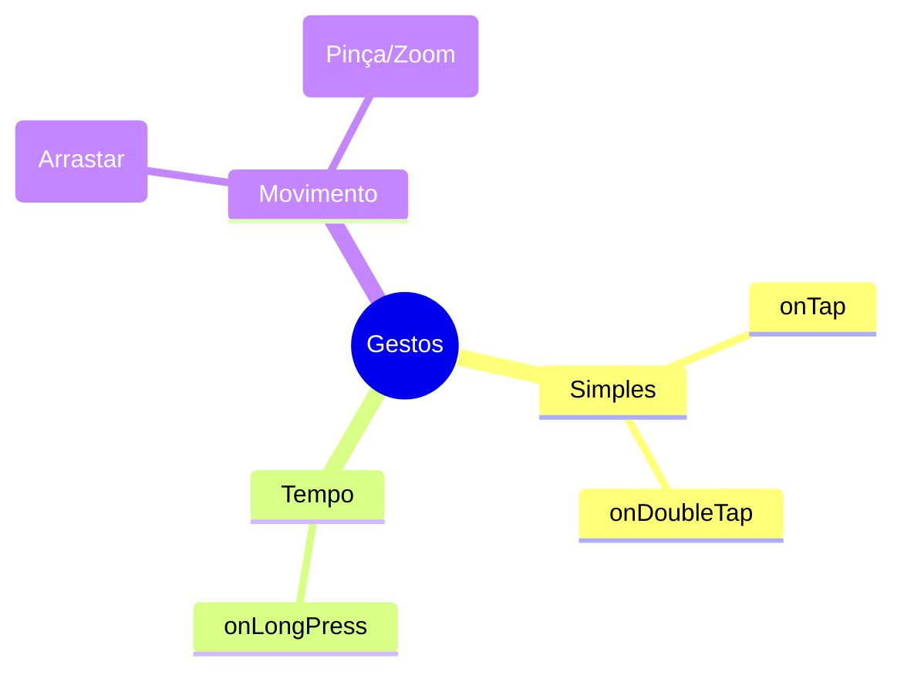

# 🖱️ Gestos e Botões

<div style="text-align: center; font-size: 3rem; margin: 20px 0;">
👆 ⚡ 🖱️
</div>

Um aplicativo não é apenas para ser visto, é para ser **tocado**. No Flutter, transformamos qualquer widget em um elemento interativo usando detectores de gestos e botões prontos que seguem o padrão profissional.

<div class="hero-section" style="background: linear-gradient(135deg, #f43f5e 0%, #e11d48 100%);">
    <h2>🎯 O Toque Humano</h2>
    <p>Desde um simples clique até gestos complexos como "arrastar" e "pinçar", o Flutter oferece controle total sobre como o usuário interage com sua criação.</p>
</div>

---

## 🔘 Os Três Botões do Material Design

O Flutter fornece três tipos principais de botões que cobrem 99% das necessidades de qualquer aplicativo:

<div class="grid-3">
    <div class="card" style="border-top: 4px solid #e11d48;">
        <strong>🚀 ElevatedButton</strong>
        <p>Botão com profundidade e sombra. Usado para a <strong>ação principal</strong> da tela.</p>
    </div>
    <div class="card" style="border-top: 4px solid #f43f5e;">
        <strong>⬜ OutlinedButton</strong>
        <p>Botão apenas com borda. Ideal para <strong>ações secundárias</strong>, como "Cancelar".</p>
    </div>
    <div class="card" style="border-top: 4px solid #fb7185;">
        <strong>📝 TextButton</strong>
        <p>Apenas texto. Usado em links ou botões discretos dentro de diálogos.</p>
    </div>
</div>

```dart
ElevatedButton(
  onPressed: () => print("Botão Principal Clicado!"),
  child: Text("Continuar"),
)
```

<div class="callout warning">
    <div class="callout-title">⚠️ Botão Desativado</div>
    Se você passar <code>null</code> para o parâmetro <code>onPressed</code>, o Flutter entende que o botão deve ficar cinza e "bloqueado" automaticamente. Útil para formulários não preenchidos!
</div>

---

## 🪄 GestureDetector vs InkWell

E se você quiser transformar um `Container` com sua própria cor ou uma `Image` em um botão? Você tem dois caminhos:

### 🕵️‍♂️ GestureDetector
Detecta cliques, toques duplos e arrastes de forma **invisível**. Ele não altera nada na aparência do widget ao ser tocado.

### 🌊 InkWell
Faz tudo o que o detector anterior faz, mas adiciona o famoso **Efeito Splash** (onda de água) do Material Design. É o que dá aquela sensação de "app profissional".

```dart
InkWell(
  onTap: () => print("Tap com feedback visual!"),
  borderRadius: BorderRadius.circular(10), // A onda respeita os cantos
  child: Container(
    padding: EdgeInsets.all(20),
    child: Text("Toque em mim!"),
  ),
)
```

---

## 🤳 Tipos de Gestos Comuns

O Flutter consegue sentir muito mais do que apenas um clique rápido:



---

## 🎯 Desafio Interativo

<div class="challenge-box">
    <h3 style="margin-top: 0;">🤔 O Mestre dos Gestos</h3>
    <p>Você precisa criar um botão que, ao ser <strong>pressionado por 2 segundos</strong>, apaga um item. Além disso, ele deve mostrar uma <strong>onda de feedback</strong> ao ser clicado normalmente. Qual widget você usaria?</p>
</div>

<details class="solution-details">
    <summary><strong>🔍 Ver Resposta</strong></summary>
    <div class="solution-content">
        <p>✅ <strong>Resposta:</strong> Você deve usar o <strong>InkWell</strong>!</p>
        <pre><code class="language-dart">InkWell(
  onTap: () => print("Clique normal"),
  onLongPress: () => print("Item Apagado!"),
  child: MyWidget(),
)</code></pre>
        <p>O <code>InkWell</code> é perfeito aqui porque oferece o <code>onLongPress</code> solicitado e ainda garante o feedback visual de "onda" que o <code>GestureDetector</code> não possui.</p>
    </div>
</details>

---

## ⏭️ O que vem por aí?

<div class="callout info">
    <div class="callout-title">🚀 Fim da Unidade 04</div>
    Parabéns! Você agora sabe como o Flutter funciona, como organizar a tela e como interagir com o usuário! Você está pronto para criar seu primeiro projeto real! 🎉
</div>

---

<div style="text-align: center; padding: 40px 0; background: linear-gradient(135deg, #f43f5e 0%, #e11d48 100%); border-radius: 12px; color: white; margin-top: 40px;">
    <h3 style="color: white; margin: 0;">🎉 Interatividade Dominada!</h3>
    <p style="margin: 10px 0 0 0;">Seu app agora ganha vida através do toque!</p>
</div>
